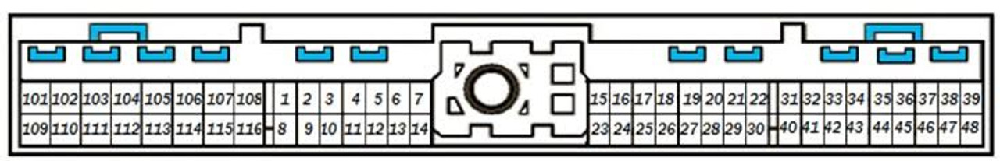
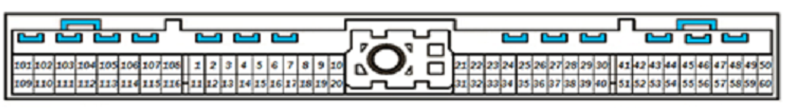
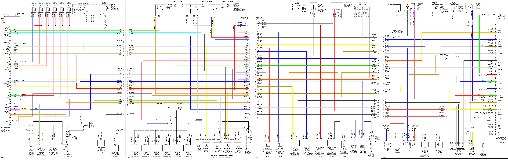
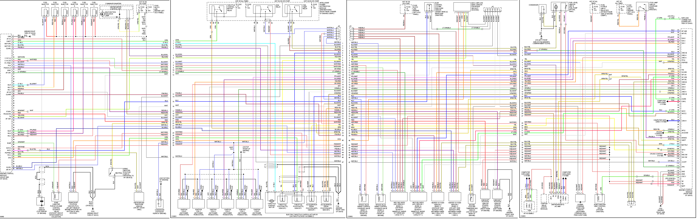
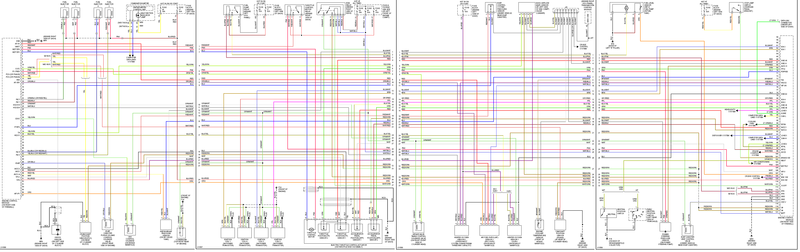
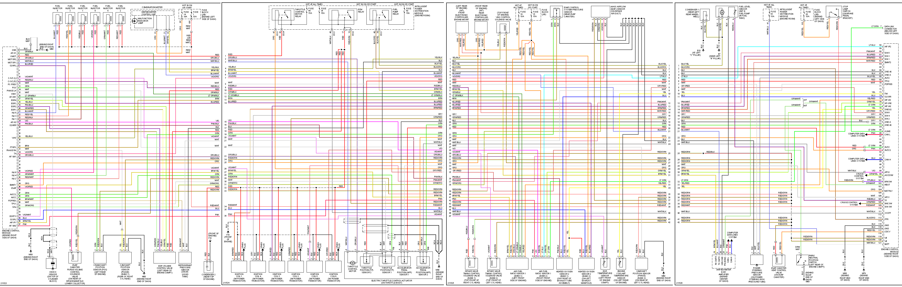
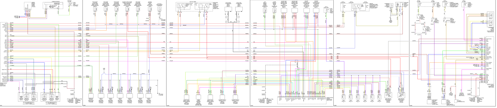

# Vault of Nissan Info

[2011 Xterra CAN](Nissan-Xterra-2011-CAN)

[Nissan-Xterra-2011](Nissan-Xterra-2011)

## 76 pin

https://rusefi.com/docs/pinouts/nissan76

https://rusefi.com/docs/pinouts/nissan-76-adapter/

https://github.com/rusefi/rusefi_documentation/blob/master/OEM-Docs/Nissan/1993%20Nissan-Datsun%20300ZX.png

https://docs.google.com/spreadsheets/d/1xH6szt3SJB7AzoseS9kyFPDHr-XMuRVpYXs7gHTQ70o/

## 121 pin

[Hellen 121 Nissan](Hellen-121-Nissan)

[Hellen 121 Nissan Forum Thread](https://rusefi.com/forum/viewtopic.php?f=4&t=1935)

## 2003 350z

## 2005 350z

## 2005 Sentra

## 2005 Maxima

## 2007 350z

not 121 pin :(

