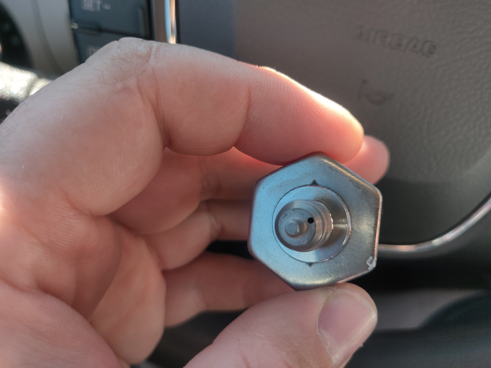
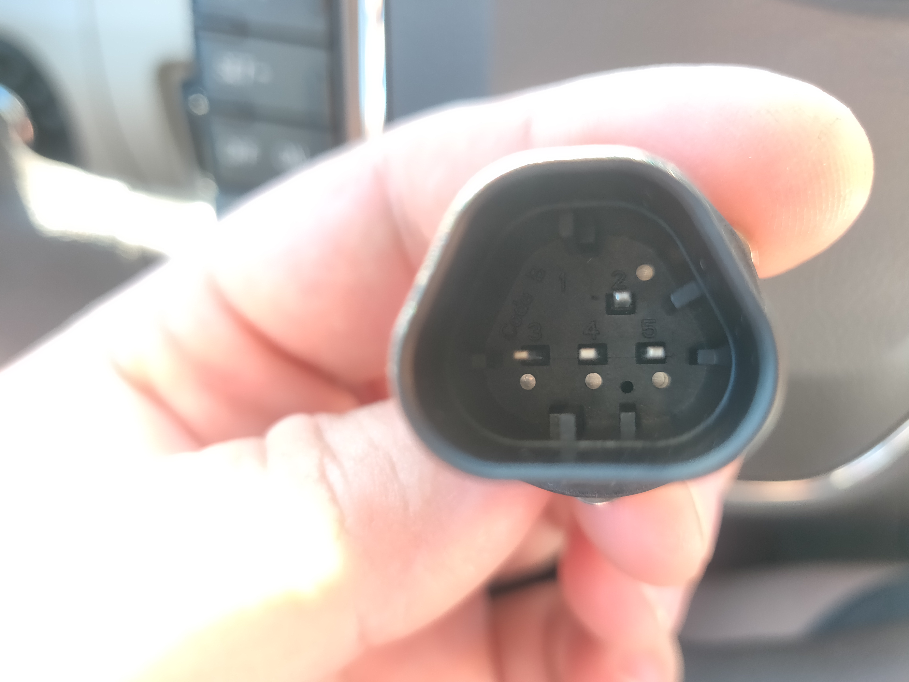
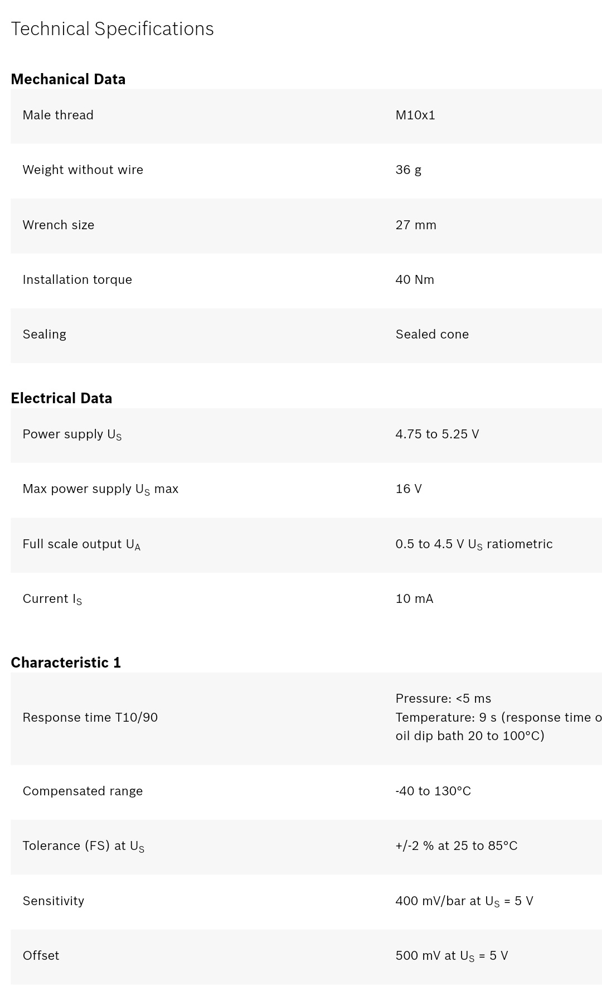
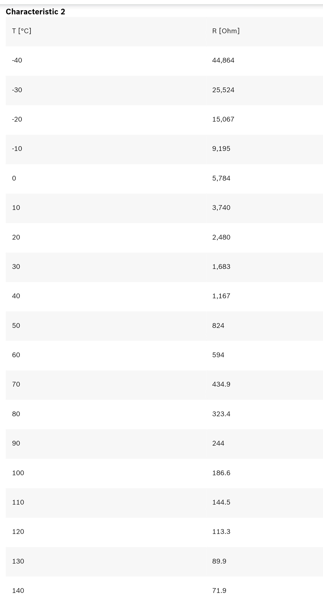
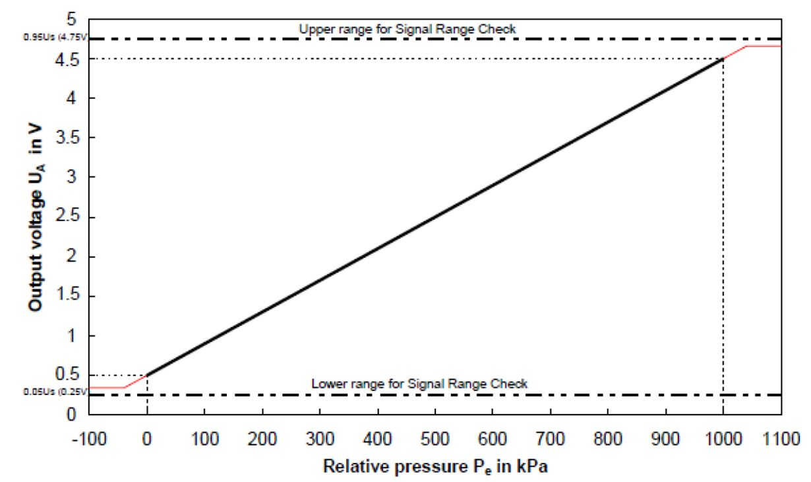
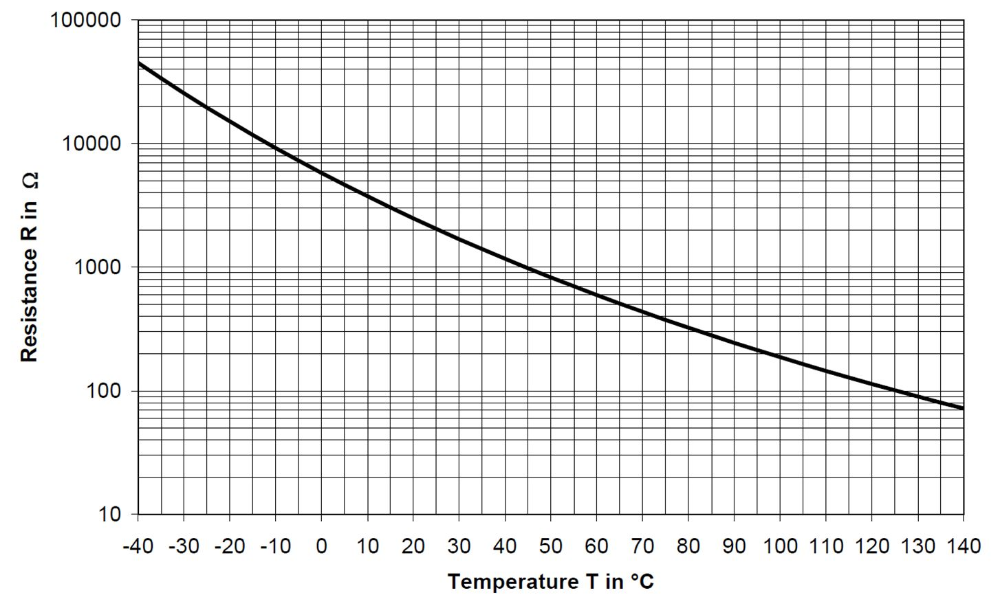
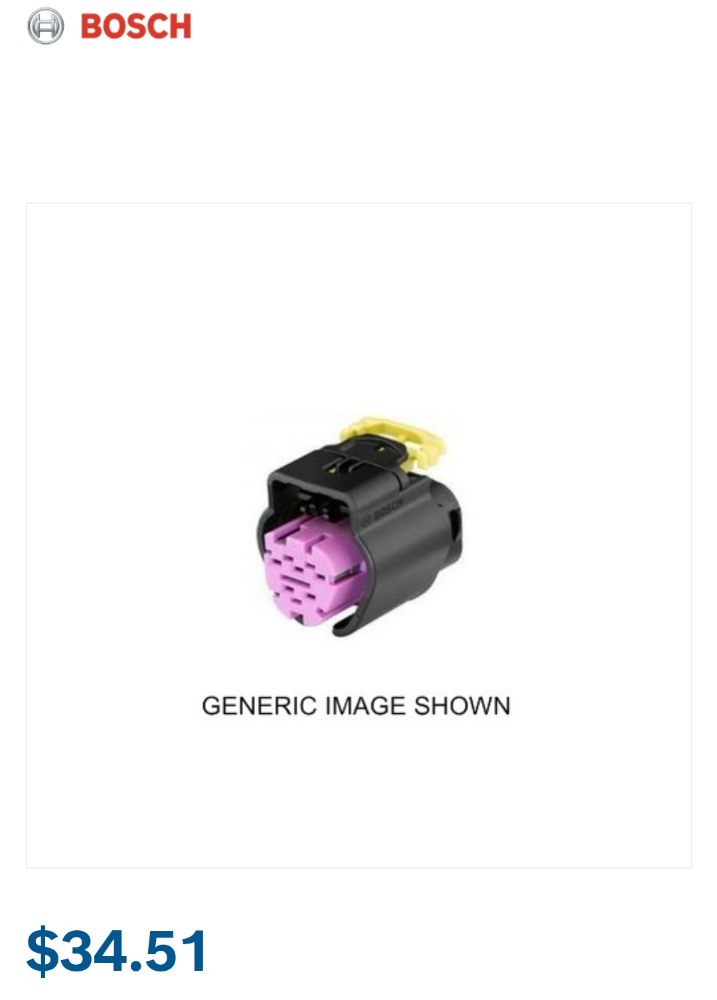

# Vault of Sensor Info

## MAF sensors

### Ford Slot type MAF sensor

PN - Hitachi MAF0012
plug TE 1-1419168-2

### Tested Sensors

A large number of tested MAF sensors can be found [here](https://rusefi.com/forum/viewtopic.php?f=4&t=1726&p=36419)

## Liquid Pressure and Temperature Sensor

- Combined Temperature and Pressure sensor. 2x Sensors in one..!!
- 0 - 10.0 bar (145psi) Pressure Sensor for liquid
- -40 - 140 deg C Temperature sensor for liquid
- Bosch Trapez 4-pin connector
- 45degree cone seat, M10x1 fitting
- Suitable for Diesel, gasoline, water, engine oil, transmission oil

| Mfgr/App | Part Number |
| -------- | ----------- |
| Aston Martin | HY539G756AA |
| Bosch | 0 261 230 340 |
| Bosch | 0 261 230 483 |
| Bosch | DS M1 TF |
| FISPA | 84.387 |
| SIDAT | 84.387 |
| HOFFER | 7472385 |
| Mazda | PY8V-18-541B |
| Mazda | SH0118541 |
| McLaren | 13F0517CP |
| Meat & Doria | 82385 |
| Metzger | 0906191 |
| Porsche 9A1 | 606 203 00 |
| WEPARTS | 410590179 |
| Wilmink Group | WG1409271 |
| Standard Motor Products | PS661 |
| Ballenger Motorsports | PST-F1 |

### Technical Specifications

For temperature measurement please use a pull-up resistor with an optimal value of 4.6 kOhm.  
The sensor has a protection for overvoltage, reverse polarity and short-circuit.  

[Data Sheet](PDFs/Data Sheet_70496907_Pressure_Sensor_Combined_PST-F_1.pdf)  
[Drawing](PDFs/Offer Drawing_254101899_Pressure_Sensor_Combined_PST-F_1.pdf)

### Connectors and Wires

Bosch Trapezoid

Mating connector
F02U.B00.751-01

Pin 2 Pressure Signal

Pin 3 Power Supply

Pin 4 Ground

Pin 5 Temperature Signal

#### Connector

VW Audi 1 928 405 159 (Inject Sensor)
Ford 1928405159

## Wide Band Sensors

### Sensors

BOSCH 17011 '2013 kia rio 1.6l l4 oxygen (o2) sensor Upstream`

BOSCH 17321 '2012 ford focus Upstream'

VAG 8R0906262E / Bosch 95890626200

See also [LSU 4.9 Cable Lengths — rusEFI Forum](https://rusefi.com/forum/viewtopic.php?p=43513)

### Connector Shells

| Connector        | Part Number |
| :--------------: | :---------: |
| Female (harness) | 1928404669  |
| Male (sensor)    | 1928405111  |

Male connector is only needed when building extension harnesses. The connector on the sensor contains a laser-trimmed calibration resistor and should not be removed.

VAG 1J0973705

### Female Terminals for Harness Side

| Wire Size | Plating | Strip       | Loose       |
| :-------: | :-----: | :---------: | :---------: |
| 24-22 AWG | Tin     | 1564324-1   | 1564325-1   |
| 24-22 AWG | Gold    | 1564324-2   | 1564325-2   |
| 20-18 AWG | Tin     | 1241380-1   | 1241381-1   |
| 20-18 AWG | Gold    | 1241380-2   | 1241381-2   |
| 16 AWG    | Tin     | 1418884-1   | 1418885-1   |
| 16 AWG    | Gold    | unavailable | unavailable |

Part numbers provided by and available for purchase at corsa-technic.com individually or [as a kit](https://www.corsa-technic.com/item.php?item_id=1296).

## Other Sensors

[Bosch Sensor Catalog](OEM-Docs/Bosch/sensors-2-1_bosch_2013_2014.pdf)
