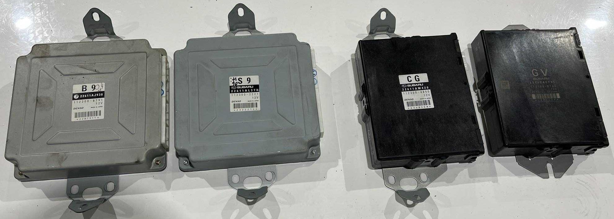
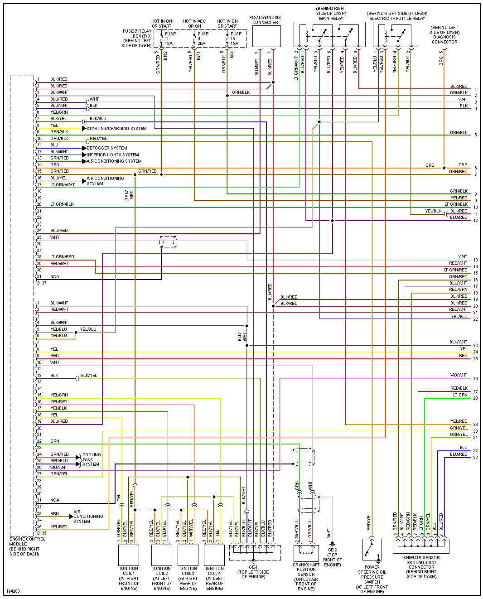
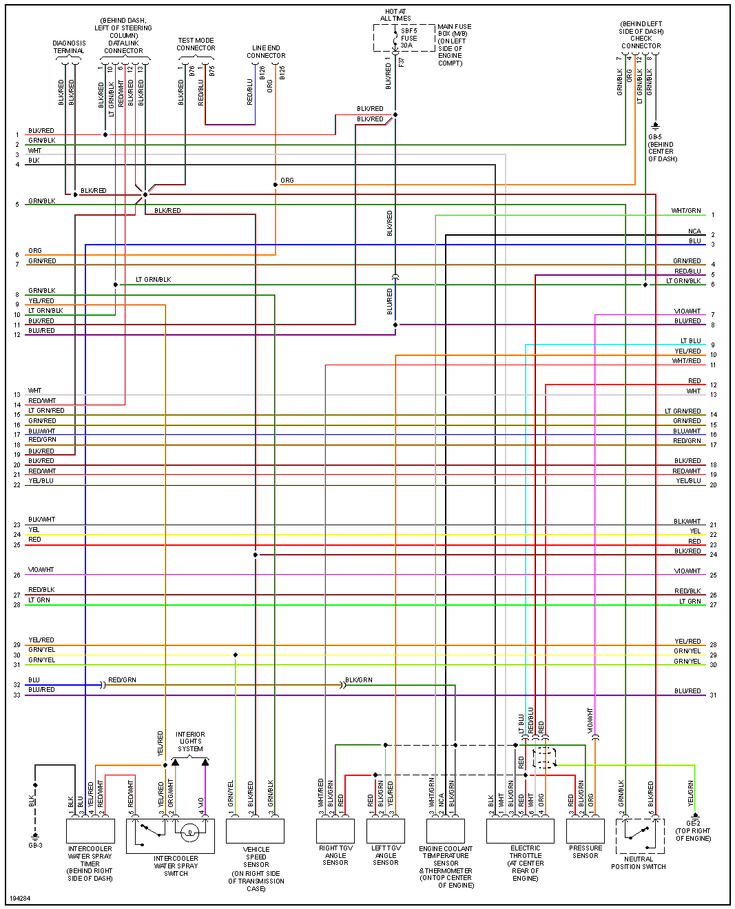
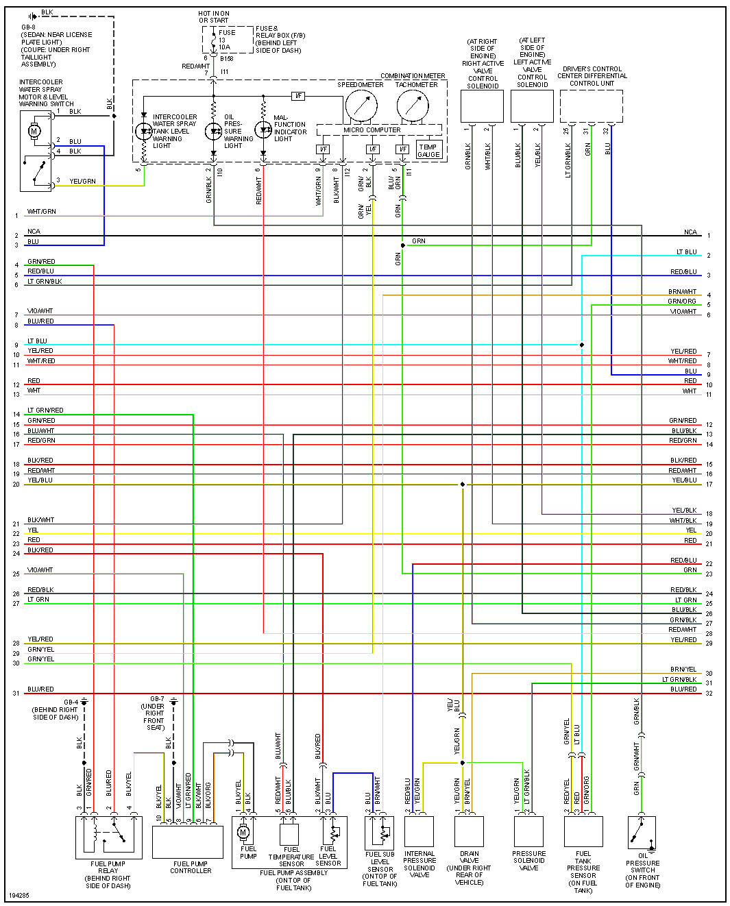
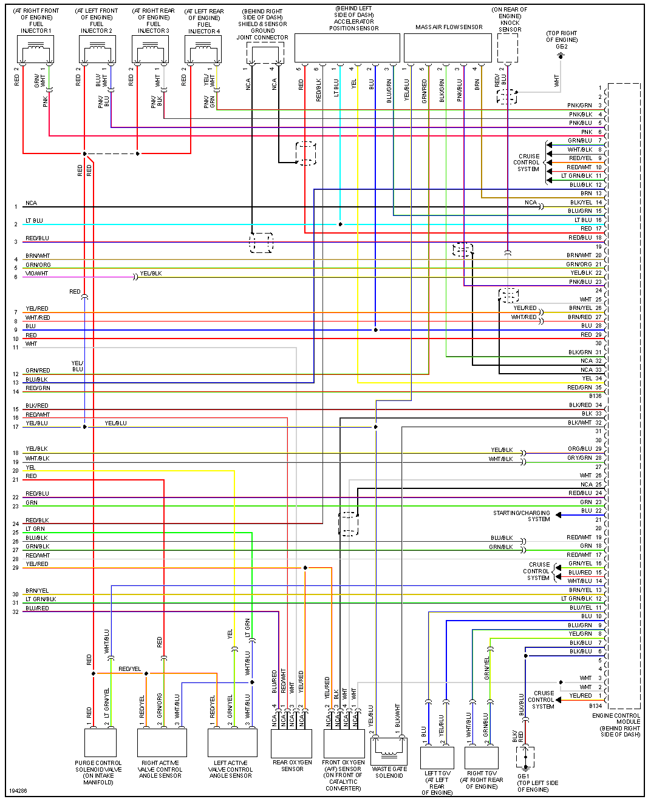
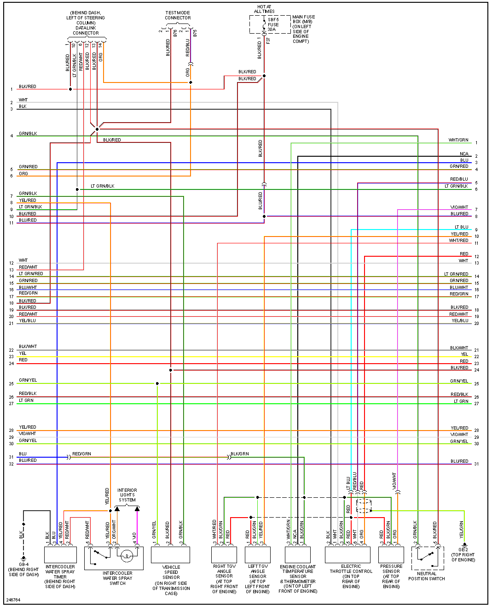
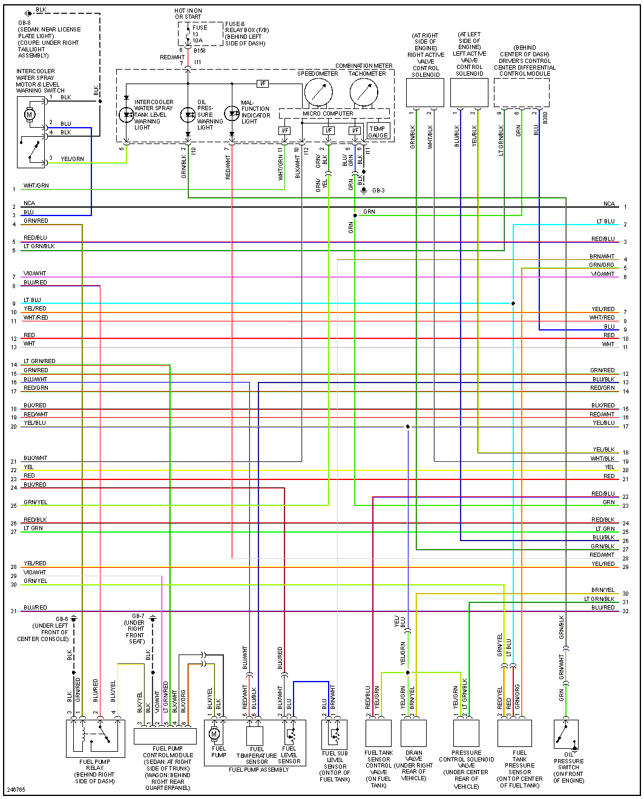
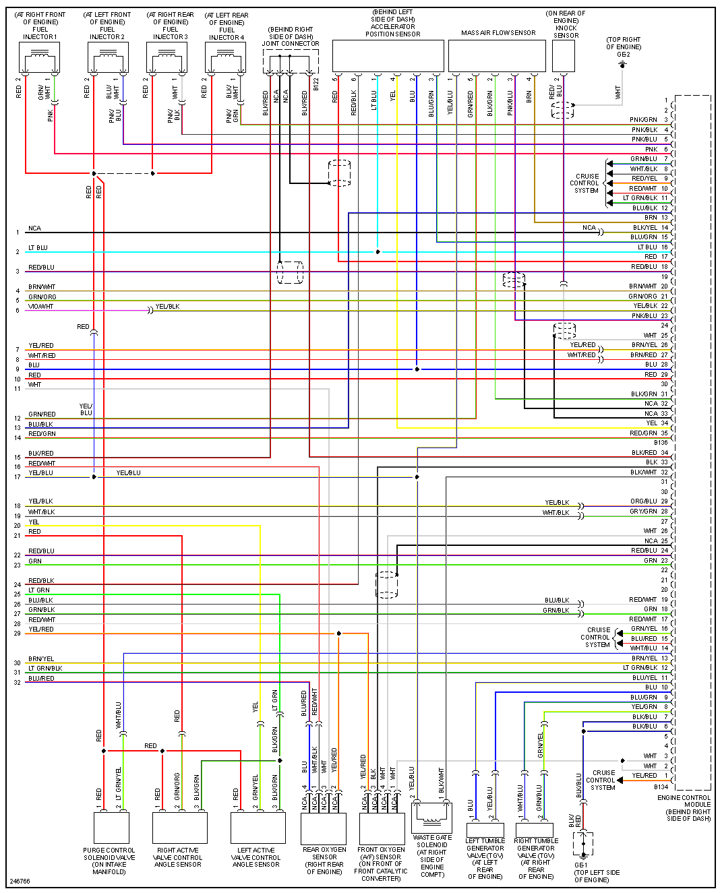
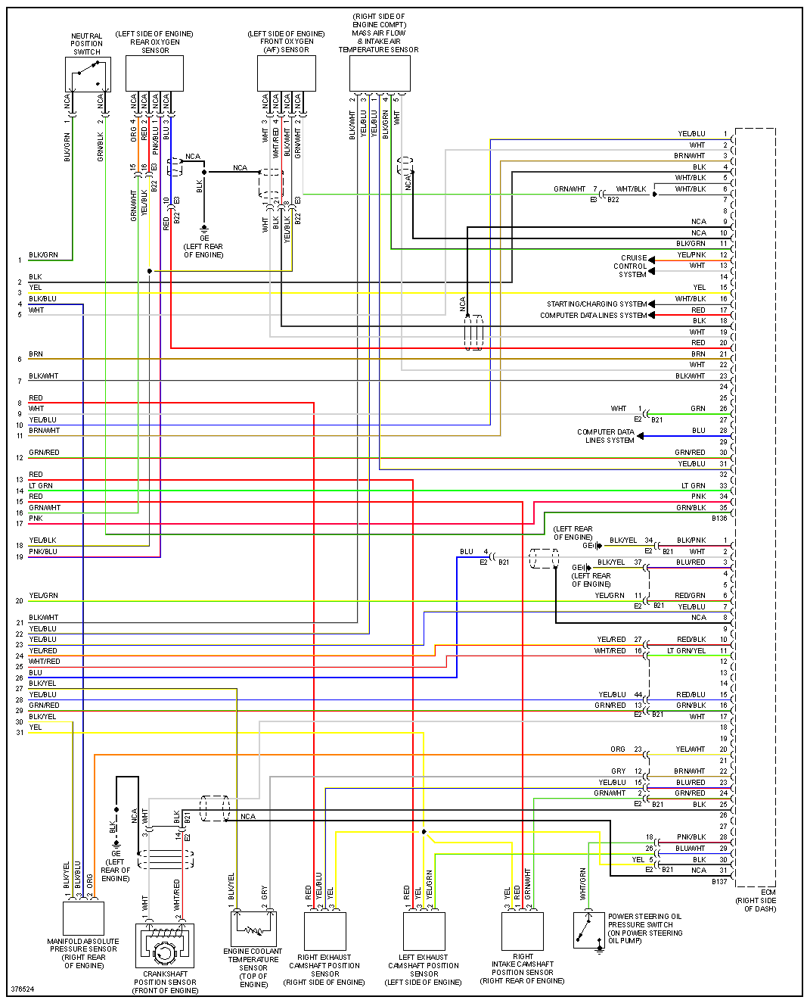

From left to right: 04 sti, 06 sti, 07 sti (canbus), 08-14 sti (canbus)

# 2004

2004 STI USDM

[2005-2007 GDA GDB 5 Engine Control Module ECM IO Signals.pdf](OEM-Docs/Subaru/2005-2007-GDA-GDB-5-Engine-Control-Module-ECM-IO-Signals.pdf)

# 2006

2006 STI USDM

# 2012

# 2013

135 pin [Subaru-2013-BRZ.pdf](OEM-Docs/Subaru/Subaru-2013-BRZ.pdf)

# 2018

135 pin [Subaru-2018-BRZ.pdf](OEM-Docs/Subaru/Subaru-2018-BRZ.pdf)

# 2022

[Toyota-2022-GR86.pdf](OEM-Docs/Toyota/Toyota-2022-GR86.pdf)
