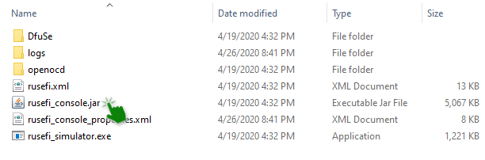
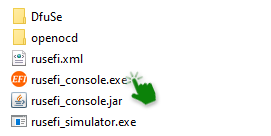
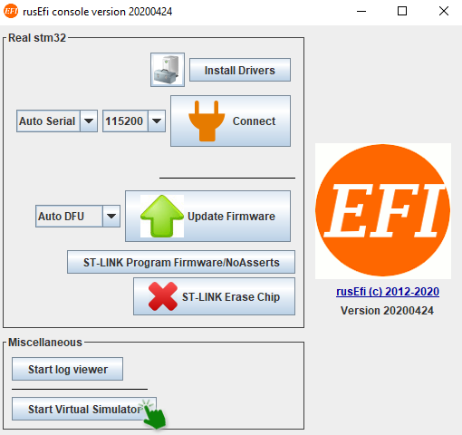
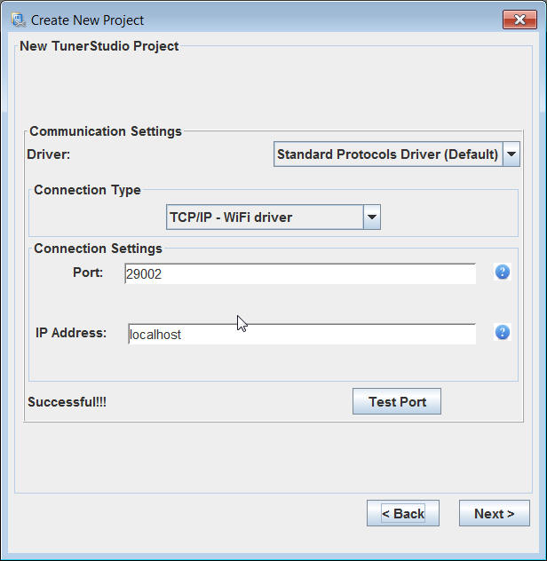
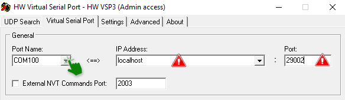
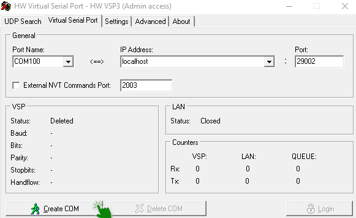
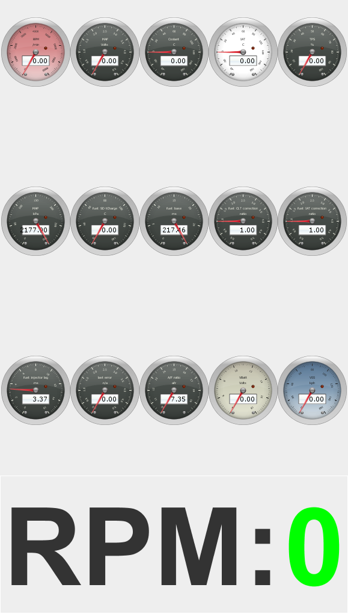

# rusEFI Virtual Simulator

rusEFI virtual firmware simulator is a way to test out and play with rusEFI on your computer without any hardware!
This simulator allows you to see how the firmware reacts to different commands and configuration adjustments via TunerStudio. The main thing one would be looking at is the 'Engine Sniffer'.

All you need is a Windows computer. This virtual simulator is built from the same source code as the firmware that runs on every rusEFI ECU.

rusEFI Console runs on Java, so if you don't have that installed on your PC, you'll need to download it.
If you don't have rusEFI Console, download the [default bundle https://rusefi.com/build_server/rusefi_bundle_f407-discovery.zip](https://rusefi.com/build_server/rusefi_bundle_f407-discovery.zip). Unzip it, and you'll find rusEFI Console in the 'console' folder.

 

 And then launch the rusefi_console.exe file.

 

After this, you'll start the virtual simulator.

## Connecting the Simulator to TunerStudio

There are two ways to connect the rusEFI virtual simulator to TunerStudio; it all depends on whether you have the lite or commercial version.

To start off, you'll need to open one of your existing projects or just create a new one.

If you don't know how to create a TunerStudio project, read [How to Create a TunerStudio Project](HOWTO-create-tunerstudio-project).

With the paid version all you need to do is to go into the communication settings inside a created project:

 

Choose the driver "Standard Protocols Driver" and connection type "TCP/IP - WiFi driver", enter the Port as "29002" and the IP address as "localhost" (or 127.0.0.1).

 

**However, if you only have the lite version of TunerStudio, the process will be different.**

## Emulating a serial port to connect to TunerStudio Lite

If you prefer using the free version of TunerStudio - TunerStudio lite - you'll need to install a serial port emulator
from [hw-group.com](https://www.hw-group.com/software/hw-vsp3-virtual-serial-port#download).
After downloading, install it, then run the configuration application "HW Virtual Serial Port".

- Switch from "read only access" to "admin access" by clicking the "Login" button
- Choose a port name, COM100 for example, and change the port address to 29002.

Now you can create your virtual port.

So now if you open the communication settings in TunerStudio:

...you'll be able to connect to your emulator.

Now if your virtual simulator is connected to Tunerstudio you'll see a green zero in your rusEFI virtual simulator.

## Troubleshooting

In case something does not work with the TCP<>Serial driver, the first step is to make sure that rusefi_simulator.exe is in the list of Processes in Task Manager.

The next step is executing `telnet localhost 29001` to make sure that dev console protocol is alive, and `telnet localhost 29002` to make sure that TunerStudio protocol is alive.

The expected behavior is that the connection would be established. If it is not, you might need to look in your firewall settings.
