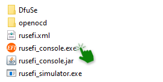
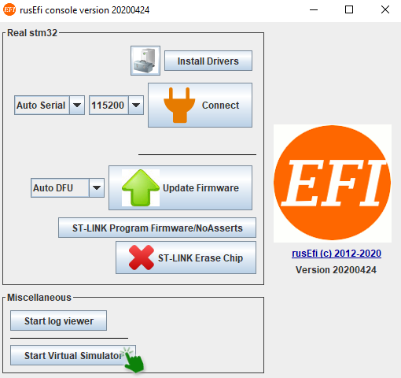
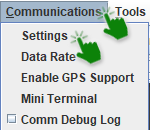
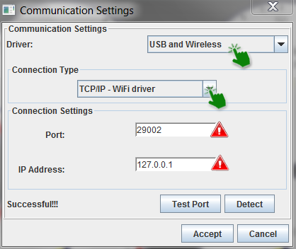
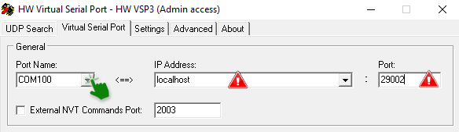
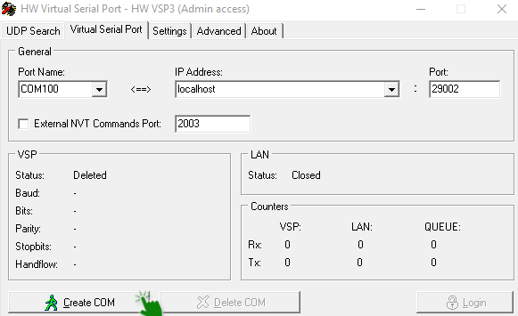
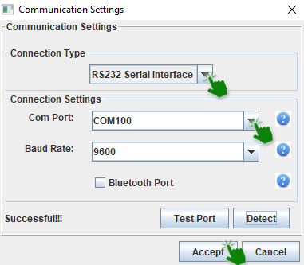
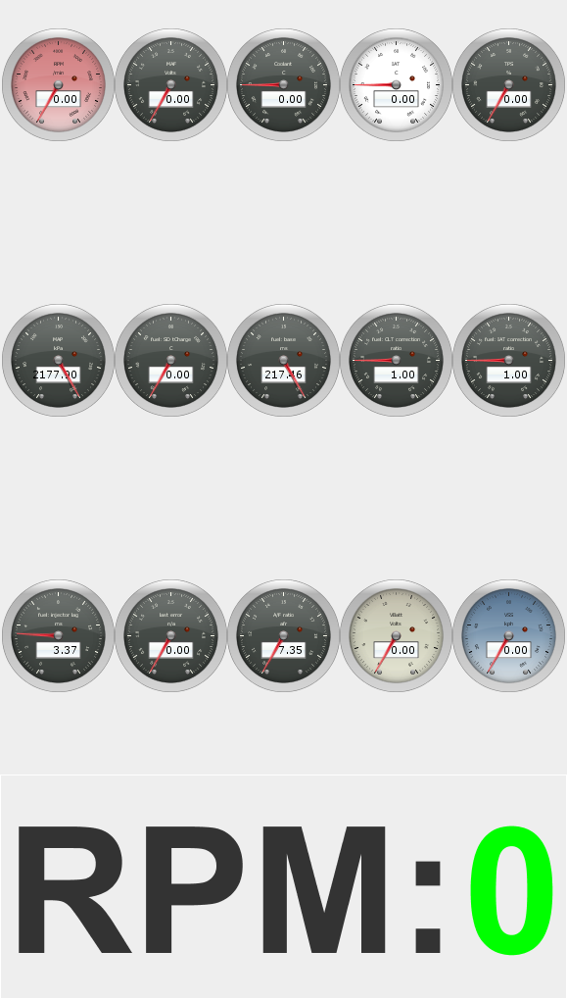

# rusEFI Virtual simulator

##### You'll be able to test out the rusEFI controller on your computer 

This virtual simulator is built on the firmware of the rusEFI controllers, made to be usable on the Windows operating systems. The only thing that you'll need will be a computer. 

The rusEFI console runs on Java, so if you don't have that installed on your PC you'll need to download it.
If you don't have the rusEFI console you can download it [here](http://rusefi.com/build_server/rusefi_bundle.zip).  
You'll have to unzip the file and go into the console folder.
 
 
 
 And then open the rusefi_console.jar file.
 
 

After this you'll start the virtual simulator.

## Connecting the simulator to Tunerstudio

There are two ways to connect rusEFI virtual simulator to Tunerstudio, it all depends on weather you have the lite or commercial version.

To start of you'll need to open one of your existing projects or just create a new one.

If you don't know how to create a Tunerstudio project go [here](HOWTO_create_tunerstudio_project.md)
 
 
 With the paid version all you need to do is to go into the communication settings inside a created project,
 
 
 
 
 choose the USB and wireless driver and the WiFi driver connection type, write the Port as 29002 and the IP address as 127.0.0.1
 
 
 
However, if you only have the lite version of Tunerstudio the process will be different.

## Emulating a serial port to connect to Tunerstudio lite

If you prefer using the free version of Tunerstudio - Tunerstudio lite -  you'll need to install a serial port emulator from [here](https://www.hw-group.com/software/hw-vsp3-virtual-serial-port#download). You'll need to emulate a port on your PC. The only thing that you'll need to do is to choose a port name, COM100 for example and to change the port address to 29002.

Now you can create your virtual port.

So now if you open the communication settings in Tunerstudio,

you'll be able to connect to your emulator.

 

Now if your virtual simulator is connected to Tunerstudio you'll see a green zero in your rusEFI virtual simulator.

 