[Wikipedia](https://en.wikipedia.org/wiki/Volkswagen_Passat_%28B6%29)

BOSCH MED9.1 ECU P/N 3C0 907 115 F

Production	2005–2010 (B6)

2.0 Turbo FSI engine code BPY ???

Fuel Rail High Pressure Sensor 0 261 545059 [0261545059](oem_docs/Bosch/0261545006.pdf) 06D906051
Fuel Rail High Pressure sensor 0 261 545016 0261545016 06J906051D

Fuel Rail Pressure sensor connector 4D0971993

Fuel Tank Pressure Sensor / 

Injector 06F906036A

Injector connector 4D0971992 - pin 1 positive/pin 2 GND

# 94 pin connector T94

|Pin Number|Name   | Default function                   | OEM Color |
| ---:|:---------- |:------------------------------------ | --- |
| 1   | **GND**    |  Power GND                            | BRN |
| 2   | **GND**    |  Power GND                            | BRN |
| 3   | **12v**    |  +12v from ECU relay                 | RED/WHT |
| 4   | **GND**    |  Power GND                            | BRN |
| 5   | **12v**    |  +12v from ECU relay                 | RED/WHT |
| 6   | **12v**    |  +12v from ECU relay                 | RED/WHT |
| 12  |            |                                       |    |
| 32  | low side   | main relay control                    | GRN/YEL |
| 53  | **GND**    |  Sensor GND ?                         | BLK |
| 69  | low side | ECU Relay Control (CAN wake up)      | BRN/VIO |
| 92  | +12v       | Constant +12v from Fuse #25 10A | BLK/YEL |
|     |            |                                       |    |
End of 94 pin connector T94

# 60 pin connector
|Pin Number|Name   | Default function                      | OEM Color |
| ---:|:---------- |:------------------------------------  | --- |
| 1   | INJ neg    | Injector #2 P5-t                      | RED/WHT |
| 2   | INJ neg    | Injector #1 P5-t                      | RED/BLK |
| 4   | low side   | Wastegate bypass valve                | VIO/WHT |
| 7   | analog in  | Fuel Low Pressure Sensor pin#2 P5-t, +5#37, GND#14              | VIO/GRN |
| 14  | **GND**    | Sensor GND (cam, LPFP)                | BRN/BLU |
| 16  | INJ neg    | Injector #4 P5-t                      | RED/GRY |
| 17  | INJ neg    | Injector #3 P5-t                      | RED/VIO |
| 19  | low side   | Fuel pressure regulator valve         | VIO/BRN |
| 20  | low side   | Camshaft valve #1                     | VIO/WHT |
| 25  | analog in  | Fuel High Pressure Sensor pin#2 P4-b            | GRY/BLU |
| 26  | 5v         | Sensor 5v power (cam, )               | BLK/GRY |
| 32  | INJ pos    | Injector #3 P5-t connected to #47     |    |
| 33  | INJ pos    | Injector #1 P5-t                      | BRN/BLK |
| 36  | Crank in   | VR Crank Negative                     | White   |
| 37  | 5v         | Sensor 5v power                       | BLK/GRN |
| 41  | High-Side  | Coil #2                               | BLU/GRY |
| 43  | High-Side  | Coil #3                               | RED/GRY |
| 44  | digital in | Cam position sensor                   | GRN/VIO |
| 47  | INJ pos    | Injector #2 P5-t connected to #32     | BRN/WHT   |
| 48  | INJ pos    | Injector #4 P5-t                      | BRN BRN/GRY   |
| 51  | Crank in   | VR Crank Positive                     | BRN |
| 52  | **GND**    | Sensor GND                            | BLK |
| 56  | High-Side  | Coil #4                               | GRY/BRN |
| 58  | High-Side  | Coil #1                               | VIO/GRY |
|     |            | |
End of 60 pin connector T60

"Early" 5 pages

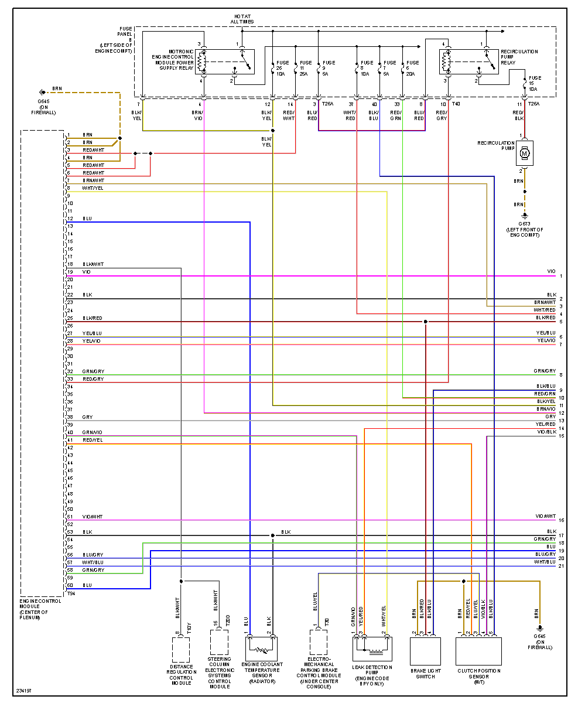
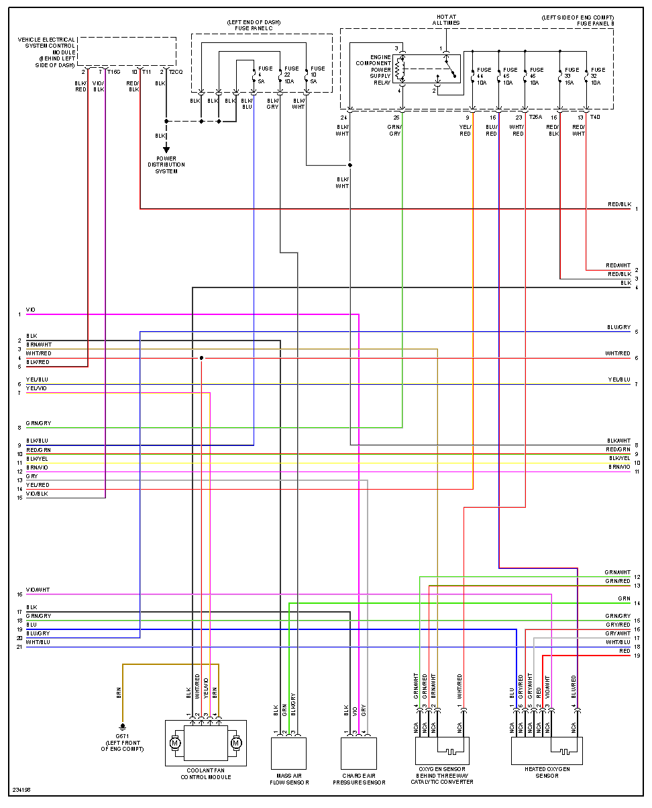
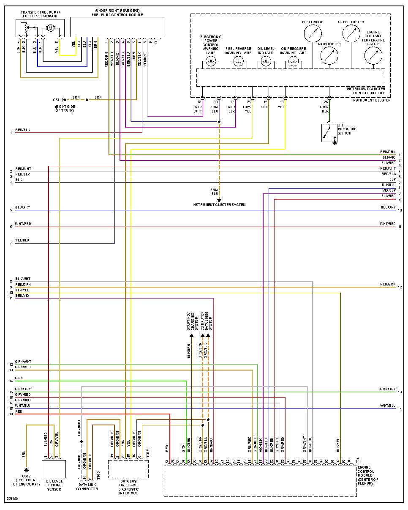
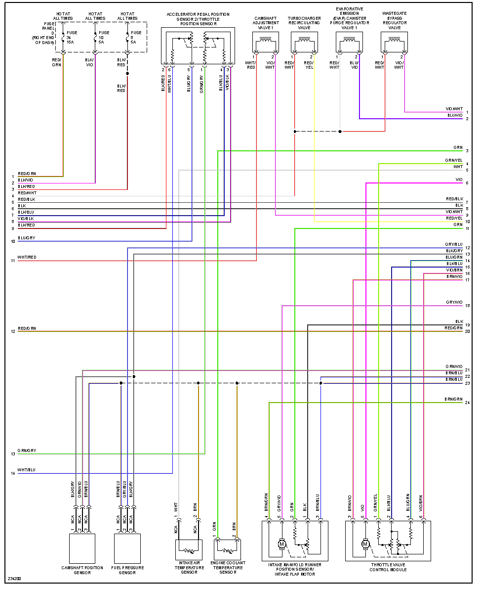

"Late" 5 pages

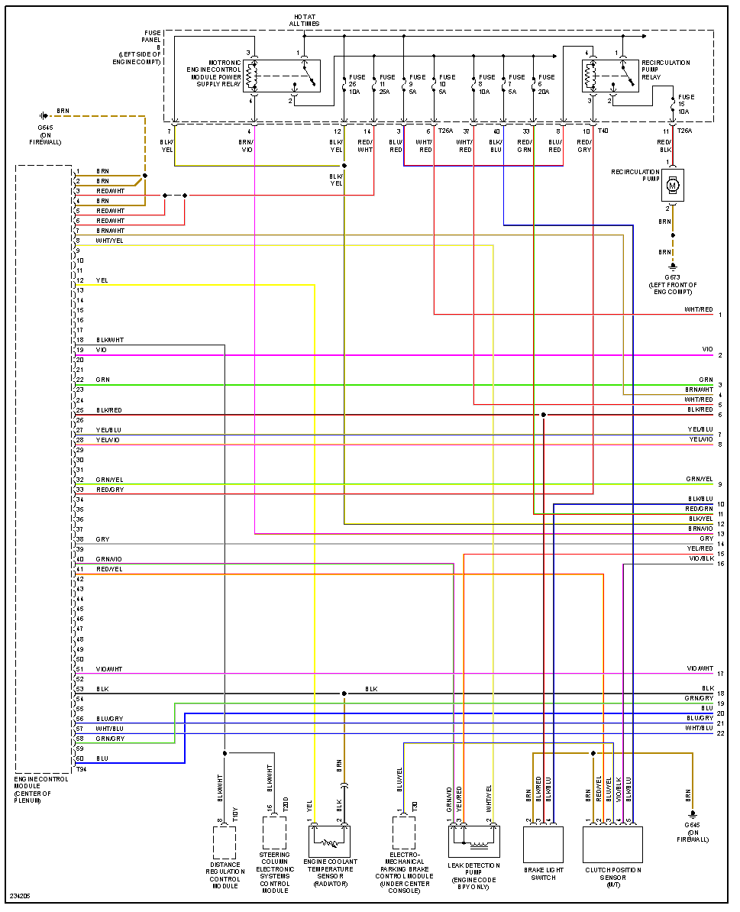
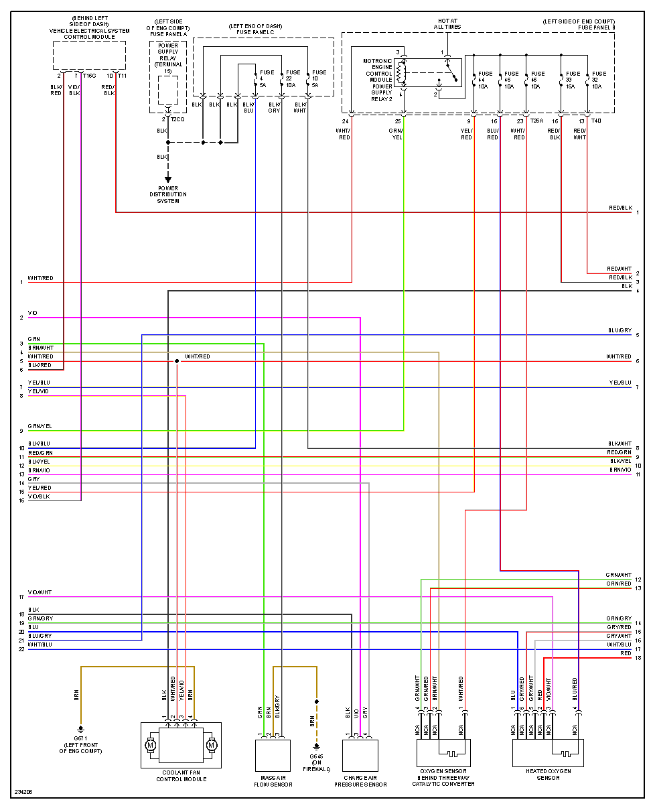
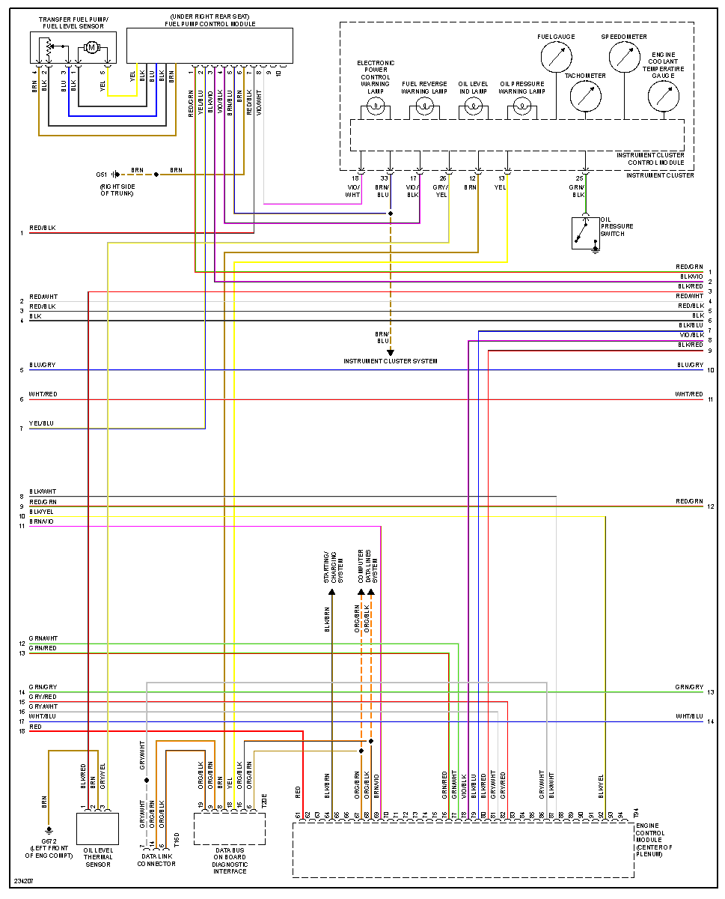
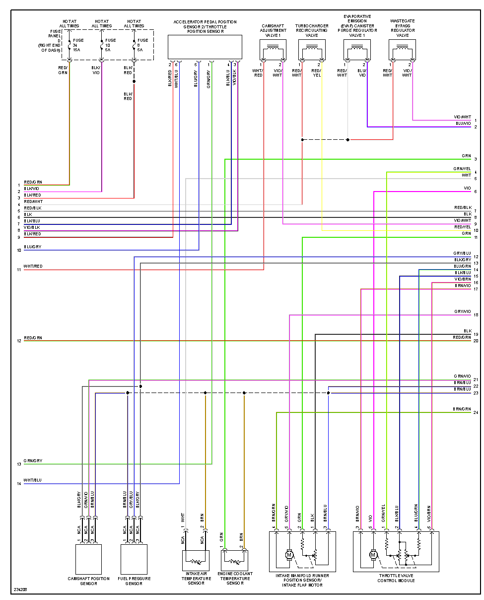
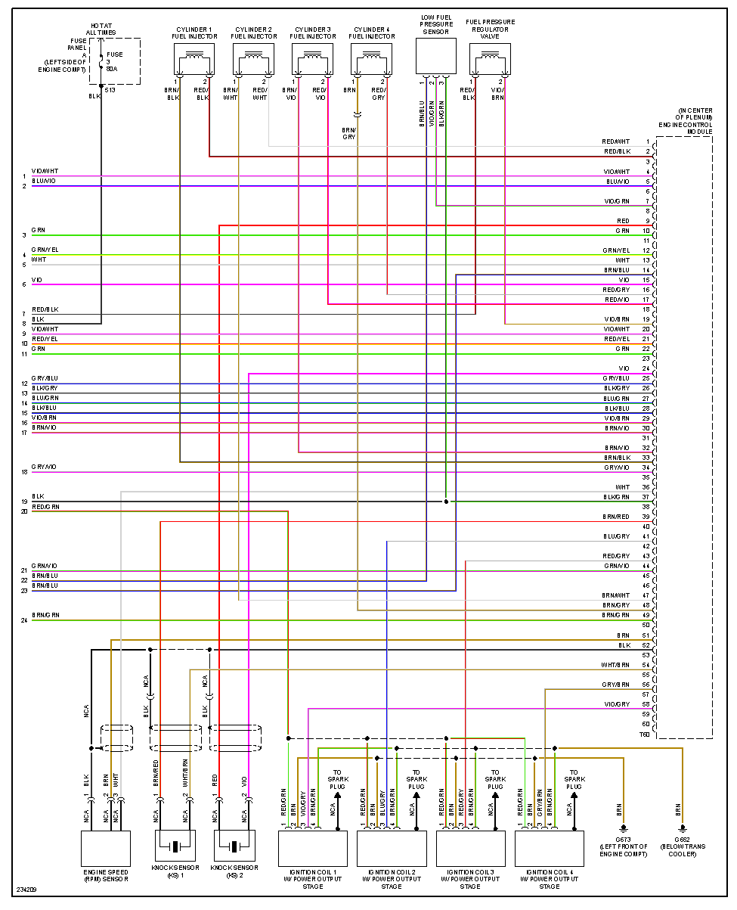

R17 Starter motor relay

Relay Control wire - RED/BLK
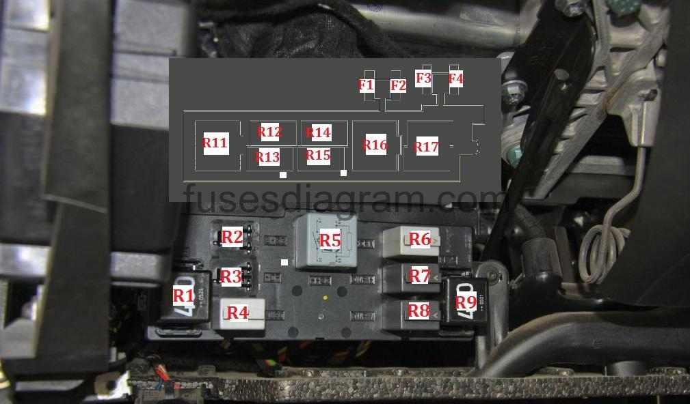

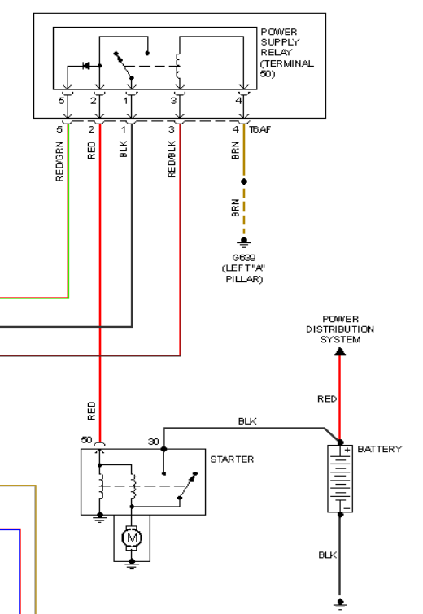