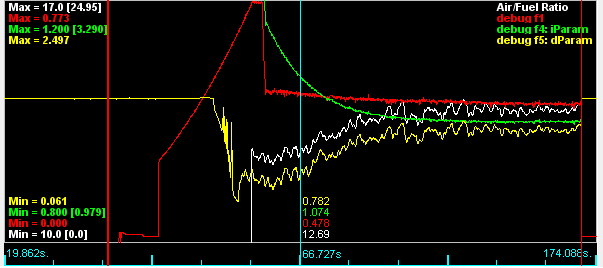

Wide band oxygen.

We have cj125 integration

TODO: document it better

# cj125 troubleshooting

We have a few rusEFI console commands relevant for cj125

``cj125_info``

``cj125_restart``

``cj125_calibrate``

Wideband controller based on Bosch CJ125 chip

green is vUr, temperature feedback

red is duty cycle

yellow is vUa, the lambda current measurement

white is converted AFR

fully operating in <30 seconds

in to closed loop in ~18 seconds

P=30

I=5

D=0.3

though you could probably use D=0 since the system is already damped so hard

50Hz