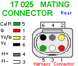
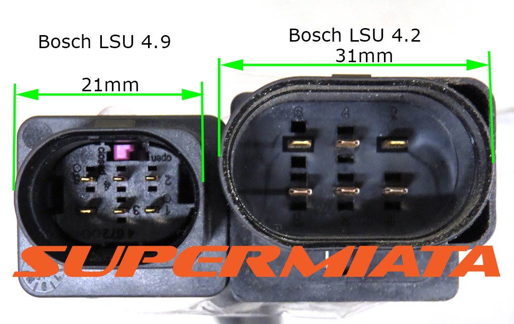

# WBO Overview

[Do-i-need-wideband-oxygen-sensor](https://github.com/rusefi/rusefi/wiki/do-i-need-wideband-oxygen-sensor)

## External WBO

* External controller with analog output, like then AEM 30-4110 and similar products.
* External controller with CAN interface, like the AEM X-Series wideband controller/gauge.

## rusEFI Wide band oxygen

[youtube has a great video](https://www.youtube.com/watch?v=tb7ZC1hpdyI)

* [https://github.com/mck1117/wideband](https://github.com/mck1117/wideband) is what we use [the forum thread](https://rusefi.com/forum/viewtopic.php?f=4&t=1856)

See [rusEFI-Wideband-Controller](rusEFI-Wideband-Controller)

## Naming Convention

pin 1 red: IP=Pump Current

pin 2 yellow: VS/IP=VM=common virtual ground for VS and IP

pin 3 white: H- Heater control, low-side

pin 4 grey: H+ Constant +12v

pin 5 green: R Trim=Calibration resistor

pin 6 black: UN = Vs = sensor voltage output = INRC

4.9 pinout courtesy of [https://www.wbo2.com/cable/lsuconns.htm](https://www.wbo2.com/cable/lsuconns.htm)

## uaEFI Connector Pinout

## Part Numbers

### Connector Shells

| Connector        | Part Number |
| :--------------: | :---------: |
| Female (harness) | 1928404669  |
| Male (sensor)    | 1928405111  |

Male connector is only needed when building extension harnesses. The connector on the sensor contains a laser-trimmed calibration resistor and should not be removed.

### Female Terminals for Harness Side

| Wire Size | Plating | Strip       | Loose       |
| :-------: | :-----: | :---------: | :---------: |
| 24-22 AWG | Tin     | 1564324-1   | 1564325-1   |
| 24-22 AWG | Gold    | 1564324-2   | 1564325-2   |
| 20-18 AWG | Tin     | 1241380-1   | 1241381-1   |
| 20-18 AWG | Gold    | 1241380-2   | 1241381-2   |
| 16 AWG    | Tin     | 1418884-1   | 1418885-1   |
| 16 AWG    | Gold    | unavailable | unavailable |

Part numbers provided by and available for purchase at corsa-technic.com individually or as a kit. <https://www.corsa-technic.com/item.php?item_id=1296>

## Sensor Part Numbers

BOSCH 17011 '2013 kia rio 1.6l l4 oxygen (o2) sensor Upstream`

BOSCH 17321 `2012 ford focus Upstream`

See also https://rusefi.com/forum/viewtopic.php?p=43513

## ADV

1J0973705 8R0906262E

## CJ125

* CJ125 is an unavailable old chip replaced by CJ135. CJ125 is not available from legit distributors for many years now. There is no documentation for CJ135. Some time ago we chose to no longer spend resources on CJ125.
