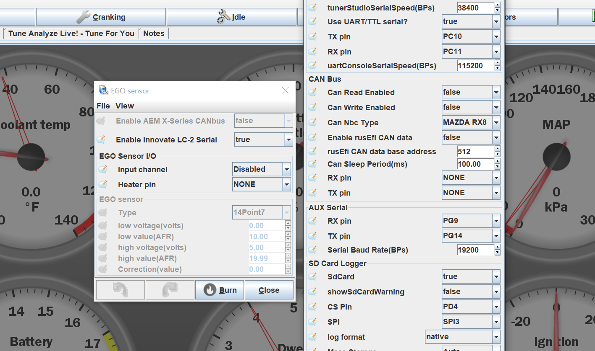
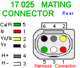
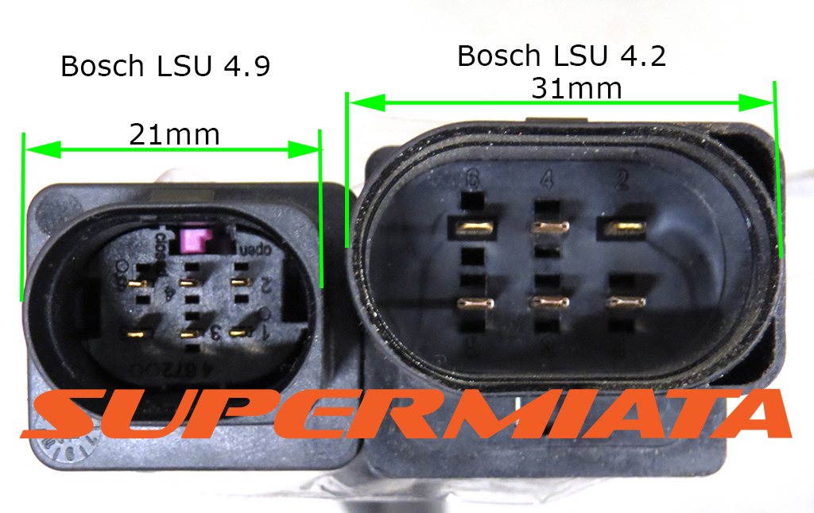

# Wideband Oxygen Sensors

*Also known as Lambda Sensors, HEGO, and WBO2*

In a performance application at wide open throttle, the ECU needs to control the air to fuel ratio to hit a small target somewhat richer than stoichiometric. The narrowband sensors most OEs use only tell you if you are rich or lean, not *how* rich or *how* lean, which makes them completely useless in this case. A reliable measurement of the air to fuel ratio is also vital for the tuner to be able to tune the engine and be sure that the changes to the fueling are correct. The solution to this is a wideband oxygen sensor, which tells the ECU quite precisely what the air to fuel ratio is based on the amount of oxygen remaining in the exhaust gas.

*Q: Can I tune my engine with a wideband, and then get rid of it?*  
A: You can't reasonably tune for all potential variables. It's much better to keep the wideband and enjoy rusEFI closed loop fuel correction functionality.

Bosch is the only genuine manufacturer of these sensors. The precision and range of the sensor is achieved by relatively sophisticated magic which happens inside the sensor. Orchestrating this magic requires 5 or 6 wires and a specialized controller.

Some rusEFI ECUs have built-in WBO controllers. If yours does not, you will need to purchase an external controller.

There are two types of wideband oxygen sensors (4.2 and 4.9), so be sure to purchase a sensor and controller that are compatible with each other.

Wide-band controllers range from $35.00 for [14point7 SLC-free](http://www.14point7.com/products/slc-free) ($85 with sensor) all the way to high-$200 for kits with a gauge.

rusEFI is able to support most aftermarket wideband controllers that have a 5v analog output, as well as the CAN interface of AEM X-type sensors.

Controllers that have been used with rusEFI so far include:

* Innovate MTX-L
* Innovate LC-2
* Spartan SLC Free
* AEM X-type WBO2
* AEM older generation WBO2

*rusEFI advises against Innovate wideband controllers.*

## rusEFI Wideband Controller

We also have our own wideband controller, which is available [in the shop](https://www.shop.rusefi.com/shop/p/dual-channel-wbo).

For more information see [the wiki page](rusEFI-Wideband-Controller).

## Innovate LC-2 serial

Innovate's LC-2 serial interface is supported. The Innovate sensor controller has typically two serial connectors, the one labeled *OUT* needs to be connected to the ECU. AUX Serial needs to be configured with a baud rate of 19200BPs and *Enable Innovate LC-2 Serial* needs to be set to true in the EGO sensor window.

## Wide Band Oxygen Sensor Info

### Pinout Naming Convention

pin 1 red: IP=Pump Current

pin 2 yellow: VS/IP=VM=common virtual ground for VS and IP

pin 3 white: H- Heater control, low-side

pin 4 grey: H+ Constant +12v

pin 5 green: R Trim=Calibration resistor

pin 6 black: UN = Vs = sensor voltage output = INRC

4.9 pinout courtesy of [https://www.wbo2.com/cable/lsuconns.htm](https://www.wbo2.com/cable/lsuconns.htm)

[Bosch LSU 4.2 Datasheet](OEM-Docs/Bosch/Lambda_Sensor_LSU_4.2_Datasheet_51_en_2779111435.pdf)

For the uaEFI wideband connector pinout, see [the uaEFI wiki page](uaEFI#wbo-connector).

## Part Numbers

### Connector Shells

| Connector        | Part Number |
| :--------------: | :---------: |
| Female (harness) | 1928404669  |
| Male (sensor)    | 1928405111  |

Male connector is only needed when building extension harnesses. The connector on the sensor contains a laser-trimmed calibration resistor and should not be removed.

### Female Terminals for Harness Side

| Wire Size | Plating | Strip       | Loose       |
| :-------: | :-----: | :---------: | :---------: |
| 24-22 AWG | Tin     | 1564324-1   | 1564325-1   |
| 24-22 AWG | Gold    | 1564324-2   | 1564325-2   |
| 20-18 AWG | Tin     | 1241380-1   | 1241381-1   |
| 20-18 AWG | Gold    | 1241380-2   | 1241381-2   |
| 16 AWG    | Tin     | 1418884-1   | 1418885-1   |
| 16 AWG    | Gold    | unavailable | unavailable |

Part numbers provided by and available for purchase at corsa-technic.com individually or as a kit. <https://www.corsa-technic.com/item.php?item_id=1296>

## Sensor Part Numbers

BOSCH 17011 '2013 kia rio 1.6l l4 oxygen (o2) sensor Upstream`

BOSCH 17321 `2012 ford focus Upstream`

See also [LSU 4.9 Cable Lengths — rusEFI Forum](https://rusefi.com/forum/viewtopic.php?p=43513)

## ADV

1J0973705 8R0906262E

## CJ125

* CJ125 is an unavailable old chip replaced by CJ135. CJ125 is not available from legit distributors for many years now. There is no documentation for CJ135. Some time ago we chose to no longer spend resources on CJ125.

## Misc Info

AEM 30-4100 Digital Wideband UEGO Gauge (donated by AlexL)

35-8469 35-8460 gauge

replacement sensor AEM 30-2001
alternative parts  2243, 170408, 48292001, 12575657, 213-1572, Type B, 57005
Manufacturer Part Number: 0258007206

"The resistor is put into the raised portion of the Plug end and is used to set the calibration of the sensor during the testing and assembly process at Bosch. When you change the O2 sensor, the resistor stays with it."

Based on LSU4.2, "Each AEM UEGO sensor is individually calibrated and a resistor integral at the
connector body is laser trimmed with this value."

0v = 10AFR
5v = 20AFR

[AEM Controller Installation Instructions](http://www.aemelectronics.com/files/instructions/30-4100%20Digital%20Wideband%20UEGO%20Gauge.pdf)

1j0973733 Bosch 4.2 6 pin connector available everywhere

[ALM-CAN lambda meter](http://www.ecotrons.com/products/wideband-controller-alm-can/)
