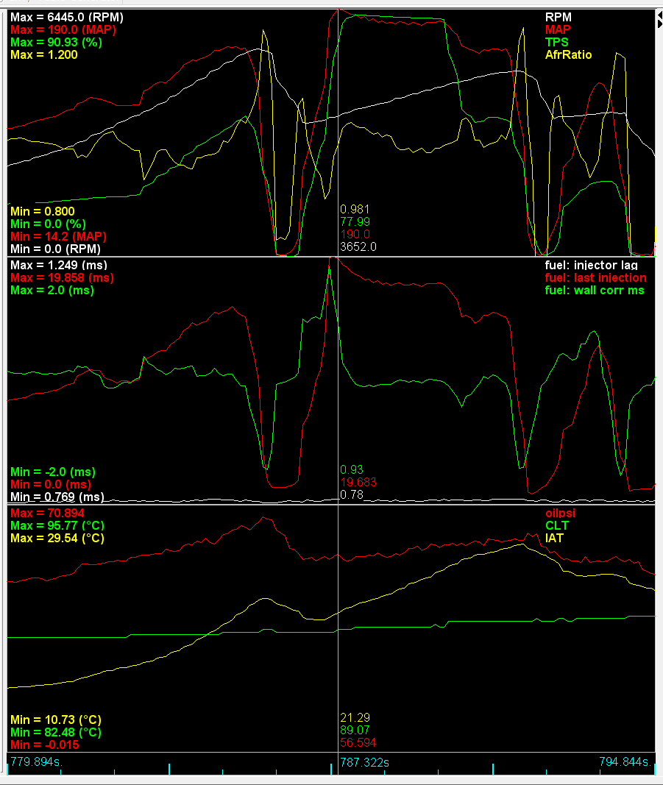

# Wall Wetting (X-tau) Acceleration Compensation

Wall Wetting (or X-tau as it is sometimes called) is one of the acceleration fuel compensation methods available in rusEFI. 
This method uses a simple model to estimate the amount of fuel that drops out of the intake charge when the manifold pressure changes. 

# The Detail

There are 3 key factors that go into the X-tau method:
1. X = the fuel deposited on the wall of the inlet port
2. Tau = the build up of fuel on the wall and how persistent it is 
3. T = The temperature of the air and surfaces

The math used is based on: SAE 810494 by C. F. Aquino and SAE 1999-01-0553 by Peter J Maloney

		M_cmd = commanded fuel mass (output of this function)
		desiredFuel = desired fuel mass (input to this function)
		fuelFilmMass = fuel film mass (how much is currently on the wall)

		First we compute how much fuel to command, by accounting for
		a) how much fuel will evaporate from the walls and enter the air charge
		b) how much fuel from the injector will hit the walls amd stay there, thus being deposited

		Next, we compute how much fuel will be deposited on the walls.   
        The net effect of these two steps is computed (some leaves the walls, some is deposited)
		and stored back in fuelFilmMass.

		alpha describes the amount of fuel that REMAINS on the wall per cycle.
		It is computed as a function of the evaporation time constant (tau) and
		the time the fuel spent on the wall this cycle, (reciprocal RPM).

		beta describes the amount of fuel that hits the wall.  

		TODO: these parameters, tau and beta vary with various engine parameters,
		most notably manifold pressure (as a proxy for air speed), and coolant
		temperature (as a proxy for the intake valve and runner temperature). 

[//]: # "Note - Are we sure these all increase?"
[//]: # "TAU: decreases with increasing temperature."
[//]: # "decreases with decreasing manifold pressure."

[//]: # "BETA: decreases with increasing temperature."
[//]: # "decreases with decreasing manifold pressure."

The current implementation of X-tau ignores coefficients (X) below 0.01 and RPM below 100. 

# How to tune it

[//]: # "need a screen shot of the x-tau TS section" 

#### Evaporation time constant /tau (seconds)
This value is the one that sets how long the fuel takes to re-enter the air charge after being deposited on the manifold walls.  
Increasing this will have the effect of making the enrichment last for a longer time. When tuning increase this value if your logs show that the AFR goes lean towards the end of the acceleration.  
Similarly reduce this value if the AFR becomes increasingly rich during the acceleration.

#### Added to wall coef / Beta (Fraction)
This value sets how much of the fuel lands on the walls during an acceleration event. Increasing this value will cause a larger quantity of fuel to be added to the inlet charge. 
A large value here implies that a lot of the fuel is landing on the walls of the inlet manifold, requiring a large value may indicate that the spray pattern of the fuel injectors is incorrect for their positioning or the manifold type. 
While tuning if you are failing to prevent the AFR from becoming leaner then increase this value. 

Good tuning of the X-tau system relies on taking logs and some trial and error to tune the coefficients correctly. 

# Old info

This is about 1 second worth of log, during a 2-3-4 shift at low-ish RPM, but near wide open throttle. Worst case scenario for AE!

The yellow trace on the top graph, AfrRatio, is a ratio of target vs. actual. If the engine is lean, it goes below 1, and rich above 1. Graph is scaled to +-20%. I'm using this because my actual AFR target varies from 14.7 all the way down to around 11.5. This swing causes the AFR signal to look like the ECU is doing a poor job, when in fact the setpoint is moving by nearly 30%.

There's a bit of a spike rich-then-lean during the shifts, but it's not bad (results in a nice burble out of the exhaust  :lol:), and resolves once back on the throttle. Some of this is caused by the phase shift between the AFR target and measured AFR, but some of it is real.

[Sample log](Overview/wall_wetting/wall_wetting_2019-01-01_19_modified.msl)

Based on [https://rusefi.com/forum/viewtopic.php?f=5&t=1481](https://rusefi.com/forum/viewtopic.php?f=5&t=1481)

[//]: # "OrchardPerformance" 
