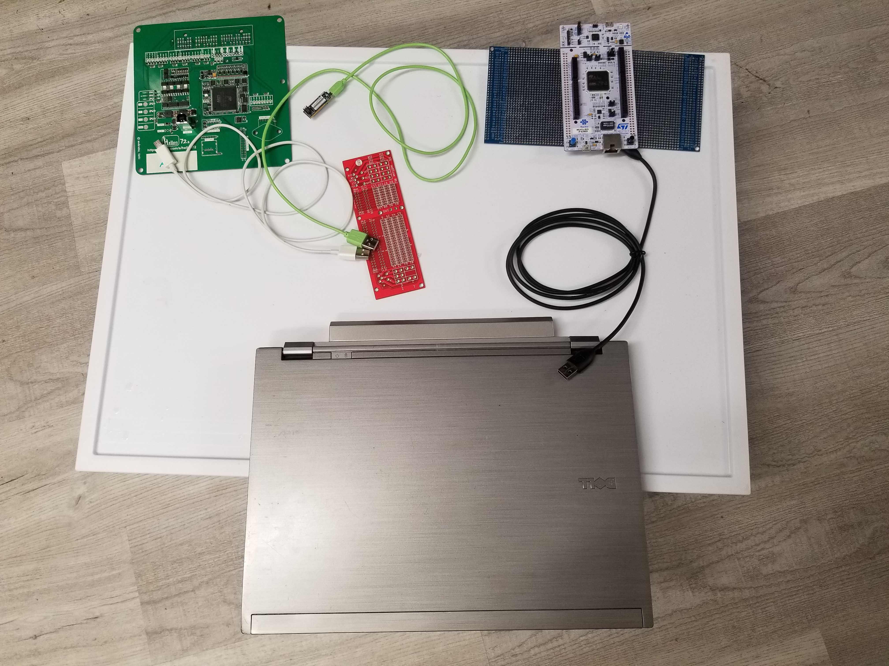

Between chip shortage, quick prototyping pace and choice of semi-manual assembly we have less than 100% quality.

As of July 9th we have custom FW builds and custom LED board with custom undocumented wired pigtail. Humans are to program, initiate test and evaluate LED status.

We need a solution to speed up the complete programming and validation cycle of freshly assembled boards.

The plan is to develop incrementally starting with a quick & dirty solution.

In the end we would need 5-25 units total (one unit soldered to application-specific connector, multiplied by number of people) so we shall maximize use of JLCPBC assembly from beginning.

For first round the proposal is to test functional blocks as separate small PCBs, long term we might Hellen merge or not.

We are building Stim using NUCLEO-F429ZI due to chip shortage.

# Overview

We have ECU, PC and Stim device interconnected.

PC runs overall control software.

PC uses ST-Link to flash rusEFI ECU with special QC firmware if needed.

PC has USB CDC with Stim.

PC _probably_ has USB CDC with ECU. Funny idea: CAN bus between ECU and Stim?

Problem: sometimes we do not want to feed ECU via ST-Link. Solution: Stim has a switch(es) (red board on the photo) to break +5v line(s) between PC and ECU.

See [Tag-Connect-TC2030](Tag-Connect-TC2030)

See https://github.com/rusefi/stim