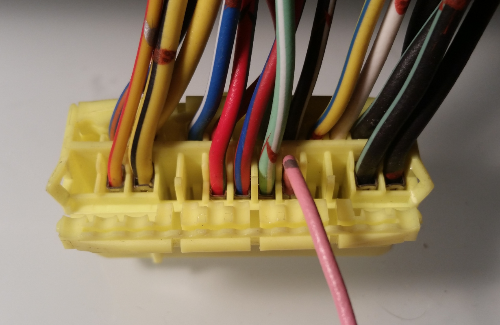

[Frankenso](https://rusefi.com/wiki/index.php?title=Manual:Hardware_Frankenso_board) board was designed to be used on Mazda Miata NA6 as a plug-and-play solution

## Stage 0

### Everything stock running rusEfi ECU
All stock sensors, no extra wires, no extra hoses - just lift the carpet and plug rusEfi box instead of OEM ECU.  

## Stage 1
Stage 0 + External wide band controller, wide band oxygen sensor, external MAP sensor

## Stage 2
Stage 1 + TPS 

#### Bench testing options
On NA6 Spark #1 and Spark #3 would audibly click if you use bench Spark Test button.
Because of wasted spark wiring Spark #2 and Spark #4 are not expected to click.

On NA6 Injector #1 and Injector #2 would audibly click if you use bench Injector Test button.
Because of batch injection wirint Injectors #3 and #4 are not expected to click.

All you need is a relatively quiet surroundings and you would hear both spark and injectors. Injectors
are louder, spark is less loud but also totally audible. Both Test buttons are expected to
produce three clicks a second after you press the button in the software.

#### Wideband O2 sensor wire WBO

You would really need a wideband sensor. Here is middle plug pinout to wire external wideband controller - +12v would feed external controller and analog output signal would provide rusEfi ECU with air/fuel ratio information.

A small flat screw driver and small pliers would allow you to move side latches and open the cap.
Insert supplied extra pin wire (pin on this picture) and close the latches. Done!

 

-----------------------------------
[Frankenso Miata NA6 PNP Technical Details](Frankenso_MazdaMiataNA6_pnp_board_wiring)

### TPS mod
Cars with automatic OEM engine harness use a better OEM TPS sensor.
On vehicles with manual OEM engine harness this TPS mod is recommended.

original manual wiring:

3C/3D GND
1N - Red - ?? switch. ground if IDLE, floating if pressed/depressed
3L - Light Green / white ?? switch - ground if WOT, floating if not WOT

GND is middle pin on OEM manual plug unfortunately

stop light switch:
ground if not depressed
floating if pressed / depressed

-----------------------------------
[Frankenso analog](https://rusefi.com/wiki/index.php?title=Manual:Hardware_Frankenso_board#Analog_Inputs)

| Analog        | ECU pin |MCU pin |  pull-up | pull-down |   |  
|------|------|----|-------|---|---|
| Coolant (stock)       | 3Q | PC2 |  2.7K | n/a      |   |
| Intake Air (stock)    | 3P | PC1 |  2.7K | n/a      |   |
| Vane Air Flow (stock) | 3O | PA0 |  n/a  | 500K     |   |
| Narrow Band O2 (stock)| 3N | PC3 |  n/a  | 500K  |
| Wide band oxygen (from middle plug) | W52   | PC3   |   n/a    | 500K  |
| TPS ??? A/T harness only!    | 3M     |    |       |   |
| Neutral switch     | 1V     | PA3   | 10K     | n/a  |
| A/C switch     | 1Q     | PA6   | 10K     | n/a  |
|      |      |    |       |   |
|      |      |    |       |   |
| MAP (from middle plug)  | 2J      | PA4   |   n/a    | 500K  |
| Stop Light Switch  green wire   | 1O rerouted     |    |       |   |
|      |      |    |       |   |

-----------------------------------

Fly back diode:
NSR0530HT SOD-323 SMD Schottky Barrier Diodes 30V 500mA 0.5A

[old wiki Mazda PnP](https://rusefi.com/wiki/index.php?title=Manual:Hardware:Mazda_PnP)

[old wiki Mazda_Miata_1990](https://rusefi.com/wiki/index.php?title=Vehicle:Mazda_Miata_1990)

[old wiki Mazda_Miata_1994](https://rusefi.com/wiki/index.php?title=Vehicle:Mazda_Miata_1994)

[old wiki Frankenso board](https://rusefi.com/wiki/index.php?title=Manual:Hardware_Frankenso_board)

1996+ is too different unfortunately

[old wiki Mazda_Miata_1996](https://rusefi.com/wiki/index.php?title=Vehicle:Mazda_Miata_1996)
