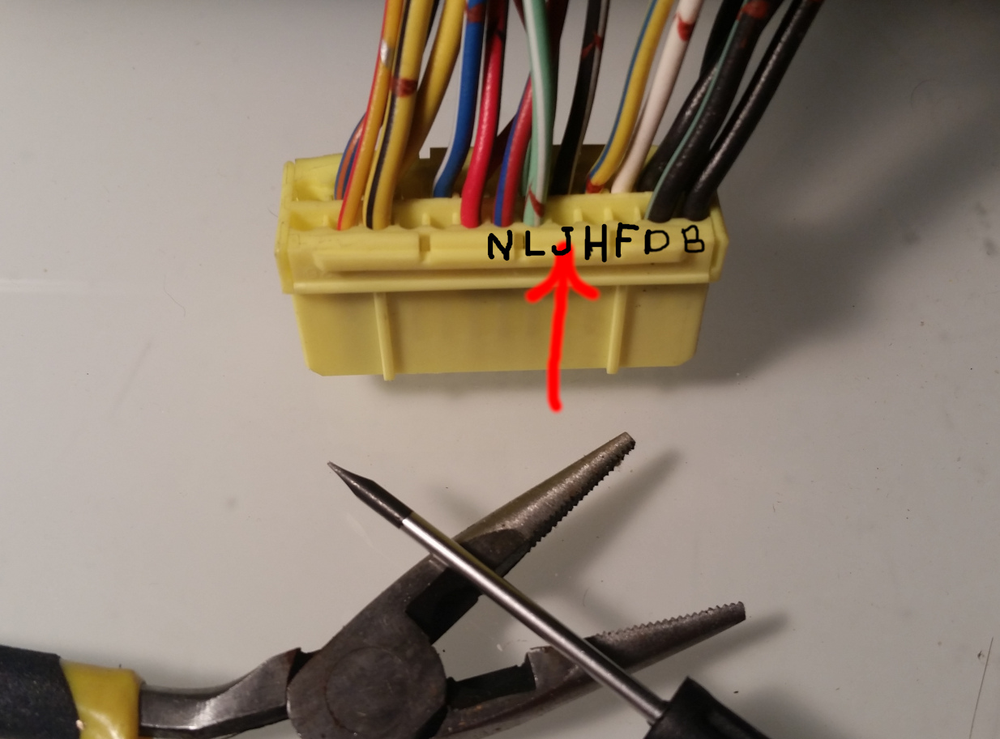
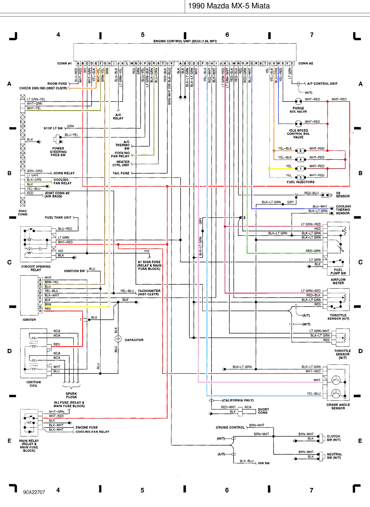

### Frankenso board was designed to be used on Mazda Miata NA6 as a plug-and-play solution

#### Wideband O2 sensor wire WBO

You would really need a wideband sensor. I suggest adding a pin into OEM connector at 3J. This pin is not used in OEM wiring,
this is between Red/White California-only wire and Lt Green/White Manual-only TPS wire.

A small flat screw driver and small pliers would allow you to move side latches and open the cap.
Insert supplied extra pin wire (pin on this picture) and close the latches. Done!

 
On Frankenso board just have a jumper between W48 top and W48 bottom.

[old wiki Mazda PnP](https://rusefi.com/wiki/index.php?title=Manual:Hardware:Mazda_PnP)

[old wiki Mazda_Miata_1990](https://rusefi.com/wiki/index.php?title=Vehicle:Mazda_Miata_1990)

[old wiki Frankenso board](https://rusefi.com/wiki/index.php?title=Manual:Hardware_Frankenso_board)
