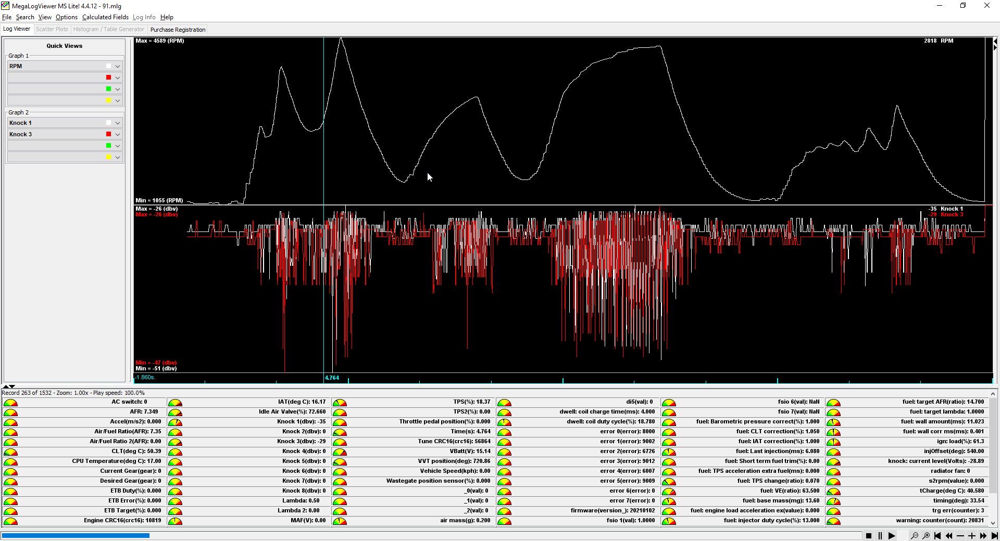

# Knock Sensing

TL,DR: We have native knock processing!

Reference tune https://rusefi.com/online/view.php?msq=1626 reference tune https://rusefi.com/online/view.php?log=1359

## Software knock sensing

## Spectrogram

Knock spectrogram is displayed by [TS-Plugin](TS-Plugin)

[Youtube rusEFI: knock on standing Miata, Proteus](https://youtu.be/GOWEKU2SH9I)

[Youtube rusEFI: Hellen knock gauge](https://youtu.be/oJKI8X4oxCs)

See also:

- [Saab Trionic on Mazda Miata](Saab-Trionic-8-Combustion-Detection-Module-on-Mazda-Miata-running-rusEFI)
- [Ion Sensing](Ion-Sense)
