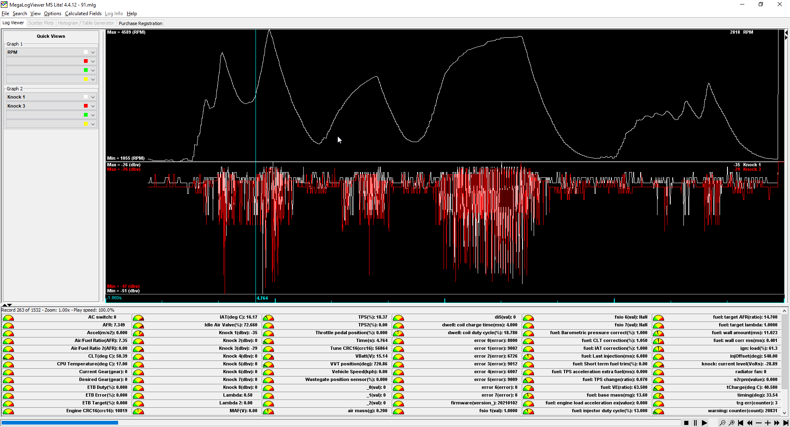

# Knock Sensing

| Feature                  | Status |
|--------------------------|--------|
| Knock Sensing            | ✓      |
| Multiple Sensors         | ✓      |
| Knock Signal Logging     | ✓      |
| Windowing                | ✓      |
| Spectrogram Creation     | ✓      |
| Spectrogram Filtering    | ✓      |
| Timing Retard Response   | ✓      |
| Fuel Enrichment Response | ✓      |

Reference [tune](https://rusefi.com/online/view.php?msq=1626) and [log](https://rusefi.com/online/view.php?log=1359)

> ⚠️ Knock (detonation) can destroy an engine quickly. Knock sensing is a safety net that pulls timing when it hears knock — it is **not** a substitute for a careful, conservative ignition tune. Verify that it actually responds to real knock (for example with a knock ear and logs) before relying on it, and leave a safety margin in your timing.

## Detection and response

- **Enable detection.** `enableSoftwareKnock` turns on rusEFI's built-in (software) knock detection.
- **Listening window.** `knockDetectionWindowStart` sets the crank angle at which rusEFI starts listening for knock, so it only evaluates the part of the cycle where knock would occur.
- **Timing pulled on knock.** `knockRetardAggression` is the "Ignition timing to remove when a knock event occurs." The firmware suggests: "5% (mild), 10% (turbo/high comp.), 15% (high knock, e.g. GDI), 20% (spicy lump)".
- **Recovery.** After a knock event, `knockRetardReapplyRate` controls how quickly timing is restored ("After a knock event, reapply timing at this rate", in deg/s).
- **Frequency choice.** `knockDetectionUseDoubleFrequency` selects the first or second harmonic; the firmware notes the "Second harmonic (aka double) is usually quieter background noise".

The knock spectrogram (`enableKnockSpectrogram`) is available through the TunerStudio plugin (see the Spectrogram section below).

## Software Knock Sensing

## Spectrogram

Knock spectrogram is displayed by [the rusEFI TunerStudio plugin](TS-Plugin)

[Youtube rusEFI: knock on standing Miata, Proteus](https://youtu.be/GOWEKU2SH9I)

[Youtube rusEFI: Hellen knock gauge](https://youtu.be/oJKI8X4oxCs)

See also:

- [Saab Trionic on Mazda Miata](Saab-Trionic-8-Combustion-Detection-Module-on-Mazda-Miata-running-rusEFI)
- [Ion Sensing](Ion-Sense)

## Technical sources

- Configuration field definitions: `firmware/integration/rusefi_config.txt` — `enableSoftwareKnock`, `knockDetectionWindowStart`, `knockRetardAggression`, `knockRetardReapplyRate`, `knockDetectionUseDoubleFrequency`, `enableKnockSpectrogram`.
