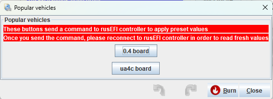

# mega100

[Firmware snapshot](https://rusefi.com/build_server/rusefi_bundle_mega100.zip)

[💲rusEFI store💲](https://www.shop.rusefi.com/shop/p/mega100-f4)

* require injector MOSFEts that can be driven by 3.3v or less. Nothing to worry about: works for most applications: works for most SMD applications, some through-hole too!

{: style="width: 559px; height: 203px;" }

https://github.com/rusefi/fw-custom-mega100-f4/

See also [mega144](mega144) for a version with more powerful MCU

Inspired by https://github.com/pazi88 work!

## Changelog

### Blue

logic buffers are not needed if using modern MOSFETs

### Purple

that one has logic buffers
