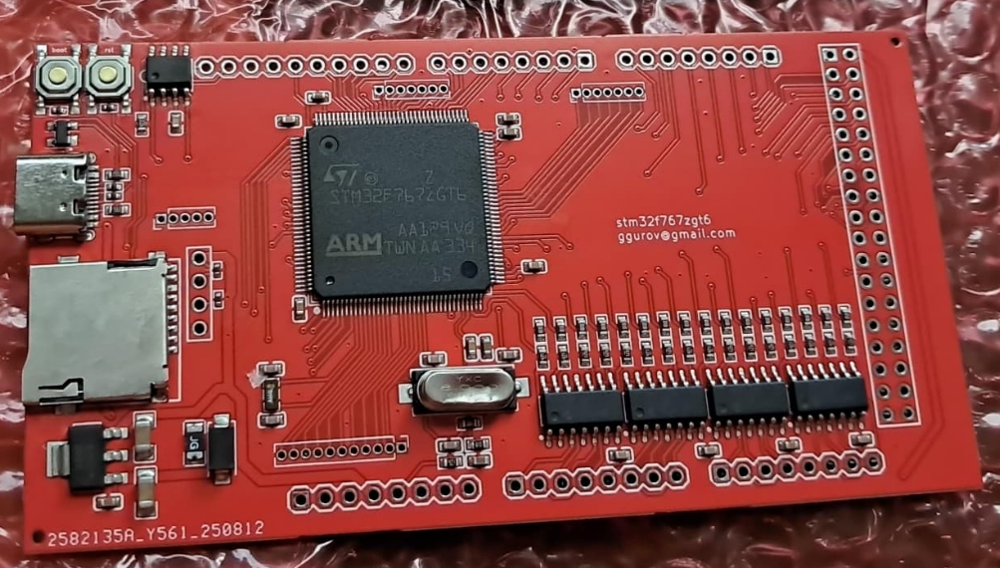

# mega144

Available at [💲rusEFI store💲](https://www.shop.rusefi.com/shop/p/mega144)

🔴 Community support ONLY 🔴

[Firmware snapshot](https://rusefi.com/build_server/rusefi_bundle_mega144-f7.zip)

A way to convert legacy Arduino hardware into rusEFI: mega2560 form factor board compatible with newer 3v MOSFETs

Uses SMT32F7, meaning extra Lua capacity.

{: style="width: 1003px; height: 570px;" }

https://github.com/rusefi/fw-custom-mega144-f7/

Superior sibling of [mega100](mega100) for lqft100 version - extra performance and extra memory for extra Lua scripting.

## MOSFETs

* STP62NS04Z 🔴 not compatible https://www.st.com/resource/en/datasheet/stp62ns04z.pdf

## FAQ

*__Q:__ Is it safe to connect a 0–5v Hall input directly?*  
__A:__ Many stm32 input pins are 5v tolerant.

*__Q:__ International shipping costs more than one board?*  
__A:__ A great reason to order multiple boards and split shipping with your friends! International shipping is annoying for us as well.
