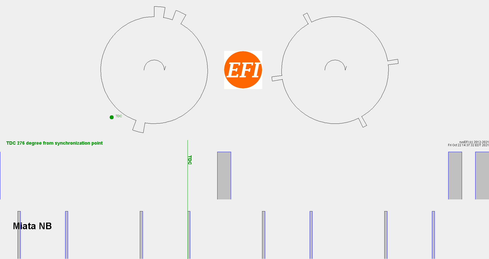

.sal is file extension of Saleae v2 

[Downloads](https://www.saleae.com/downloads/)

First channel is CRANK shaft - see RIGHT 4 tooth per revolution shape

Second channel is CAM shaft (half speed of CRANK shaft) - three tooth per revolution see left

# July dataset

nb2-happy-warmup-idle: good spark plugs, everything good

nb2-idle-without-injector-2: same good spark plugs but injector #2 disabled in software

nb2-suspected-bad-sparkplug-1: injector #2 re-enabled but now spark plug #1 is suspected bad

nb2-sparkplug-1-completely-removed-zero-compression-in-1: now spark plug #1 is removed and injector #1 disabled in software

# September dataset

nb2-normal-revving

nb2-normal-revving-2

nb2-misfire1-every-12-then-every-26
