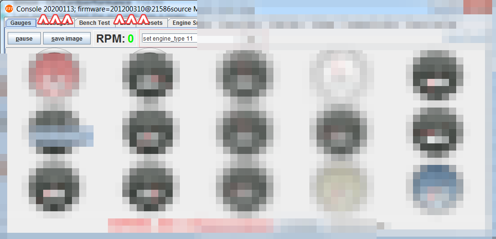

# microRusEFI Manual

Our older fully-featured larger ECU available at [💲rusEFI store💲](https://www.shop.rusefi.com/shop/p/microrusefi-assembled-ecu-development-module)

🔴 Community support ONLY 🔴 [Support Statement](https://github.com/rusefi/rusefi/wiki/Support) 🔴 [Facebook group](https://www.facebook.com/groups/rusEfi) 🔴 [Discord](https://github.com/rusefi/rusefi/wiki/Discord) 🔴

[New to rusEFI start here](Home)

[microRusEFI Release Software](https://github.com/rusefi/rusefi/releases/latest/download/rusefi_bundle_mre_f4.zip)
[microRusEFI Beta Snapshot](https://rusefi.com/build_server/rusefi_bundle_mre_f4.zip)
[Release vs Snapshot](https://github.com/rusefi/rusefi/wiki/Release-Snapshot-Latest-firmware)

## Specs

* [⏩ Interactive Pinout ⏪](https://rusefi.com/docs/pinouts/microrusefi/)
* One of the eight [universal units we offer](Hardware)

## microRusEFI User Documentation

[microRusEFI Hardware](Hardware-microRusEFI)

[microRusEFI wiring](Hardware-microRusEFI-wiring)

[HOWTO program rusEFI using DFU](https://www.youtube.com/watch?v=VdvXYgv_acg)

### HOWTO update microRusEFI Firmware

The best way to update microRusEFI firmware is using rusEFI console "Auto DFU" mode.
In AutoDFU a few things happen once you click the "Update Firmware" button.

0. AutoDFU procedure works if your Windows device manager shows "STMicroelectronics Virtual COM Port" in "Ports" category.

   

1. rusEFI console finds your microRusEFI device serial port and sends it a command to reboot into DFU mode.

   It is expected that microRusEFI would stop blinking the blue light and reboot. It is expected that Virtual COM Port
   would disappear from Device Manager and "STM Device in DFU Mode" device would appear in "Universal Serial Bus controllers" category.

   

2. rusEFI console gives Windows 3 seconds to re-enumerate USB device from Virtual COM Port to DFU Device.

Now the programming begins and the expected output is along the following lines:

```shell
Giving time for USB enumeration...
Executing .\../misc/install\DfuSe/DfuSeCommand.exe -c -d --v --fn ../firmware/deliver\rusefi.dfu
1 Device(s) found : 
Device [1]: STM Device in DFU Mode, having [4] alternate targets 
 Duration: 00:00:01
Target 00: Upgrading - Erase Phase (12)... Duration: 00:00:01
Target 00: Upgrading - Erase Phase (37)... Duration: 00:00:02
Target 00: Upgrading - Erase Phase (49)... Duration: 00:00:02
Target 00: Upgrading - Erase Phase (49)... Duration: 00:00:03
Target 00: Upgrading - Erase Phase (61)... Duration: 00:00:03
Target 00: Upgrading - Erase Phase (61)... Duration: 00:00:04
Target 00: Upgrading - Erase Phase (61)... Duration: 00:00:04
Target 00: Upgrading - Erase Phase (61)... Duration: 00:00:05
Target 00: Upgrading - Erase Phase (74)... Duration: 00:00:05
Target 00: Upgrading - Erase Phase (74)... Duration: 00:00:06
Target 00: Upgrading - Erase Phase (74)... Duration: 00:00:06
Target 00: Upgrading - Erase Phase (86)... Duration: 00:00:07
Target 00: Upgrading - Erase Phase (86)... Duration: 00:00:07
Target 00: Upgrading - Erase Phase (86)... Duration: 00:00:08
Target 00: Upgrading - Erase Phase (86)... Duration: 00:00:08
Target 00: Upgrading - Erase Phase (100)... Duration: 00:00:09
Target 00: Upgrading - Download Phase (0)... Duration: 00:00:09
Target 00: Upgrading - Download Phase (2)... Duration: 00:00:10
Target 00: Upgrading - Download Phase (4)... Duration: 00:00:10
Target 00: Upgrading - Download Phase (6)... Duration: 00:00:11
Target 00: Upgrading - Download Phase (7)... Duration: 00:00:11
Target 00: Upgrading - Download Phase (9)... Duration: 00:00:12
Target 00: Upgrading - Download Phase (11)... Duration: 00:00:12
Target 00: Upgrading - Download Phase (12)... Duration: 00:00:13
Target 00: Upgrading - Download Phase (14)... Duration: 00:00:13
Target 00: Upgrading - Download Phase (16)... Duration: 00:00:14
Target 00: Upgrading - Download Phase (18)... Duration: 00:00:14
Target 00: Upgrading - Download Phase (20)... Duration: 00:00:15
Target 00: Upgrading - Download Phase (22)... Duration: 00:00:15
Target 00: Upgrading - Download Phase (24)... Duration: 00:00:16
Target 00: Upgrading - Download Phase (25)... Duration: 00:00:16
Target 00: Upgrading - Download Phase (27)... Duration: 00:00:17
Target 00: Upgrading - Download Phase (29)... Duration: 00:00:17
Target 00: Upgrading - Download Phase (31)... Duration: 00:00:18
Target 00: Upgrading - Download Phase (33)... Duration: 00:00:18
Target 00: Upgrading - Download Phase (35)... Duration: 00:00:19
Target 00: Upgrading - Download Phase (37)... Duration: 00:00:19
Target 00: Upgrading - Download Phase (38)... Duration: 00:00:20
Target 00: Upgrading - Download Phase (40)... Duration: 00:00:20
Target 00: Upgrading - Download Phase (42)... Duration: 00:00:21
Target 00: Upgrading - Download Phase (45)... Duration: 00:00:21
Target 00: Upgrading - Download Phase (46)... Duration: 00:00:22
Target 00: Upgrading - Download Phase (48)... Duration: 00:00:22
Target 00: Upgrading - Download Phase (50)... Duration: 00:00:23
Target 00: Upgrading - Download Phase (51)... Duration: 00:00:23
Target 00: Upgrading - Download Phase (54)... Duration: 00:00:24
Target 00: Upgrading - Download Phase (56)... Duration: 00:00:24
Target 00: Upgrading - Download Phase (57)... Duration: 00:00:25
Target 00: Upgrading - Download Phase (59)... Duration: 00:00:25
Target 00: Upgrading - Download Phase (61)... Duration: 00:00:26
Target 00: Upgrading - Download Phase (63)... Duration: 00:00:26
Target 00: Upgrading - Download Phase (65)... Duration: 00:00:27
Target 00: Upgrading - Download Phase (67)... Duration: 00:00:27
Target 00: Upgrading - Download Phase (69)... Duration: 00:00:28
Target 00: Upgrading - Download Phase (71)... Duration: 00:00:28
Target 00: Upgrading - Download Phase (73)... Duration: 00:00:29
Target 00: Upgrading - Download Phase (74)... Duration: 00:00:29
Target 00: Upgrading - Download Phase (76)... Duration: 00:00:30
Target 00: Upgrading - Download Phase (78)... Duration: 00:00:30
Target 00: Upgrading - Download Phase (80)... Duration: 00:00:31
Target 00: Upgrading - Download Phase (82)... Duration: 00:00:31
Target 00: Upgrading - Download Phase (84)... Duration: 00:00:32
Target 00: Upgrading - Download Phase (86)... Duration: 00:00:32
Target 00: Upgrading - Download Phase (87)... Duration: 00:00:33
Target 00: Upgrading - Download Phase (90)... Duration: 00:00:34
Target 00: Upgrading - Download Phase (92)... Duration: 00:00:34
Target 00: Upgrading - Download Phase (93)... Duration: 00:00:35
Target 00: Upgrading - Download Phase (95)... Duration: 00:00:35
Target 00: Upgrading - Download Phase (97)... Duration: 00:00:36
Target 00: Upgrading - Download Phase (100)...
Upgrade successful !
 Duration: 00:00:00
Target 00: Uploading (48)... Duration: 00:00:01
Target 00: Uploading (100)...
Verify successful !
Done!
Please power cycle device to exit DFU mode
```

At this point you need to power rusEFI device off/on and new firmware version would be running!

New firmware version could be confirmed in rusEFI window title - both console and firmware versions are displayed there.



## Pin Reuse

AV6, AV8, AV9 and AV10 are either analog inputs or digital outputs depending on hardware configurations. Corresponding resistors on the board are R86, R84, R30 and R86 respectively. See [iBom 0.6.0](https://rusefi.com/docs/ibom/micro_rusEFI_R0.6.0.html)

See https://www.rusefi.com/forum/viewtopic.php?p=47715#p47715
