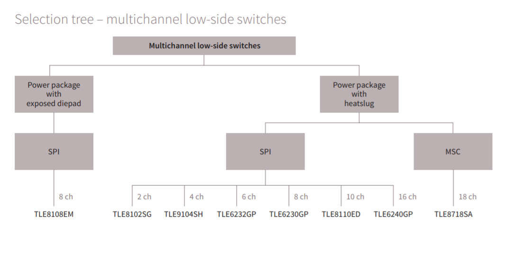

## Low side drivers

| Model | Data Sheet Years | Low side #, >1A & <1A | eBay $ | Notes  |   |
|-------|------|------------|------|---|---|
|       |      |            |   |   |
| TLE6240GP      |  2010    |      8+8      | $3  | used as x4 injector driver by January Yanvar 7.2  |
| TLE8104E      | 2007-2010     |  4+0          | $2.4  |   |
| TLE8110EE      | 2009-2013     |       6+4     | $2.4  |   |
| TLE8080-3EM      | 2012-2016     |  2+2  | n/a | also power supply, for one cylinder motocycle engine  |   |
| TLE8110ED      | 2018     |       6+4     | n/a  |   |
|       |      |            |   |   |
|       |      |            |   |   |
|       |      |            |   |   |

from https://www.infineon.com/dgdl/Infineon-Automotive_Power_SelectionGuide_2019-SG-v01_00-EN.pdf?fileId=5546d4625ee5d4cd015f10996d2d6d44