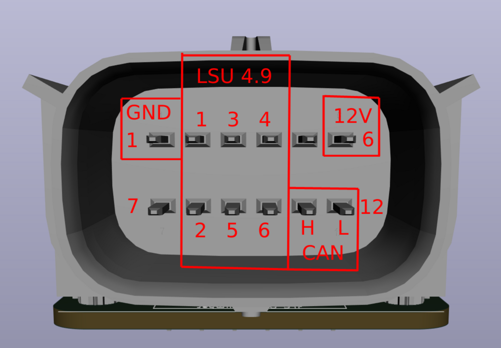

# rusEFI Wideband Controller

*also see [Wide Band Sensors](Wide-Band-Sensors) for general information regarding wideband oxygen sensors*

Base CAN ID: 400 (decimal) = 0x190 (11-bit standard ID). This number increments by 2xN for the N-th controller

Bytes 2-3 are your lambda, scaled by 0.0001. The range is 0.5 to 2.0

[Turbine Research on YouTube](https://www.youtube.com/watch?v=tb7ZC1hpdyI) has created a great video on setting up the rusEFI Wideband Controller.

## FAQ

### Q: I am trying to test on bench but heater is not on?

A: We control heater based on RPM, there is also an option to force heater for bench test.

### Q: dim red LED?

A: We only preheat mildly until engine is running for reasons TBD.

### Q: Why would you need CAN for rusEFI WBO?

A: We control heater based on RPM, also WBO compensate for battery voltage based on CAN info.

## 042 mini WBO Pinout

[connector info](https://rusefi.com/forum/viewtopic.php?p=43705#p43705)

F042 module pinout

| Pin Number | Function | Notes |
|:---:|:---:| ---|
| 1 | Ground | Connect to chassis ground |
| 2 | LSU Ip | Connect to sensor pin 1 |
| 3 | LSU Heater - | Connect to sensor pin 3 |
| 4 | LSU Heater + | Connect to sensor pin 4 |
| 5 | No connection | |
| 6 | 12v Supply | Connect to fuel pump supply or independent relay controlled by ECU |
| 7 | No connection | |
| 8 | LSU Vm | Connect to sensor pin 2 |
| 9 | LSU Rtrim | Connect to sensor pin 5 |
| 10 | LSU Un | Connect to sensor pin 6 |
| 11 | CAN H | CAN bus high |
| 12 | CAN L | CAN bus low |

## LED decoding

| Blue LED | Green LED | Meaning |
|:--------:|:---------:| -----|
| off | fast flash | sensor warming up |
| off | slow flash | Sensor hot, operating normally |
| flashing | off | See error code table below |
| alternating | alternating | Bootloader, see below |

## Firmware Update

rusEFI own wideband module requires one time initial programming. Self contained version of the board relies on custom USB header while module integrated into Hellen requires usage of ST-Link programmer hardware via TC2030 or breakout SWD pins.

initial programming binary at [https://github.com/mck1117/wideband/tree/master/for_rusefi](https://github.com/mck1117/wideband/tree/master/for_rusefi)

At the moment only known to work using stm32cube software not ST Link utility (weird). In case of Hellen 5v via USB is required.

## Error Codes

Green LED off and blue LED flashing indicates an error.  The blue LED will blink a certain number of times, with a 2 second pause, then repeats.

| Blinks | Meaning |
| --- |:--- |
| 3 | Sensor failed to heat up within 30 seconds |
| 4 | Sensor overheated after entering closed loop mode |
| 5 | Sensor unexpectedly cold after entering closed loop mode (bad wiring?) |

### Bootloader LED Codes

| Blink pattern | Meaning |
| --- |:--- |
| alternating slowly | Firmware integrity check failed, please retry firmware upgrade. |
| alternating quickly | Waiting for bootloader entry command, only occurs for ~1 second before launching firmware |

## Setting it up in Tunerstudio

In order for the WBO to work, the following conditions (and maybe more) have to be met:

* Under "Controller" -> "Can Bus Communication" -> "Enable rusEFI Can Broadcast" = "true" must be set
* Under "Sensors" -> "EGO Sensor" -> "Enable Can Wideband" = "true" must be set

There was also an opinion voiced that the board needs to see voltage on the "vBatt ADC Input" pin. This is as yet unconfirmed.

## Source Code

[The hardware and software source code are hosted here.](https://github.com/mck1117/wideband)

## Forum Thread

[Wideband Controller — rusEFI Forum](https://rusefi.com/forum/viewtopic.php?f=4&t=1856)

## Index Selection

[https://github.com/mck1117/wideband/issues/11](https://github.com/mck1117/wideband/issues/11)

## Firmware

[Classic 2023 firmware](https://github.com/andreika-git/hellen-one/tree/master/modules/wbo/fw-releases/Wideband%20f0_module%202023-dec)

[2025 release candidate](https://github.com/rusefi/wideband/tree/prod-2025-05/release/rc)

## Fabrication

* Power board with 5v (WBO module produces it's own 3v from supplied 5v)
* Tag-Connect-TC2030 to upload
* power cycle to confirm green LED blinking

