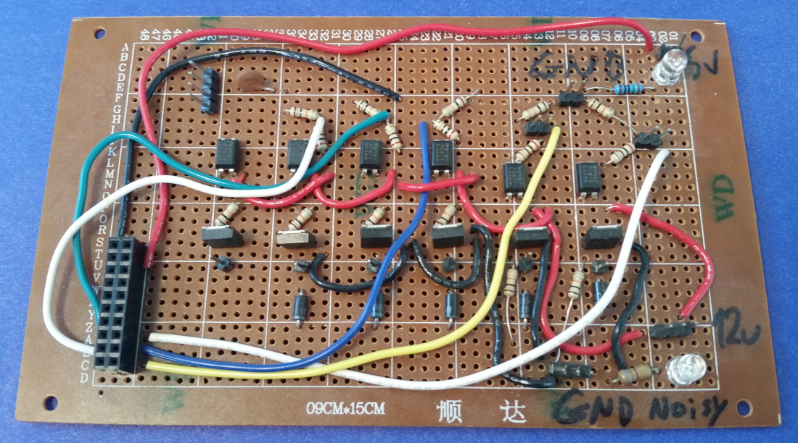

# rusEFI History

## 2021 is the year of Hellen

By the way, Hellen is the son of Deucalion (we have Deucalion board). Deucalion is the son of Prometheus (we have Prometheus board).

Mary Shelley has a novel named "Frankenstein, or The Modern Prometheus" and that's how Hellen name has roots in Frankenstein which was the first rusEFI board :)

## 2014

[Honda Accord came with head gasket pre-blown!](https://honda-tech.com/forums/engine-management-tuning-124/rusefi-diy-ems-build-thread-3216231/)

That's when Nick has joined the party.

[List of Engines Running rusEFI](List-of-Engines-Running-rusEFI/)

## 2013

After 9 months of very questionable hardware a silent co-founder from New England has joined the fun and stuff got real.

[Forum thread on DIYEFI](http://forum.diyefi.org/viewtopic.php?f=4&t=2184)

## 2012

[First test mule Ford Aspire - Forum](https://rusefi.com/forum/viewtopic.php?t=375)

rusEFI has started out of the blue by Andrey.

## 2010

Keith, Hoang and Josh has pulled me into 24 hours of Lemons. That's how I got into cars :) [24 hours of Lemons - Byte Marks Racing 89 Mercury Tracer - Video](https://www.youtube.com/watch?v=nfwEQIIFBlU)
