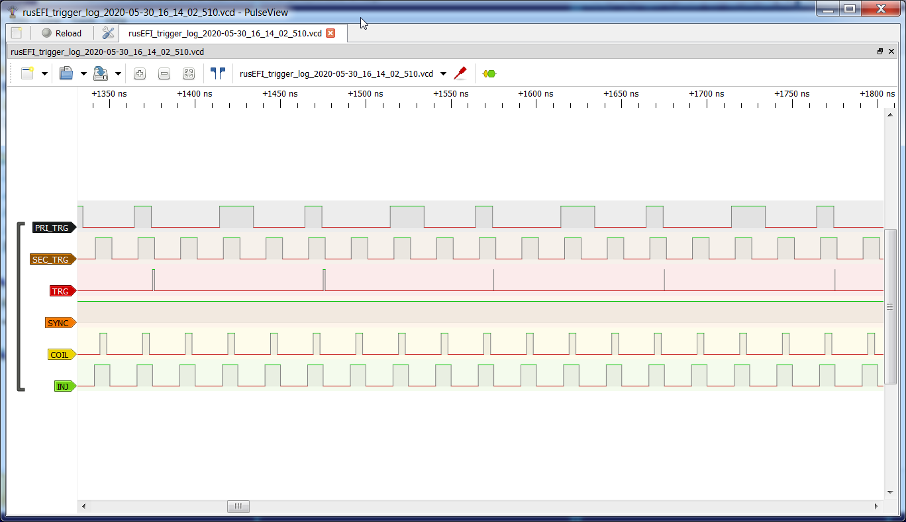

rusEFI console automatically writes gauges .msl log files compatible with [MegaLogViewer](https://www.efianalytics.com/MegaLogViewer/)

rusEFI console automatically writes tooth log .cvs files compatible with TunerStudio High Speed loggers tab.

rusEFI console also automatically writes tooth log .vcd files compatible with [PulseView](https://sigrok.org/wiki/Downloads) and [GTKWave](https://sourceforge.net/projects/gtkwave/files/)

Both tooth logs are written until we have at least 300 RPM for at least 5 seconds.

