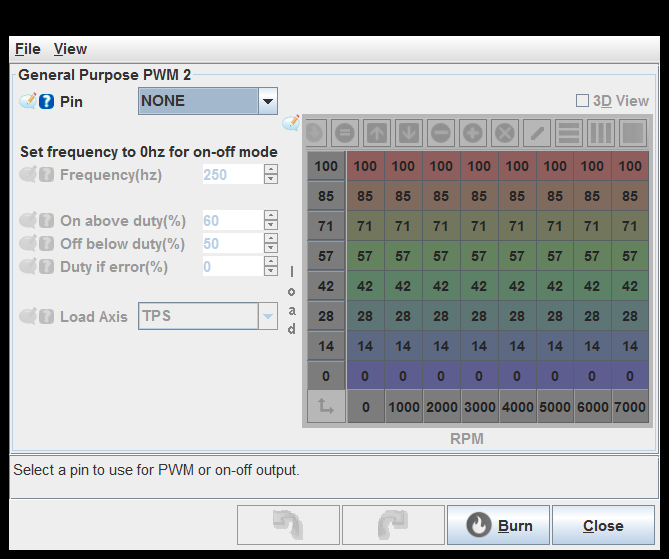
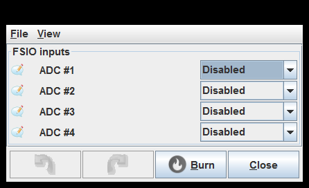
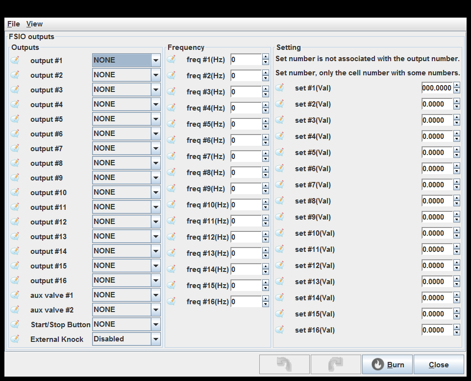
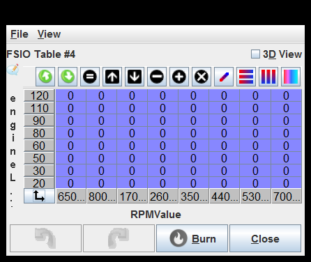
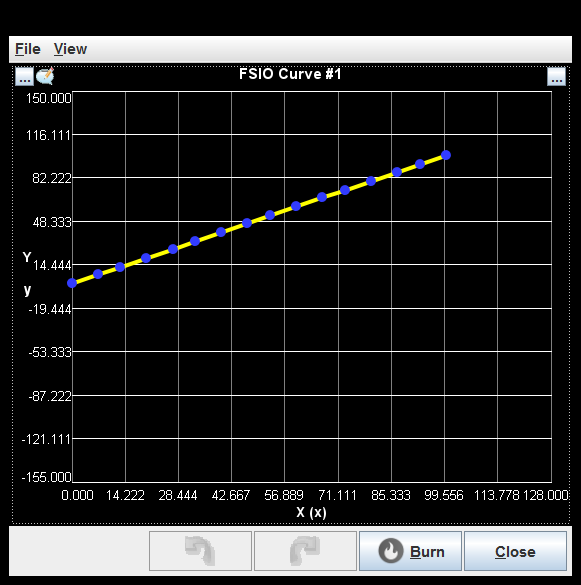

# [rusEFI project](rusEFI-project)

## Advanced

[Boost Control](#boost-control)

[General Purpose PWM 1](#general-purpose-pwm-1)

[General Purpose PWM 2](#general-purpose-pwm-2)

[General Purpose PWM 3](#general-purpose-pwm-3)

[General Purpose PWM 4](#general-purpose-pwm-4)

[FSIO inputs](#fsio-inputs)

[Aux PID](#aux-pid)

[FSIO outputs](#fsio-outputs)

[FSIO Table #1](#fsio-table-1)

[FSIO Table #2](#fsio-table-2)

[FSIO Table #3](#fsio-table-3)

[FSIO Table #4](#fsio-table-4)

[FSIO Formulas](#fsio-formulas)

[FSIO Curve #1](#fsio-curve-1)

[FSIO Curve #2](#fsio-curve-2)

[FSIO Curve #3](#fsio-curve-3)

[FSIO Curve #4](#fsio-curve-4)

### Boost Control

### General Purpose PWM 1

Pin: This implementation produces one pulse per engine cycle. See also dizzySparkOutputPin.

On above duty(%): In on-off mode, turn the output on when the table value is above this duty.

Off below duty(%): In on-off mode, turn the output off when the table value is below this duty.

Duty if error(%): If an error (with a sensor, etc) is detected, this value is used instead of reading from the table.
This should be a safe value for whatever hardware is connected to prevent damage.

Load Axis: Selects the load axis to use for the table.

### General Purpose PWM 2

Pin: This implementation produces one pulse per engine cycle. See also dizzySparkOutputPin.

On above duty(%): In on-off mode, turn the output on when the table value is above this duty.

Off below duty(%): In on-off mode, turn the output off when the table value is below this duty.

Duty if error(%): If an error (with a sensor, etc) is detected, this value is used instead of reading from the table.
This should be a safe value for whatever hardware is connected to prevent damage.

Load Axis: Selects the load axis to use for the table.

### General Purpose PWM 3

Pin: This implementation produces one pulse per engine cycle. See also dizzySparkOutputPin.

On above duty(%): In on-off mode, turn the output on when the table value is above this duty.

Off below duty(%): In on-off mode, turn the output off when the table value is below this duty.

Duty if error(%): If an error (with a sensor, etc) is detected, this value is used instead of reading from the table.
This should be a safe value for whatever hardware is connected to prevent damage.

Load Axis: Selects the load axis to use for the table.

### General Purpose PWM 4

Pin: This implementation produces one pulse per engine cycle. See also dizzySparkOutputPin.

On above duty(%): In on-off mode, turn the output on when the table value is above this duty.

Off below duty(%): In on-off mode, turn the output off when the table value is below this duty.

Duty if error(%): If an error (with a sensor, etc) is detected, this value is used instead of reading from the table.
This should be a safe value for whatever hardware is connected to prevent damage.

Load Axis: Selects the load axis to use for the table.

### FSIO inputs

### Aux PID

Detailed status in console: Print details into rusEfi console

### FSIO outputs

### FSIO Table #1

### FSIO Table #2

### FSIO Table #3

### FSIO Table #4

### FSIO Formulas

use FSIO #16 for timing adjustment: See fsioTimingAdjustment

### FSIO Curve #1

### FSIO Curve #2

### FSIO Curve #3

### FSIO Curve #4

generated by class com.rusefi.MdGenerator on Fri May 01 15:24:28 EDT 2020
