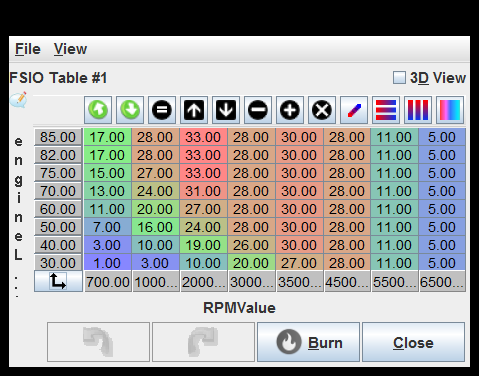
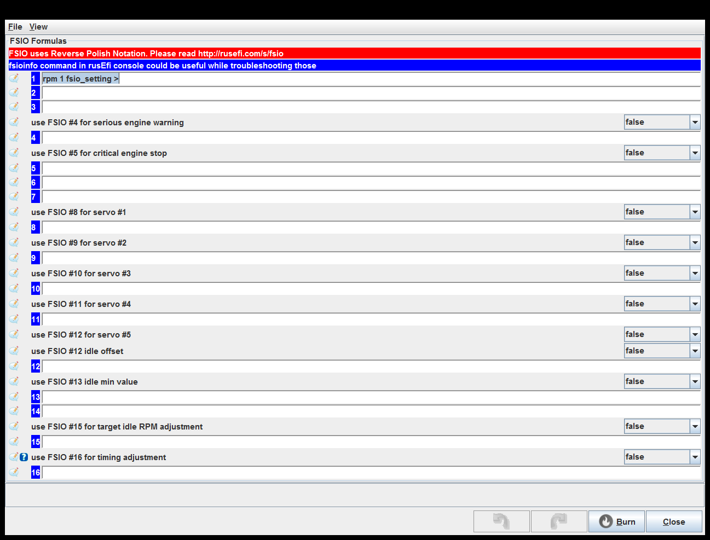

# [rusEFI project](rusEFI-project)
## Advanced
[Boost Control](#Boost-Control)

[General Purpose PWM 1](#General-Purpose-PWM-1)

[General Purpose PWM 2](#General-Purpose-PWM-2)

[General Purpose PWM 3](#General-Purpose-PWM-3)

[General Purpose PWM 4](#General-Purpose-PWM-4)

[FSIO inputs](#FSIO-inputs)

[Aux PID](#Aux-PID)

[FSIO outputs](#FSIO-outputs)

[FSIO Table #1](#FSIO-Table-#1)

[FSIO Table #2](#FSIO-Table-#2)

[FSIO Table #3](#FSIO-Table-#3)

[FSIO Table #4](#FSIO-Table-#4)

[FSIO Formulas](#FSIO-Formulas)

[FSIO Curve #1](#FSIO-Curve-#1)

[FSIO Curve #2](#FSIO-Curve-#2)

[FSIO Curve #3](#FSIO-Curve-#3)

[FSIO Curve #4](#FSIO-Curve-#4)

### Boost Control

### General Purpose PWM 1

Pin: This implementation produces one pulse per engine cycle. See also dizzySparkOutputPin.

On above duty(%): In on-off mode, turn the output on when the table value is above this duty.

Off below duty(%): In on-off mode, turn the output off when the table value is below this duty.

Duty if error(%): If an error (with a sensor, etc) is detected, this value is used instead of reading from the table.
This should be a safe value for whatever hardware is connected to prevent damage.

Load Axis: Selects the load axis to use for the table.

### General Purpose PWM 2

Pin: This implementation produces one pulse per engine cycle. See also dizzySparkOutputPin.

On above duty(%): In on-off mode, turn the output on when the table value is above this duty.

Off below duty(%): In on-off mode, turn the output off when the table value is below this duty.

Duty if error(%): If an error (with a sensor, etc) is detected, this value is used instead of reading from the table.
This should be a safe value for whatever hardware is connected to prevent damage.

Load Axis: Selects the load axis to use for the table.

### General Purpose PWM 3

Pin: This implementation produces one pulse per engine cycle. See also dizzySparkOutputPin.

On above duty(%): In on-off mode, turn the output on when the table value is above this duty.

Off below duty(%): In on-off mode, turn the output off when the table value is below this duty.

Duty if error(%): If an error (with a sensor, etc) is detected, this value is used instead of reading from the table.
This should be a safe value for whatever hardware is connected to prevent damage.

Load Axis: Selects the load axis to use for the table.

### General Purpose PWM 4

Pin: This implementation produces one pulse per engine cycle. See also dizzySparkOutputPin.

On above duty(%): In on-off mode, turn the output on when the table value is above this duty.

Off below duty(%): In on-off mode, turn the output off when the table value is below this duty.

Duty if error(%): If an error (with a sensor, etc) is detected, this value is used instead of reading from the table.
This should be a safe value for whatever hardware is connected to prevent damage.

Load Axis: Selects the load axis to use for the table.

### FSIO inputs

### Aux PID

Detailed status in console: Print details into rusEfi console

### FSIO outputs

### FSIO Table #1

### FSIO Table #2

### FSIO Table #3

### FSIO Table #4

### FSIO Formulas

use FSIO #16 for timing adjustment: See fsioTimingAdjustment

### FSIO Curve #1

### FSIO Curve #2

### FSIO Curve #3

### FSIO Curve #4

generated by class com.rusefi.MdGenerator on Fri May 01 14:57:55 EDT 2020
