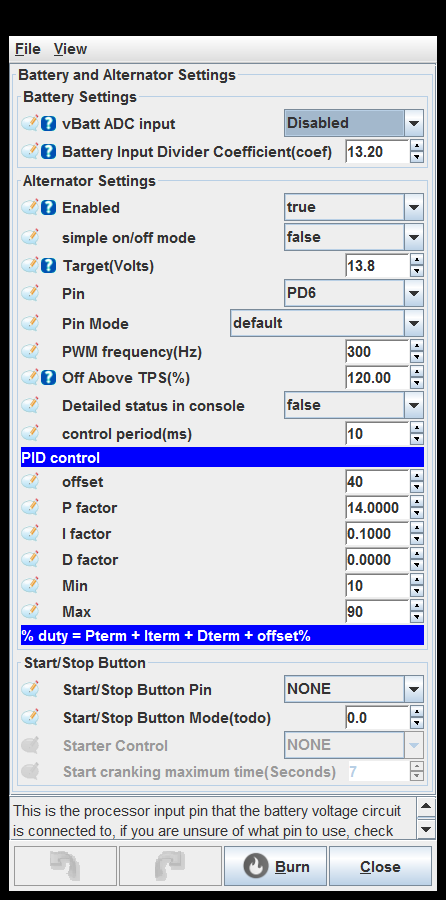
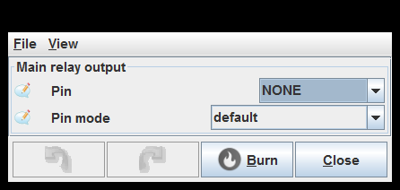
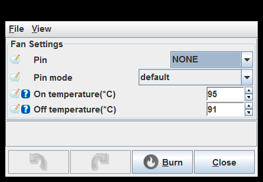
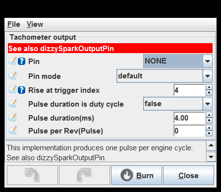
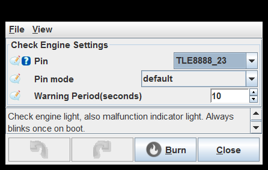

# [rusEFI project](rusEFI-project)
## Base Engine
[Base Engine Settings](#Base-Engine-Settings)

[Trigger](#Trigger)

[Battery and Alternator Settings](#Battery-and-Alternator-Settings)

[Main relay output](#Main-relay-output)

[Starter relay output](#Starter-relay-output)

[Fuel pump  rail](#Fuel-pump--rail)

[Fan Settings](#Fan-Settings)

[Tachometer output](#Tachometer-output)

[Check Engine Settings](#Check-Engine-Settings)

[Status LEDs](#Status-LEDs)

### Base Engine Settings

Fuel strategy: This setting controls which fuel quantity control algorithm is used.
See also useTPSAdvanceTable
set algorithm X

Debug mode: See http://rusefi.com/s/debugmode

set debug_mode X

Fuel strategy: This setting controls which fuel quantity control algorithm is used.
See also useTPSAdvanceTable
set algorithm X

Debug mode: See http://rusefi.com/s/debugmode

set debug_mode X

Fuel strategy: This setting controls which fuel quantity control algorithm is used.
See also useTPSAdvanceTable
set algorithm X

Debug mode: See http://rusefi.com/s/debugmode

set debug_mode X

### Trigger

Operation mode / speed: 'Some triggers could be mounted differently. Most well-known triggers imply specific sensor setup. 4 stroke with symmetrical crank' is a pretty special case for example on Miata NB2
See engineCycle
set operation_mode X

use only rising edge: VR sensors are only precise on rising front
enable trigger_only_front

VVT use rise front: Use rise or fall signal front

print verbose sync details to console: enable trigger_details

Do not print messages in case of sync error: Sometimes we have a performance issue while printing error

Operation mode / speed: 'Some triggers could be mounted differently. Most well-known triggers imply specific sensor setup. 4 stroke with symmetrical crank' is a pretty special case for example on Miata NB2
See engineCycle
set operation_mode X

use only rising edge: VR sensors are only precise on rising front
enable trigger_only_front

VVT use rise front: Use rise or fall signal front

print verbose sync details to console: enable trigger_details

Do not print messages in case of sync error: Sometimes we have a performance issue while printing error

Operation mode / speed: 'Some triggers could be mounted differently. Most well-known triggers imply specific sensor setup. 4 stroke with symmetrical crank' is a pretty special case for example on Miata NB2
See engineCycle
set operation_mode X

use only rising edge: VR sensors are only precise on rising front
enable trigger_only_front

VVT use rise front: Use rise or fall signal front

print verbose sync details to console: enable trigger_details

Do not print messages in case of sync error: Sometimes we have a performance issue while printing error

### Battery and Alternator Settings

vBatt ADC input: This is the processor input pin that the battery voltage circuit is connected to, if you are unsure of what pin to use, check the schematic that corresponds to your PCB.

Pin: This implementation produces one pulse per engine cycle. See also dizzySparkOutputPin.

Off Above TPS(%): Turns off alternator output above specified TPS, enabling this reduced parasitic drag on the engine at full load.

Detailed status in console: Print details into rusEfi console

vBatt ADC input: This is the processor input pin that the battery voltage circuit is connected to, if you are unsure of what pin to use, check the schematic that corresponds to your PCB.

Pin: This implementation produces one pulse per engine cycle. See also dizzySparkOutputPin.

Off Above TPS(%): Turns off alternator output above specified TPS, enabling this reduced parasitic drag on the engine at full load.

Detailed status in console: Print details into rusEfi console

vBatt ADC input: This is the processor input pin that the battery voltage circuit is connected to, if you are unsure of what pin to use, check the schematic that corresponds to your PCB.

Pin: This implementation produces one pulse per engine cycle. See also dizzySparkOutputPin.

Off Above TPS(%): Turns off alternator output above specified TPS, enabling this reduced parasitic drag on the engine at full load.

Detailed status in console: Print details into rusEfi console

### Main relay output

Pin: This implementation produces one pulse per engine cycle. See also dizzySparkOutputPin.

### Starter relay output

Pin: This implementation produces one pulse per engine cycle. See also dizzySparkOutputPin.

### Fuel pump  rail

Pin: This implementation produces one pulse per engine cycle. See also dizzySparkOutputPin.

Absolute Fuel Pressure: If your fuel regulator does not have vacuum line

Pin: This implementation produces one pulse per engine cycle. See also dizzySparkOutputPin.

Absolute Fuel Pressure: If your fuel regulator does not have vacuum line

Pin: This implementation produces one pulse per engine cycle. See also dizzySparkOutputPin.

Absolute Fuel Pressure: If your fuel regulator does not have vacuum line

### Fan Settings

Pin: This implementation produces one pulse per engine cycle. See also dizzySparkOutputPin.

### Tachometer output

Pin: This implementation produces one pulse per engine cycle. See also dizzySparkOutputPin.

Rise at trigger index: Trigger cycle index at which we start tach pulse (performance consideration)

### Check Engine Settings

Pin: This implementation produces one pulse per engine cycle. See also dizzySparkOutputPin.

### Status LEDs

Trigger error LED: This pin is used for debugging - snap a logic analyzer on it and see if it's ever high

generated by class com.rusefi.MdGenerator on Fri May 01 15:08:34 EDT 2020
