# [rusEFI project](rusEFI-project)
## Controller
[ECU stimulator](#ECU-stimulator)

[Datalogging Settings](#Datalogging-Settings)

[Bench Test & Commands](#Bench-Test-&-Commands)

[Popular vehicles](#Popular-vehicles)

[LCD screen](#LCD-screen)

[Joystick](#Joystick)

[SPI settings](#SPI-settings)

[rusEfi Console Settings](#rusEfi-Console-Settings)

[Connection](#Connection)

[TLE8888](#TLE8888)

[All Pins 1/3](#All-Pins-1/3)

[All Pins 2/3](#All-Pins-2/3)

[All Pins 3/3](#All-Pins-3/3)

[Experimental/Broken](#Experimental/Broken)

[Multispark](#Multispark)

[GDI Dreams](#GDI-Dreams)

[HIP9011 Settings (knock decoder)](#HIP9011-Settings-(knock-decoder))

[Electronic Throttle Body (beta)](#Electronic-Throttle-Body-(beta))

[Electronic TB Bias Curve](#Electronic-TB-Bias-Curve)

[ETB Pedal to TPS](#ETB-Pedal-to-TPS)

[Launch Control Settings NOT WORKING](#Launch-Control-Settings-NOT-WORKING)

[Rolling Launch Settings NOT WORKING](#Rolling-Launch-Settings-NOT-WORKING)

[AntiLag Settings NOT WORKING](#AntiLag-Settings-NOT-WORKING)

### ECU stimulator
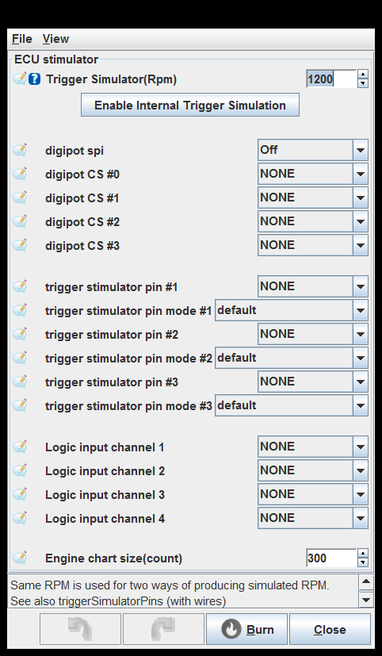

### Datalogging Settings
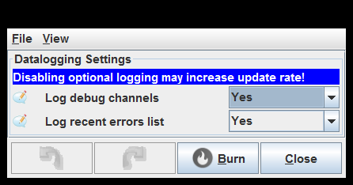

### Bench Test & Commands
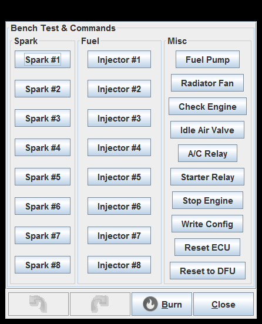

### Popular vehicles
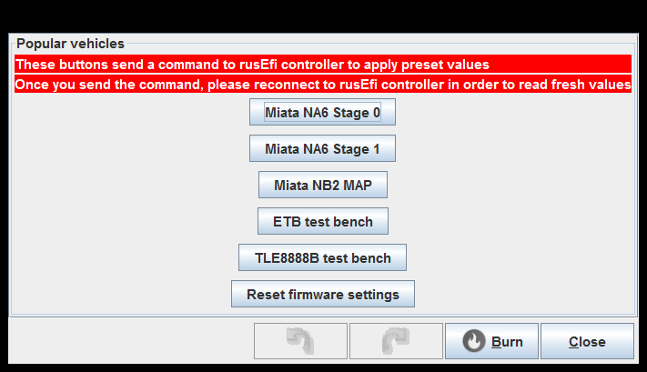

### LCD screen
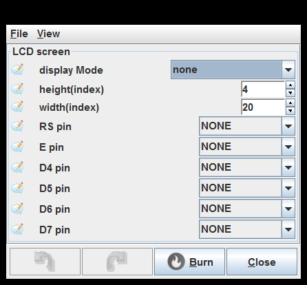

### Joystick
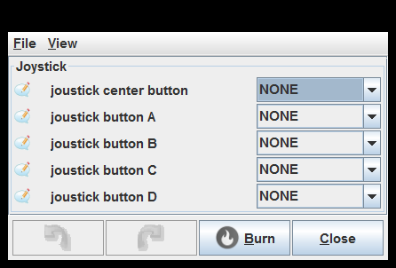

### SPI settings
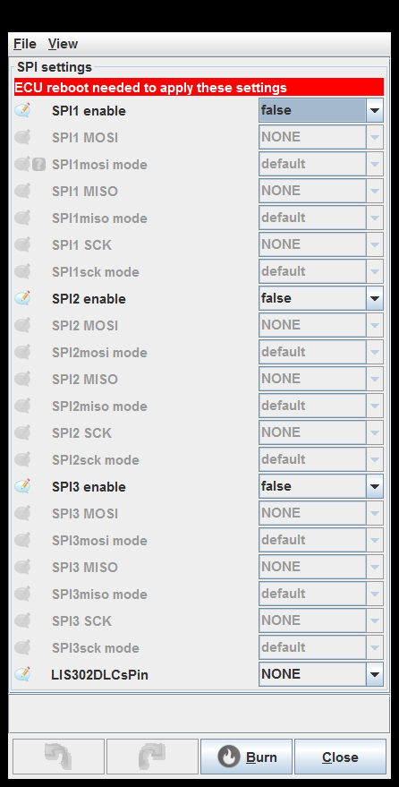

SPI1mosi mode: Modes count be used for 3v<>5v integration using pull-ups/pull-downs etc.

### rusEfi Console Settings
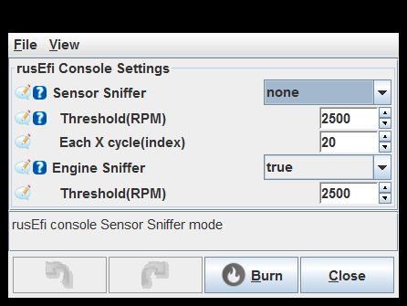

Sensor Sniffer: rusEfi console Sensor Sniffer mode

Engine Sniffer: This options enables data for 'engine sniffer' tab in console, which comes at some CPU price

### Connection
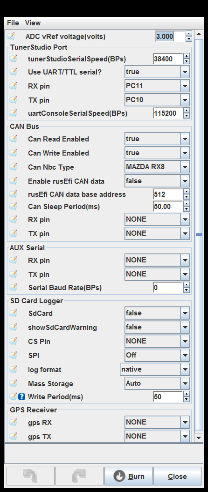

### TLE8888
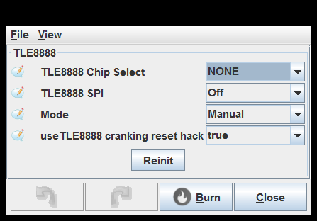

### All Pins 1/3
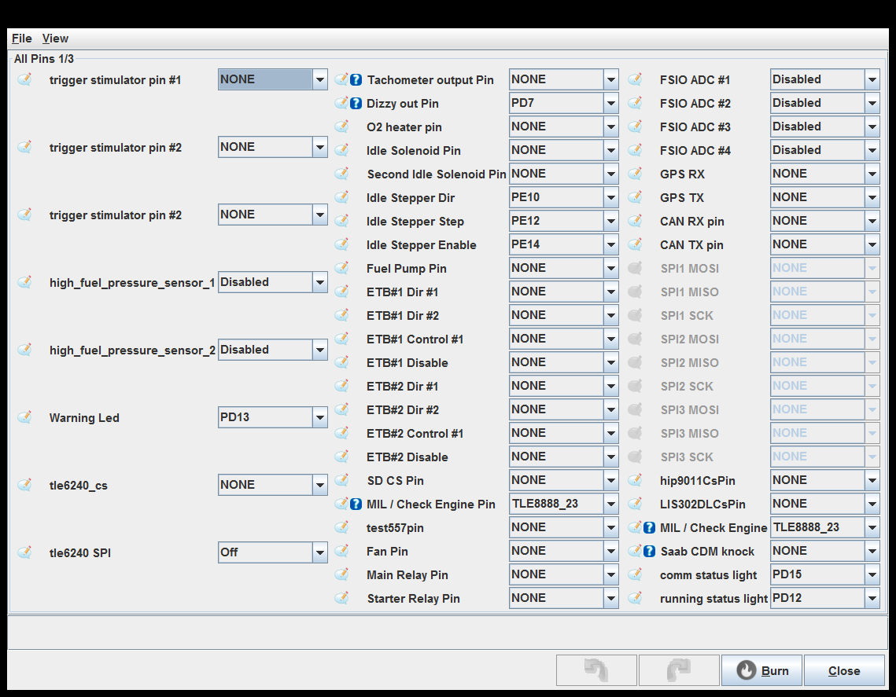

Dizzy out Pin: This implementation makes a pulse every time one of the coils is charged, using coil dwell for pulse width. See also tachOutputPin

Saab CDM knock: Saab Combustion Detection Module knock signal input pin
also known as Saab Ion Sensing Module

### All Pins 2/3
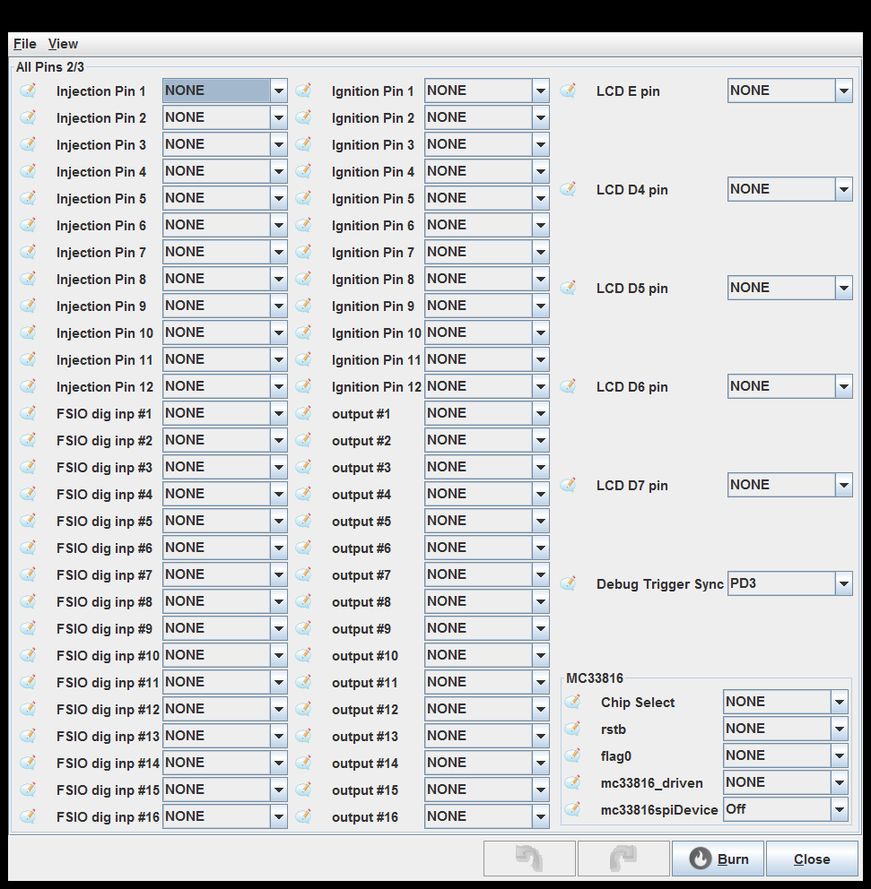

### All Pins 3/3
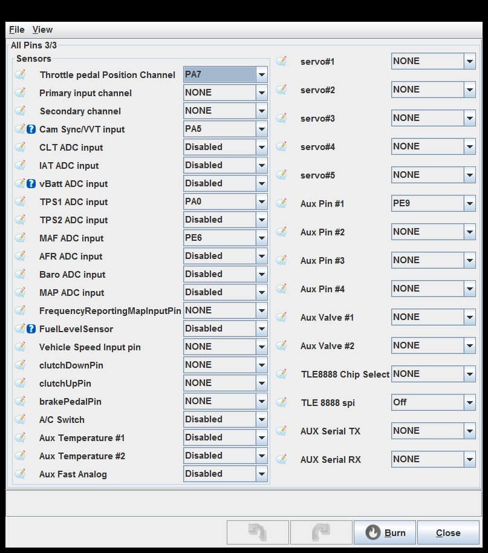

Cam Sync/VVT input: Camshaft input could be used either just for engine phase detection if your trigger shape does not include cam sensor as 'primary' channel, or it could be used for Variable Valve timing on one of the camshafts.
TODO #660

vBatt ADC input: This is the processor input pin that the battery voltage circuit is connected to, if you are unsure of what pin to use, check the schematic that corresponds to your PCB.

FuelLevelSensor: This is the processor pin that your fuel level sensor in connected to. This is a non standard input so will need to be user defined.

### Experimental/Broken
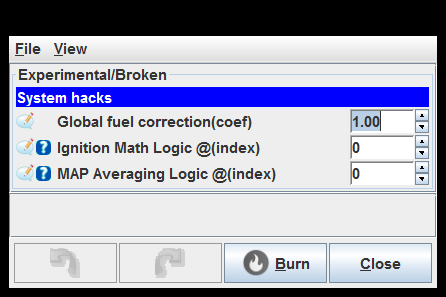

### Multispark
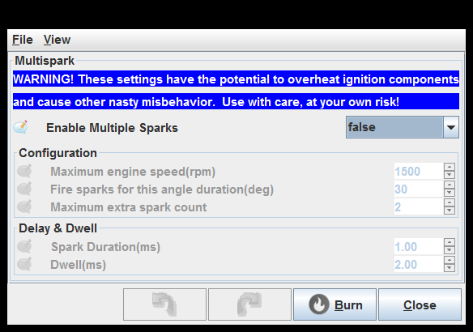

### GDI Dreams
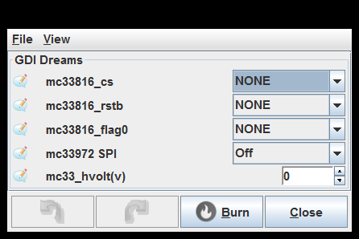

### HIP9011 Settings (knock decoder)
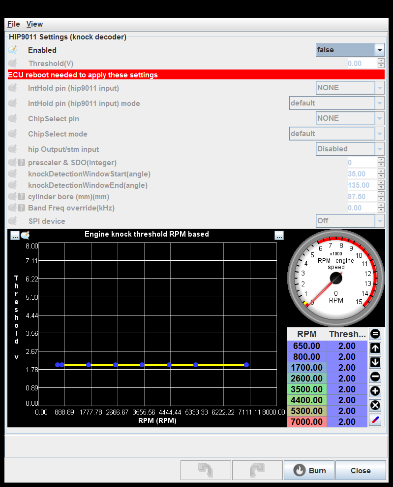

### Electronic Throttle Body (beta)
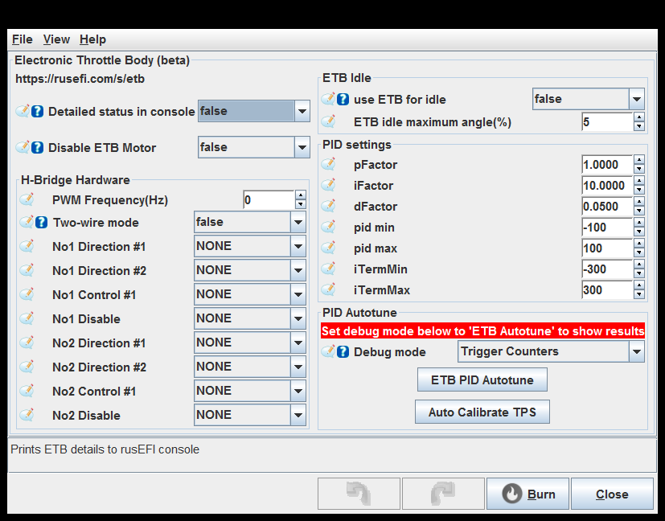

Detailed status in console: Print details into rusEfi console

Disable ETB Motor: Disable the electronic throttle motor for testing.
This mode is for testing ETB position sensors, etc without actually driving the throttle.

Two-wire mode: TLE7209 uses two-wire mode. TLE9201 and VNH2SP30 do NOT use two wire mode.

Two-wire mode: TLE7209 uses two-wire mode. TLE9201 and VNH2SP30 do NOT use two wire mode.

Two-wire mode: TLE7209 uses two-wire mode. TLE9201 and VNH2SP30 do NOT use two wire mode.

use ETB for idle: This setting allows the ETB to act as the idle air control valve and move to regulate the airflow at idle.

Debug mode: See http://rusefi.com/s/debugmode

set debug_mode X

use ETB for idle: This setting allows the ETB to act as the idle air control valve and move to regulate the airflow at idle.

Debug mode: See http://rusefi.com/s/debugmode

set debug_mode X

use ETB for idle: This setting allows the ETB to act as the idle air control valve and move to regulate the airflow at idle.

Debug mode: See http://rusefi.com/s/debugmode

set debug_mode X

### Electronic TB Bias Curve
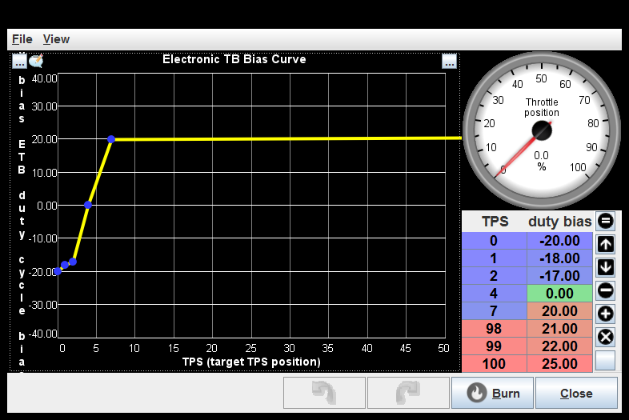

### ETB Pedal to TPS
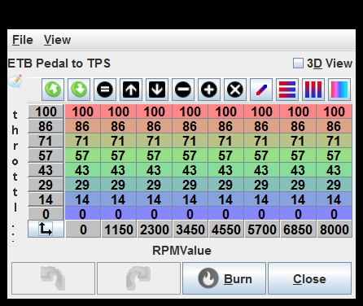

### Launch Control Settings NOT WORKING
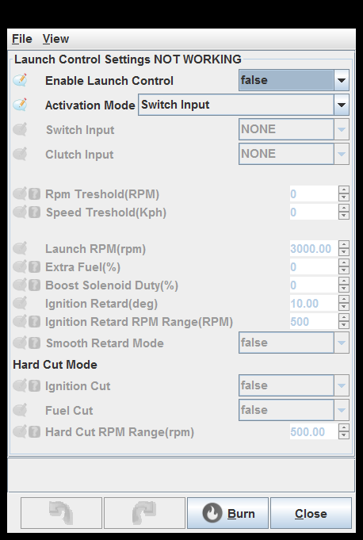

Extra Fuel(%): Extra Fuel Added

Boost Solenoid Duty(%): Duty Cycle for the Boost Solenoid

Smooth Retard Mode: Interpolates the Ignition Retard from 0 to 100% within the RPM Range

Ignition Cut: This is the Cut Mode normally used

### Rolling Launch Settings NOT WORKING
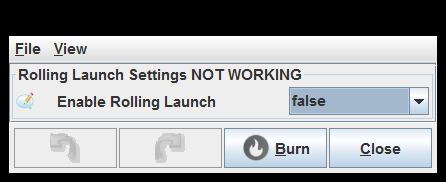

### AntiLag Settings NOT WORKING
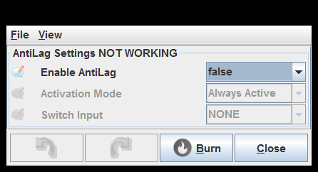

generated by class com.rusefi.MdGenerator on Fri May 01 15:08:34 EDT 2020
