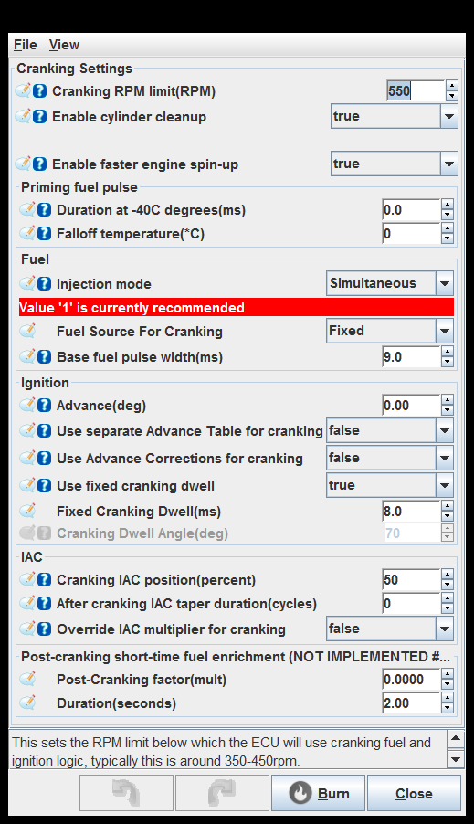
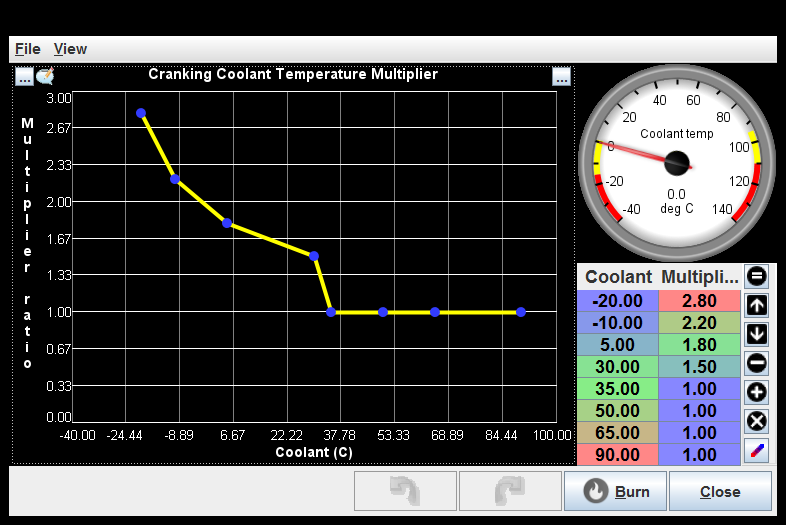

# [rusEFI project](rusEFI-project)

## Cranking

[Cranking Settings](#cranking-settings)

[Cranking Coolant Temperature Multiplier](#cranking-coolant-temperature-multiplier)

[Cranking Duration Multiplier](#cranking-duration-multiplier)

[Cranking TPS Multiplier](#cranking-tps-multiplier)

### Cranking Settings

Enable cylinder cleanup: When enabled if TPS is held above 95% no fuel is injected while cranking to clear excess fuel from the cylinders.

Enable faster engine spin-up: Smarter cranking logic.
See also startOfCrankingPrimingPulse

Use separate Advance Table for cranking: This activates a separate advance table for cranking conditions, this allows cranking advance to be RPM dependant.

Use Advance Corrections for cranking: This enables the various ignition corrections during cranking (IAT, CLT, FSIO and PID idle).

Use fixed cranking dwell: If set to true, will use the specified duration for cranking dwell. If set to false, will use the specified dwell angle. Unless you have a really good reason to, leave this set to true to use duration mode.

Use separate Advance Table for cranking: This activates a separate advance table for cranking conditions, this allows cranking advance to be RPM dependant.

Use Advance Corrections for cranking: This enables the various ignition corrections during cranking (IAT, CLT, FSIO and PID idle).

Use fixed cranking dwell: If set to true, will use the specified duration for cranking dwell. If set to false, will use the specified dwell angle. Unless you have a really good reason to, leave this set to true to use duration mode.

Use separate Advance Table for cranking: This activates a separate advance table for cranking conditions, this allows cranking advance to be RPM dependant.

Use Advance Corrections for cranking: This enables the various ignition corrections during cranking (IAT, CLT, FSIO and PID idle).

Use fixed cranking dwell: If set to true, will use the specified duration for cranking dwell. If set to false, will use the specified dwell angle. Unless you have a really good reason to, leave this set to true to use duration mode.

### Cranking Coolant Temperature Multiplier

### Cranking Duration Multiplier

### Cranking TPS Multiplier

generated by class com.rusefi.MdGenerator on Fri May 01 15:24:28 EDT 2020
