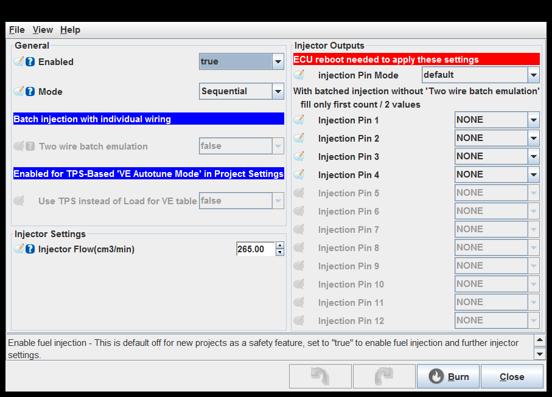
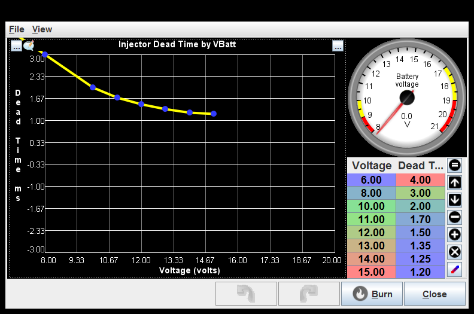
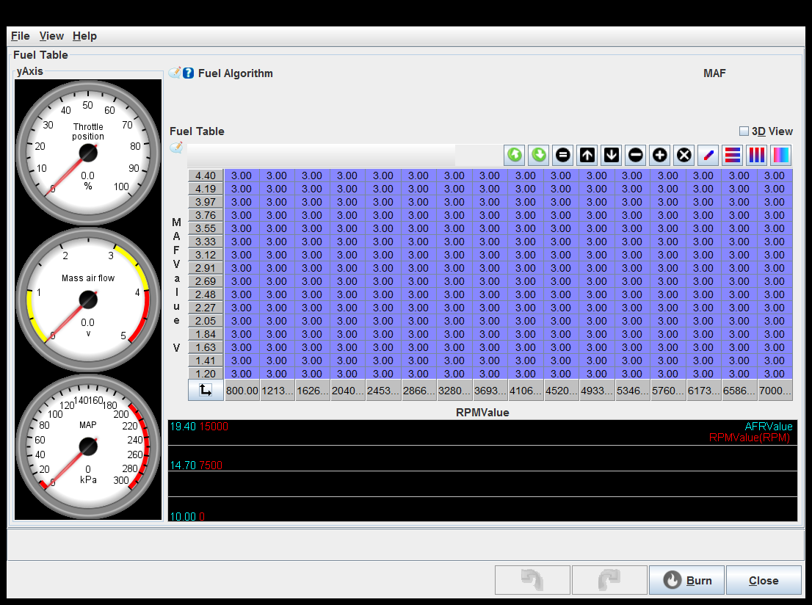
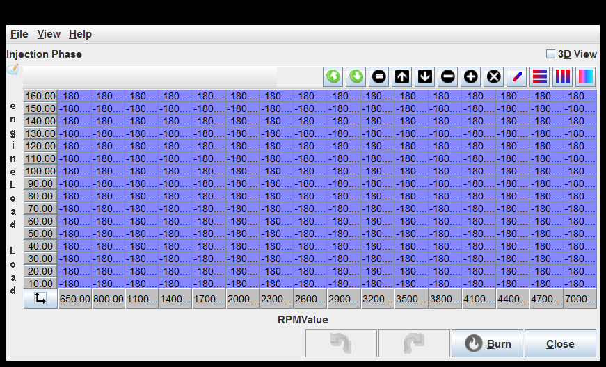
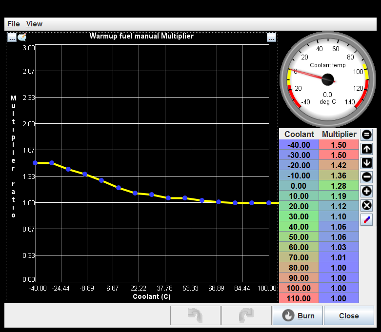
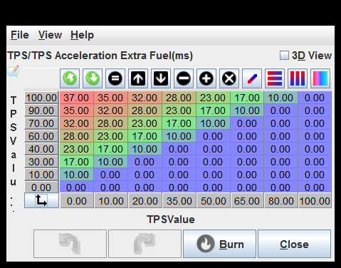

# [rusEFI project](rusEFI-project)

## Fuel

[Injection settings](#injection-settings)

[Injector dead time](#injector-dead-time)

[Fuel short-term closed-loop correction](#fuel-short-term-closed-loop-correction)

[Coasting Fuel Cutoff Settings](#coasting-fuel-cutoff-settings)

[Fuel Table](#fuel-table)

[Injection Phase](#injection-phase)

[Warmup fuel manual Multiplier](#warmup-fuel-manual-multiplier)

[Intake air temperature fuel Multiplier](#intake-air-temperature-fuel-multiplier)

[tCharge Settings](#tcharge-settings)

[Acceleration or Deceleration Enrichment](#acceleration-or-deceleration-enrichment)

[TPS Acceleration Extra Fuel](#tps-acceleration-extra-fuel)

[Engine Load Acceleration Enrichment Taper](#engine-load-acceleration-enrichment-taper)

### Injection settings

Two wire batch emulation: This is needed if your coils are individually wired and you wish to use batch injection.
enable two_wire_batch_injection

Two wire batch emulation: This is needed if your coils are individually wired and you wish to use batch injection.
enable two_wire_batch_injection

Two wire batch emulation: This is needed if your coils are individually wired and you wish to use batch injection.
enable two_wire_batch_injection

### Injector dead time

### Fuel short-term closed-loop correction

### Coasting Fuel Cutoff Settings

Enable Coasting Fuel Cutoff: This setting disables fuel injection while the engine is in overrun, this is useful as a fuel saving measure and to prevent back firing.

TPS Deactivation Threshold(%): percent between 0 and 100 below which the fuel cut is deactivated, this helps low speed drivability.

### Fuel Table

### Injection Phase

### Warmup fuel manual Multiplier

### Intake air temperature fuel Multiplier

### tCharge Settings

### Acceleration or Deceleration Enrichment

### TPS Acceleration Extra Fuel

### Engine Load Acceleration Enrichment Taper

generated by class com.rusefi.MdGenerator on Fri May 01 15:24:28 EDT 2020
