# [rusEFI-project](rusEFI project)
## Fuel
[Injection settings](#Injection-settings)

[Injector dead time](#Injector-dead-time)

[Fuel short-term closed-loop correction](#Fuel-short-term-closed-loop-correction)

[Coasting Fuel Cutoff Settings](#Coasting-Fuel-Cutoff-Settings)

[Fuel Table](#Fuel-Table)

[Injection Phase](#Injection-Phase)

[Warmup fuel manual Multiplier](#Warmup-fuel-manual-Multiplier)

[Intake air temperature fuel Multiplier](#Intake-air-temperature-fuel-Multiplier)

[tCharge Settings](#tCharge-Settings)

[Accel/Decel Enrichment](#Accel/Decel-Enrichment)

[TPS/TPS Acceleration Extra Fuel(ms)](#TPS/TPS-Acceleration-Extra-Fuel(ms))

[Engine Load Acceleration Enrichment Taper](#Engine-Load-Acceleration-Enrichment-Taper)

### Injection settings
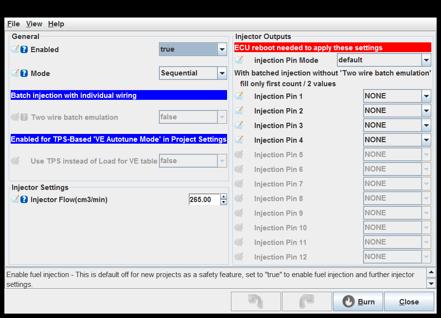

Two wire batch emulation: This is needed if your coils are individually wired and you wish to use batch injection.
enable two_wire_batch_injection

Two wire batch emulation: This is needed if your coils are individually wired and you wish to use batch injection.
enable two_wire_batch_injection

Two wire batch emulation: This is needed if your coils are individually wired and you wish to use batch injection.
enable two_wire_batch_injection

### Injector dead time
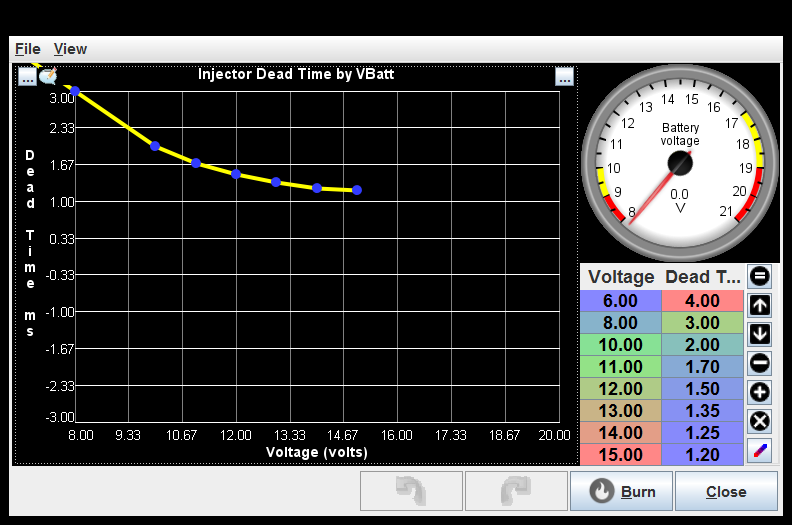

### Fuel short-term closed-loop correction
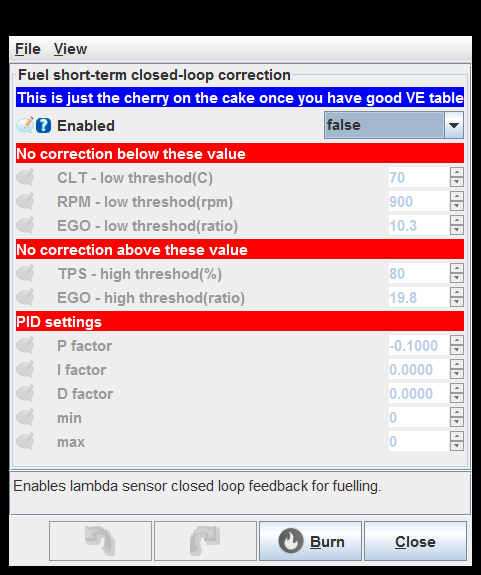

### Coasting Fuel Cutoff Settings
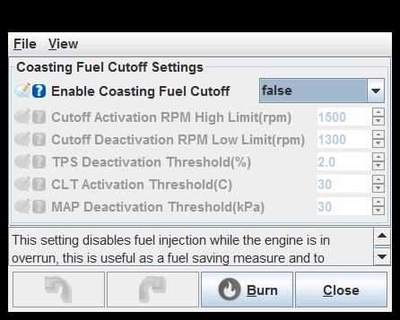

Enable Coasting Fuel Cutoff: This setting disables fuel injection while the engine is in overrun, this is useful as a fuel saving measure and to prevent back firing.

TPS Deactivation Threshold(%): percent between 0 and 100 below which the fuel cut is deactivated, this helps low speed drivability.

### Fuel Table
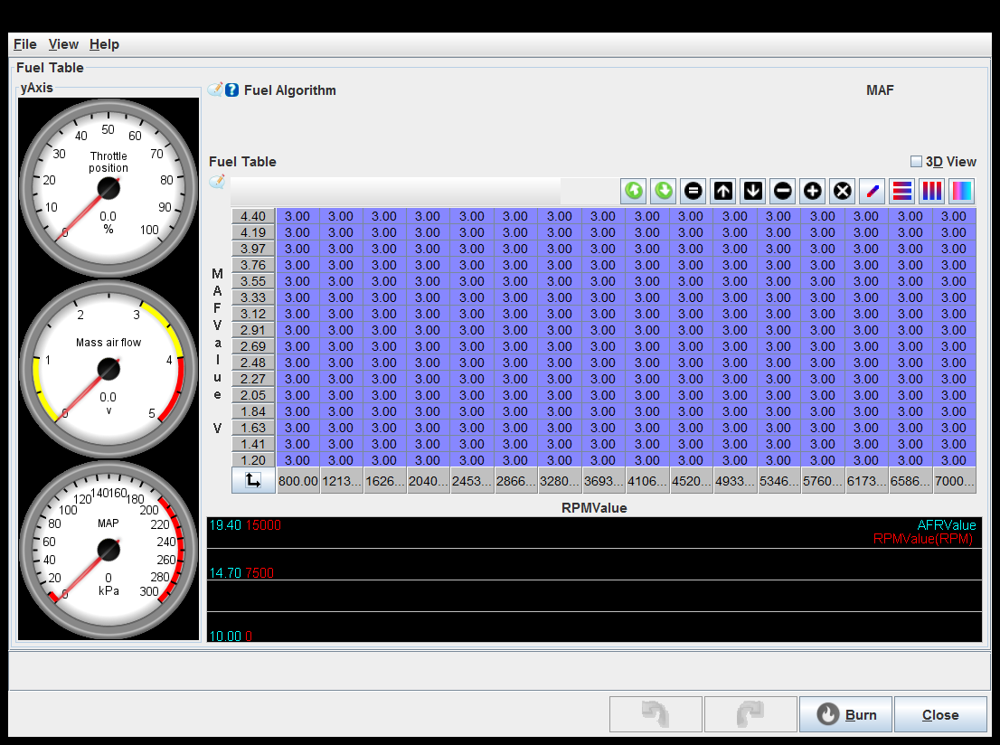

### Injection Phase
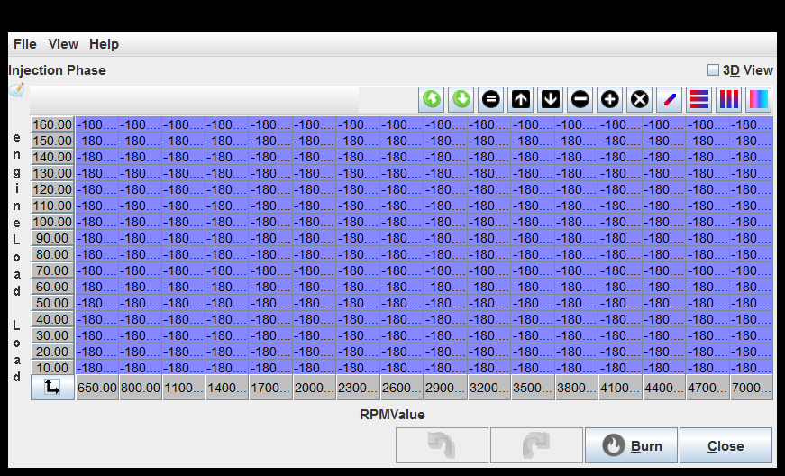

### Warmup fuel manual Multiplier
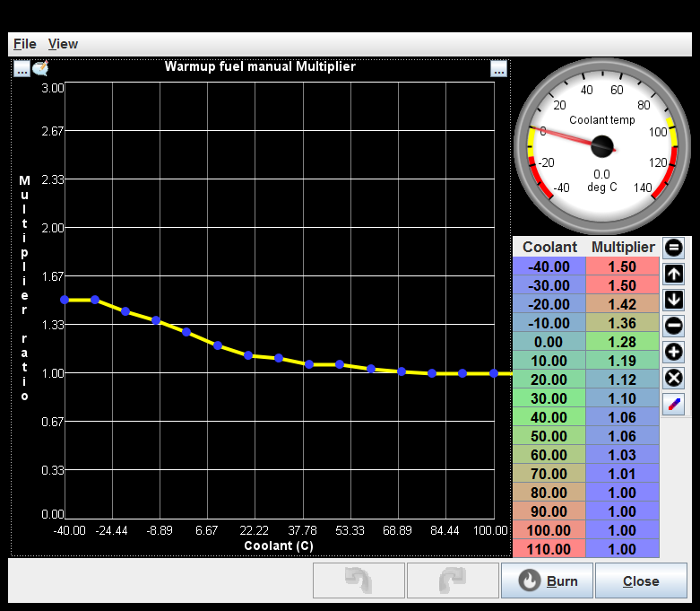

### Intake air temperature fuel Multiplier
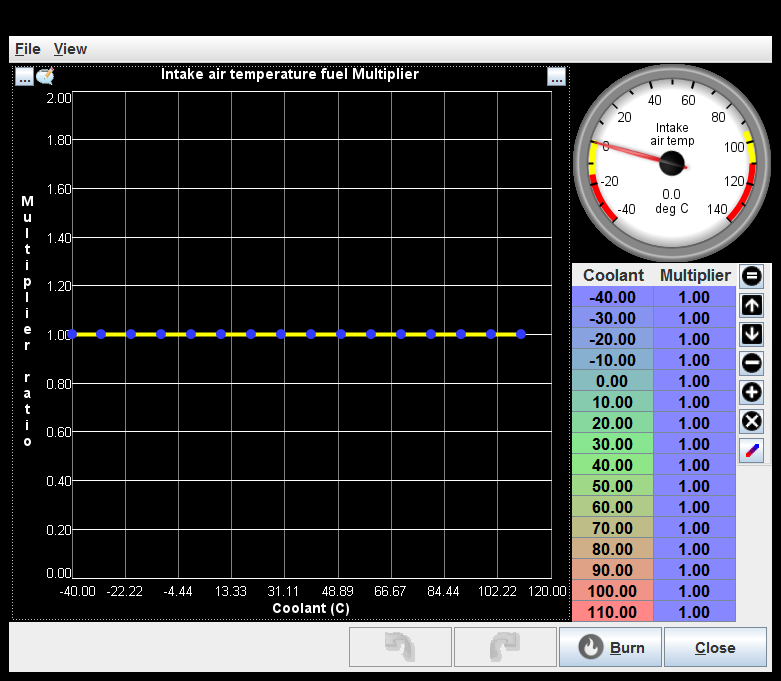

### tCharge Settings
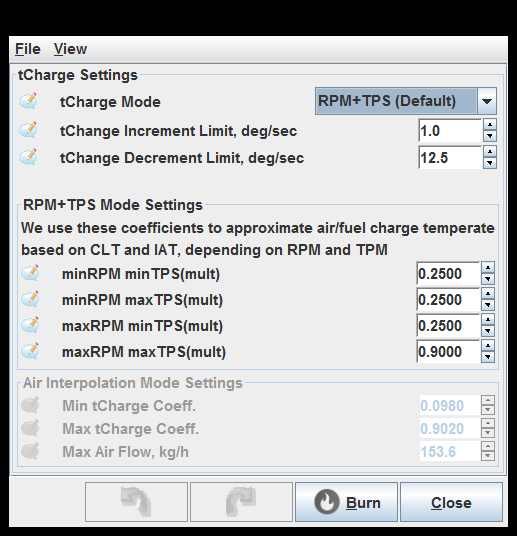

### Accel/Decel Enrichment
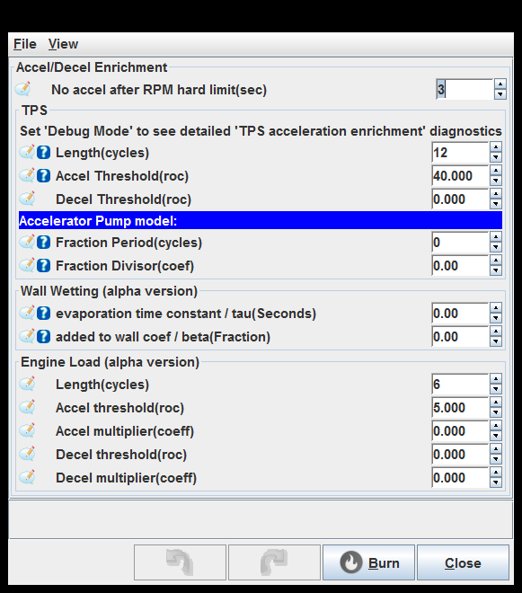

### TPS/TPS Acceleration Extra Fuel(ms)
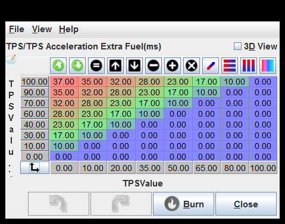

### Engine Load Acceleration Enrichment Taper
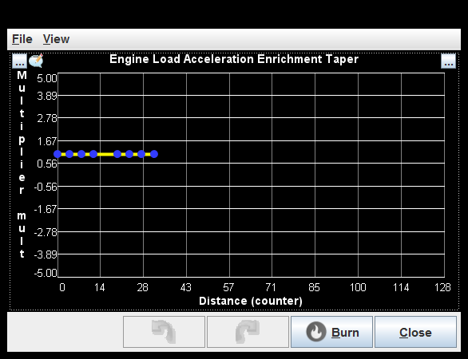

generated by class com.rusefi.MdGenerator on Fri May 01 14:55:08 EDT 2020
