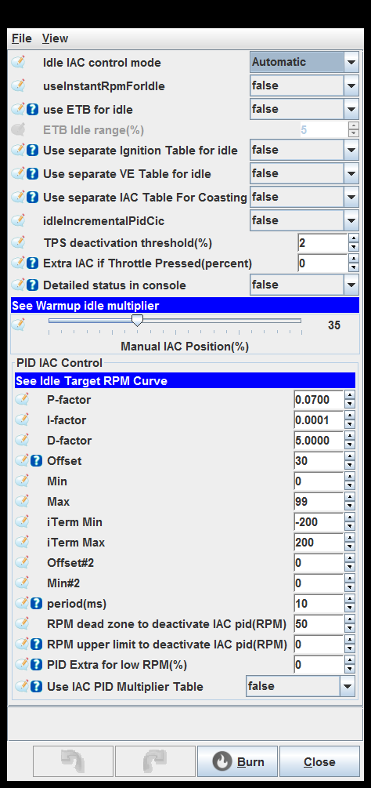
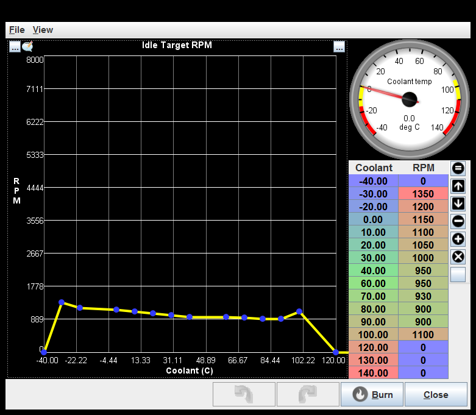
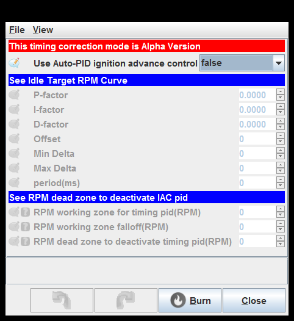

# [rusEFI project](rusEFI-project)

## Idle

[Idle settings](#idle-settings)

[Idle hardware](#idle-hardware)

[Idle Target RPM](#idle-target-rpm)

[Closed-loop idle timing](#closed-loop-idle-timing)

[Warmup Idle multiplier](#warmup-idle-multiplier)

### Idle settings

use ETB for idle: This setting allows the ETB to act as the idle air control valve and move to regulate the airflow at idle.

Use separate Ignition Table for idle: This activates a separate ignition timing table for idle conditions, this can help idle stability by using ignition retard and advance either side of the desired idle speed. Extra retard at low idle speeds will prevent stalling and extra advance at high idle speeds can help reduce engine power and slow the idle speed.

Use separate VE Table for idle: This activates a separate fuel table for Idle, this allows fine tuning of the idle fuelling.

Use separate IAC Table For Coasting: This setting allows the ECU to open the IAC during overrun conditions to help reduce engine breaking, this can be helpful for large engines in light weight cars.

Detailed status in console: Print details into rusEFI console

PID Extra for low RPM(%): Increases PID reaction for RPM<target by adding extra percent to PID-error

Use IAC PID Multiplier Table: This flag allows to use a special 'PID Multiplier' table (0.0-1.0) to compensate for nonlinear nature of IAC-RPM controller

PID Extra for low RPM(%): Increases PID reaction for RPM<target by adding extra percent to PID-error

Use IAC PID Multiplier Table: This flag allows to use a special 'PID Multiplier' table (0.0-1.0) to compensate for nonlinear nature of IAC-RPM controller

PID Extra for low RPM(%): Increases PID reaction for RPM<target by adding extra percent to PID-error

Use IAC PID Multiplier Table: This flag allows to use a special 'PID Multiplier' table (0.0-1.0) to compensate for nonlinear nature of IAC-RPM controller

### Idle hardware

Use Stepper: This setting should only be used if you have a stepper motor idle valve and a stepper motor driver installed.

Two-wire mode: TLE7209 uses two-wire mode. TLE9201 and VNH2SP30 do NOT use two wire mode.

Two-wire mode: TLE7209 uses two-wire mode. TLE9201 and VNH2SP30 do NOT use two wire mode.

Two-wire mode: TLE7209 uses two-wire mode. TLE9201 and VNH2SP30 do NOT use two wire mode.

Two-wire mode: TLE7209 uses two-wire mode. TLE9201 and VNH2SP30 do NOT use two wire mode.

Two-wire mode: TLE7209 uses two-wire mode. TLE9201 and VNH2SP30 do NOT use two wire mode.

### Idle Target RPM

### Closed-loop idle timing

### Warmup Idle multiplier

generated by class com.rusefi.MdGenerator on Fri May 01 15:24:28 EDT 2020
