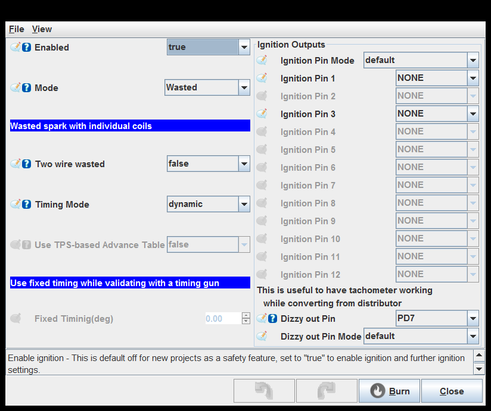
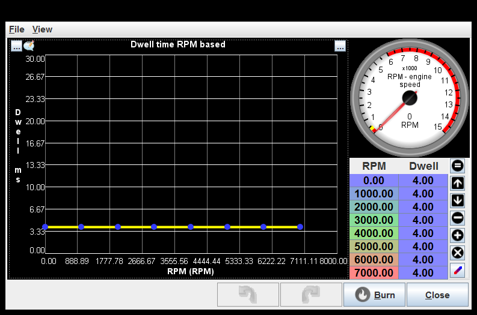
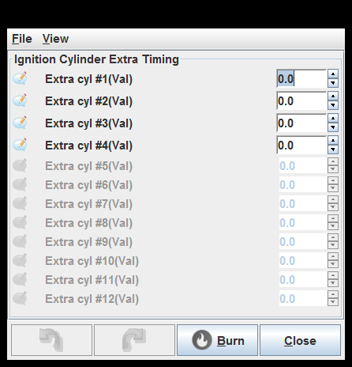
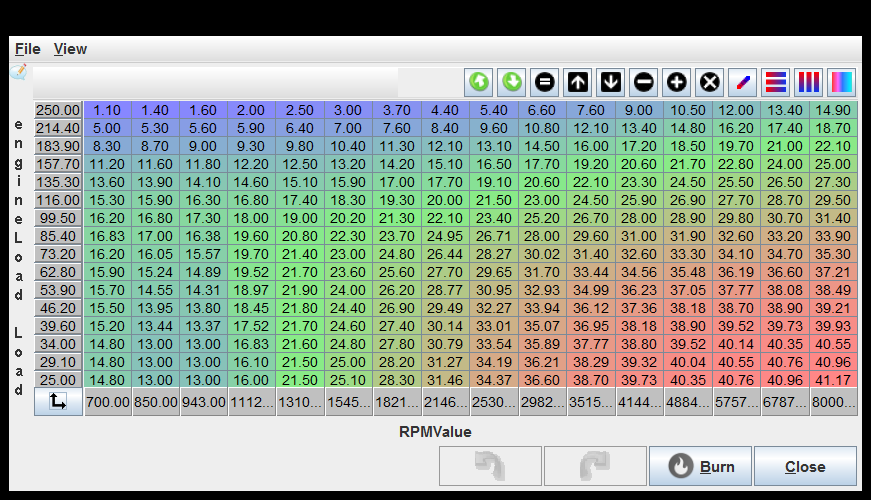
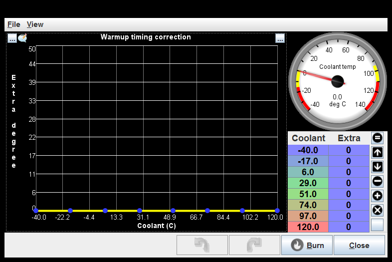
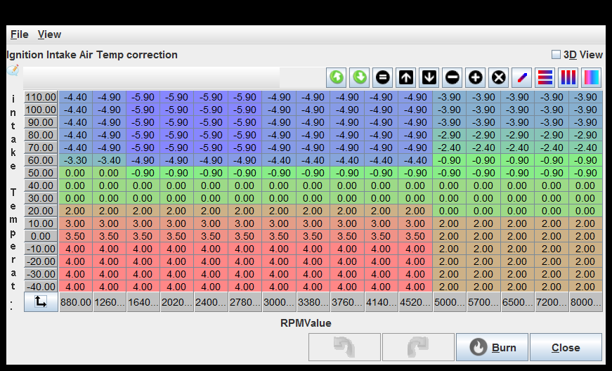

# Ignition
[Ignition settings](#Ignition-settings)

[Dwell](#Dwell)

[Ignition Cylinder Extra Timing](#Ignition-Cylinder-Extra-Timing)

[Ignition Table](#Ignition-Table)

[Warmup timing correction](#Warmup-timing-correction)

[Ignition Intake Air Temp correction](#Ignition-Intake-Air-Temp-correction)

## Ignition settings

Two wire wasted: This is needed if your coils are individually wired (COP) and you wish to use batch ignition (wasted spark).

Timing Mode: Dynamic uses the timing map to decide the ignition timing, Static timing fixes the timing to the value set below (only use for checking static timing).

Use TPS-based Advance Table: This flag allows to use TPS for ignition lookup while in Speed Density Fuel Mode

Dizzy out Pin: This implementation makes a pulse every time one of the coils is charged, using coil dwell for pulse width. See also tachOutputPin

## Dwell

## Ignition Cylinder Extra Timing

## Ignition Table

## Warmup timing correction

## Ignition Intake Air Temp correction

generated by class com.rusefi.MdGenerator on Fri May 01 14:51:28 EDT 2020
