# [rusEFI project](rusEFI-project)

## Sensors

[Trigger Inputs](#trigger-inputs)

[Other Sensor Inputs](#other-sensor-inputs)

[Analog Input Settings](#analog-input-settings)

[CLT sensor](#clt-sensor)

[IAT sensor](#iat-sensor)

[aux1 Thermistor Settings](#aux1-thermistor-settings)

[aux2 Thermistor Settings](#aux2-thermistor-settings)

[TPS](#tps)

[Accelerator pedal](#accelerator-pedal)

[MAP sensor](#map-sensor)

[MAP sampling](#map-sampling)

[Baro sensor](#baro-sensor)

[MAF sensor](#maf-sensor)

[MAF sensor](#maf-sensor)

[EGO sensor](#ego-sensor)

[Narrow to Wideband approximation](#narrow-to-wideband-approximation)

[CJ125 Settings (wbo decoder)](#cj125-settings-wbo-decoder)

[Speed sensor](#speed-sensor)

[Oil pressure](#oil-pressure)

[EGT inputs](#egt-inputs)

### Trigger Inputs

Invert Primary: This setting flips the signal from the primary engine speed sensor.

Invert Secondary: This setting flips the signal from the secondary engine speed sensor.

Cam Sync/VVT input: Camshaft input could be used either just for engine phase detection if your trigger shape does not include cam sensor as 'primary' channel, or it could be used for Variable Valve timing on one of the camshafts.
TODO #660

### Other Sensor Inputs

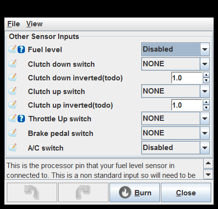

Throttle Up switch: Throttle Pedal not pressed switch - used on some older vehicles like early Mazda Miata

### Analog Input Settings

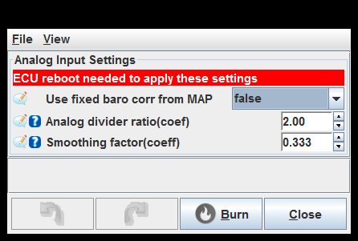

### CLT sensor

### IAT sensor

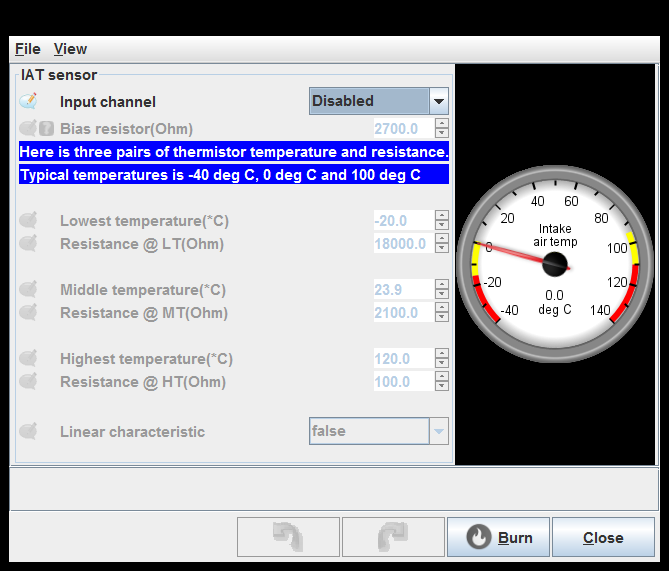

### aux1 Thermistor Settings

### aux2 Thermistor Settings

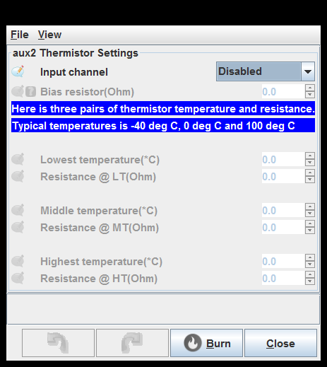

### TPS

TPS low value detection threshold(%): TPS error detection, what TPS % value is unrealistically low

TPS high value detection threshold(%): TPS error detection, what TPS % value is unrealistically high

### Accelerator pedal

Down (WOT) voltage: Pedal in the floor

### MAP sensor

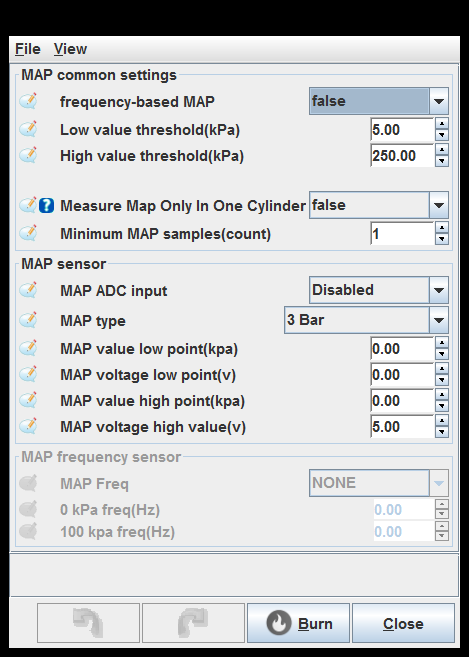

Measure Map Only In One Cylinder: Useful for individual intakes

Measure Map Only In One Cylinder: Useful for individual intakes

Measure Map Only In One Cylinder: Useful for individual intakes

### MAP sampling

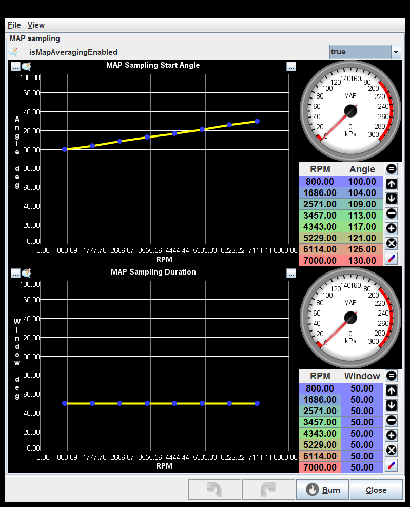

### Baro sensor

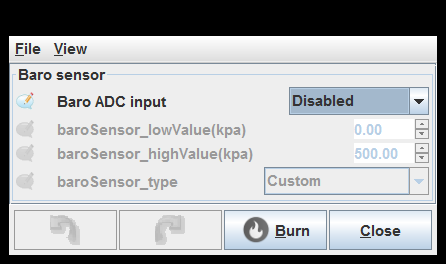

### MAF sensor

### EGO sensor

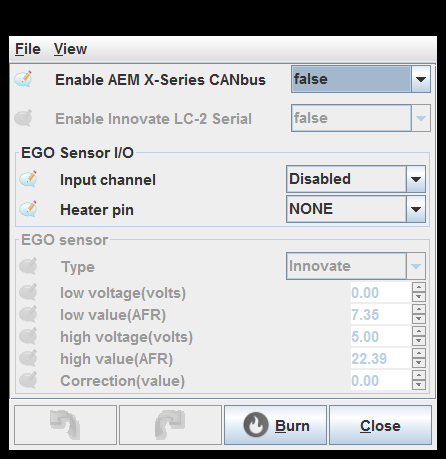

### Narrow to Wideband approximation

### CJ125 Settings (wbo decoder)

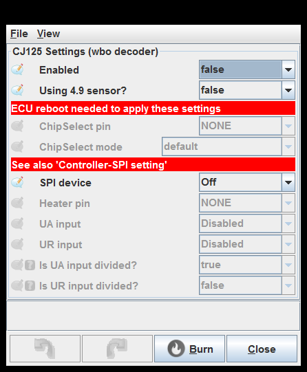

Is UA input divided?: Is your UA CJ125 output wired to MCU via resistor divider?

Is UR input divided?: Is your UR CJ125 output wired to MCU via resistor divider?
Looks like 3v range should be enough, divider generally not needed.

### Speed sensor

### Oil pressure

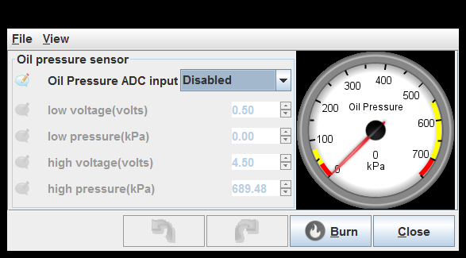

### EGT inputs

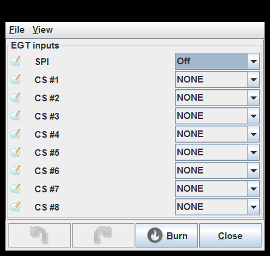

generated by class com.rusefi.MdGenerator on Fri May 01 15:24:28 EDT 2020
