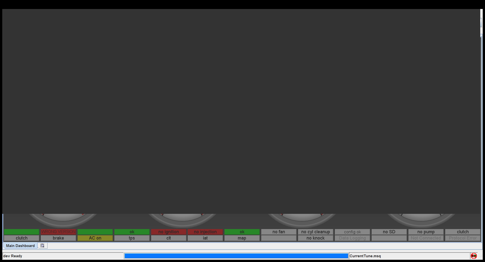
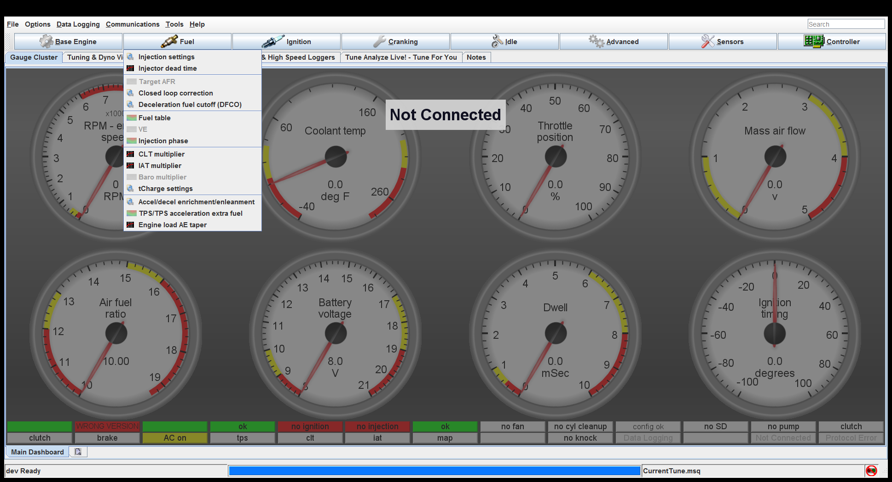
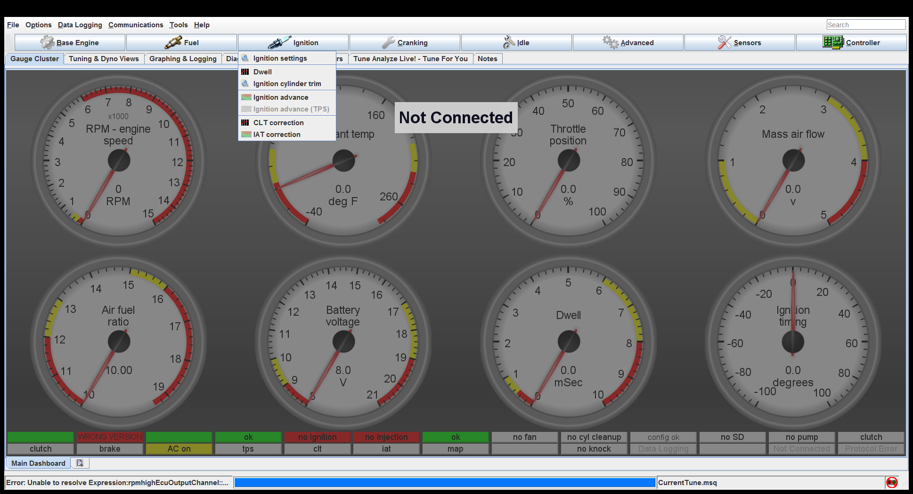
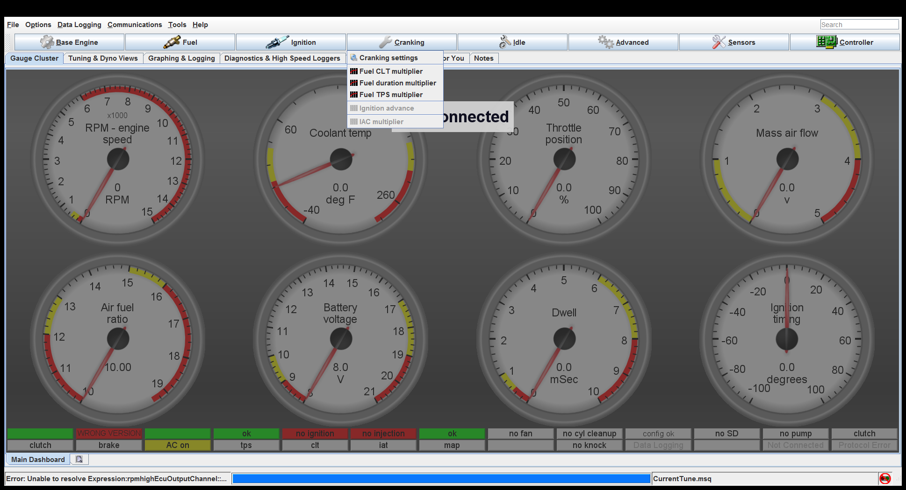
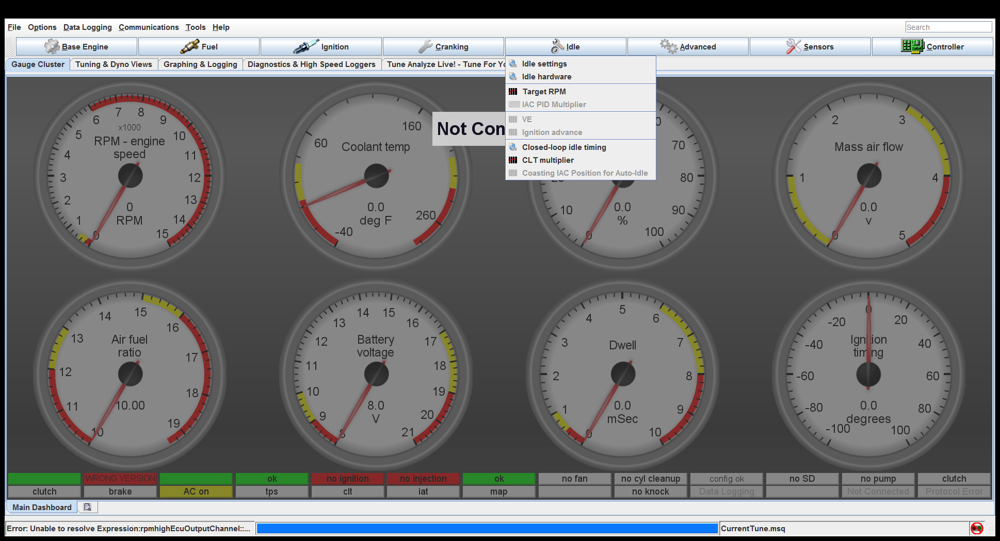
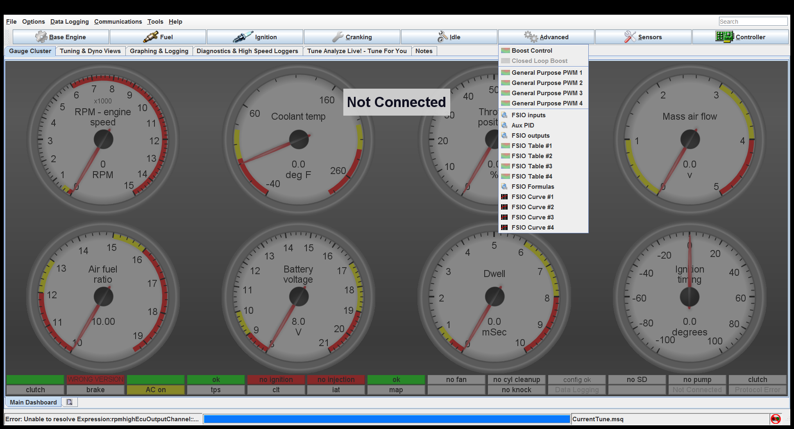
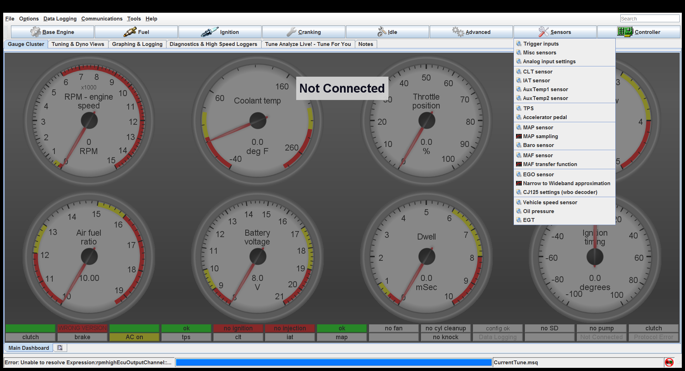

# [Base Engine](rusEFI_project_Base-Engine)

[Base Engine Settings](rusEFI_project_Base-Engine#Base-Engine-Settings)

[Trigger](rusEFI_project_Base-Engine#Trigger)

[Battery and Alternator Settings](rusEFI_project_Base-Engine#Battery-and-Alternator-Settings)

[Main relay output](rusEFI_project_Base-Engine#Main-relay-output)

[Starter relay output](rusEFI_project_Base-Engine#Starter-relay-output)

[Fuel pump  rail](rusEFI_project_Base-Engine#Fuel-pump--rail)

[Fan Settings](rusEFI_project_Base-Engine#Fan-Settings)

[Tachometer output](rusEFI_project_Base-Engine#Tachometer-output)

[Check Engine Settings](rusEFI_project_Base-Engine#Check-Engine-Settings)

[Status LEDs](rusEFI_project_Base-Engine#Status-LEDs)

# [Fuel](rusEFI_project_Fuel)

[Injection settings](rusEFI_project_Fuel#Injection-settings)

[Injector dead time](rusEFI_project_Fuel#Injector-dead-time)

[Fuel short-term closed-loop correction](rusEFI_project_Fuel#Fuel-short-term-closed-loop-correction)

[Coasting Fuel Cutoff Settings](rusEFI_project_Fuel#Coasting-Fuel-Cutoff-Settings)

[Fuel Table](rusEFI_project_Fuel#Fuel-Table)

[Injection Phase](rusEFI_project_Fuel#Injection-Phase)

[Warmup fuel manual Multiplier](rusEFI_project_Fuel#Warmup-fuel-manual-Multiplier)

[Intake air temperature fuel Multiplier](rusEFI_project_Fuel#Intake-air-temperature-fuel-Multiplier)

[tCharge Settings](rusEFI_project_Fuel#tCharge-Settings)

[Accel/Decel Enrichment](rusEFI_project_Fuel#Accel/Decel-Enrichment)

[TPS/TPS Acceleration Extra Fuel(ms)](rusEFI_project_Fuel#TPS/TPS-Acceleration-Extra-Fuel(ms))

[Engine Load Acceleration Enrichment Taper](rusEFI_project_Fuel#Engine-Load-Acceleration-Enrichment-Taper)

# [Ignition](rusEFI_project_Ignition)

[Ignition settings](rusEFI_project_Ignition#Ignition-settings)

[Dwell](rusEFI_project_Ignition#Dwell)

[Ignition Cylinder Extra Timing](rusEFI_project_Ignition#Ignition-Cylinder-Extra-Timing)

[Ignition Table](rusEFI_project_Ignition#Ignition-Table)

[Warmup timing correction](rusEFI_project_Ignition#Warmup-timing-correction)

[Ignition Intake Air Temp correction](rusEFI_project_Ignition#Ignition-Intake-Air-Temp-correction)

# [Cranking](rusEFI_project_Cranking)

[Cranking Settings](rusEFI_project_Cranking#Cranking-Settings)

[Cranking Coolant Temperature Multiplier](rusEFI_project_Cranking#Cranking-Coolant-Temperature-Multiplier)

[Cranking Duration Multiplier](rusEFI_project_Cranking#Cranking-Duration-Multiplier)

[Cranking TPS Multiplier](rusEFI_project_Cranking#Cranking-TPS-Multiplier)

# [Idle](rusEFI_project_Idle)

[Idle settings](rusEFI_project_Idle#Idle-settings)

[Idle hardware](rusEFI_project_Idle#Idle-hardware)

[Idle Target RPM](rusEFI_project_Idle#Idle-Target-RPM)

[Closed-loop idle timing](rusEFI_project_Idle#Closed-loop-idle-timing)

[Warmup Idle multiplier](rusEFI_project_Idle#Warmup-Idle-multiplier)

# [Advanced](rusEFI_project_Advanced)

[Boost Control](rusEFI_project_Advanced#Boost-Control)

[General Purpose PWM 1](rusEFI_project_Advanced#General-Purpose-PWM-1)

[General Purpose PWM 2](rusEFI_project_Advanced#General-Purpose-PWM-2)

[General Purpose PWM 3](rusEFI_project_Advanced#General-Purpose-PWM-3)

[General Purpose PWM 4](rusEFI_project_Advanced#General-Purpose-PWM-4)

[FSIO inputs](rusEFI_project_Advanced#FSIO-inputs)

[Aux PID](rusEFI_project_Advanced#Aux-PID)

[FSIO outputs](rusEFI_project_Advanced#FSIO-outputs)

[FSIO Table #1](rusEFI_project_Advanced#FSIO-Table-#1)

[FSIO Table #2](rusEFI_project_Advanced#FSIO-Table-#2)

[FSIO Table #3](rusEFI_project_Advanced#FSIO-Table-#3)

[FSIO Table #4](rusEFI_project_Advanced#FSIO-Table-#4)

[FSIO Formulas](rusEFI_project_Advanced#FSIO-Formulas)

[FSIO Curve #1](rusEFI_project_Advanced#FSIO-Curve-#1)

[FSIO Curve #2](rusEFI_project_Advanced#FSIO-Curve-#2)

[FSIO Curve #3](rusEFI_project_Advanced#FSIO-Curve-#3)

[FSIO Curve #4](rusEFI_project_Advanced#FSIO-Curve-#4)

# [Sensors](rusEFI_project_Sensors)

[Trigger Inputs](rusEFI_project_Sensors#Trigger-Inputs)

[Other Sensor Inputs](rusEFI_project_Sensors#Other-Sensor-Inputs)

[Analog Input Settings](rusEFI_project_Sensors#Analog-Input-Settings)

[CLT sensor](rusEFI_project_Sensors#CLT-sensor)

[IAT sensor](rusEFI_project_Sensors#IAT-sensor)

[aux1 Thermistor Settings](rusEFI_project_Sensors#aux1-Thermistor-Settings)

[aux2 Thermistor Settings](rusEFI_project_Sensors#aux2-Thermistor-Settings)

[TPS](rusEFI_project_Sensors#TPS)

[Accelerator pedal](rusEFI_project_Sensors#Accelerator-pedal)

[MAP sensor](rusEFI_project_Sensors#MAP-sensor)

[MAP sampling](rusEFI_project_Sensors#MAP-sampling)

[Baro sensor](rusEFI_project_Sensors#Baro-sensor)

[MAF sensor](rusEFI_project_Sensors#MAF-sensor)

[MAF sensor](rusEFI_project_Sensors#MAF-sensor)

[EGO sensor](rusEFI_project_Sensors#EGO-sensor)

[Narrow to Wideband approximation](rusEFI_project_Sensors#Narrow-to-Wideband-approximation)

[CJ125 Settings (wbo decoder)](rusEFI_project_Sensors#CJ125-Settings-(wbo-decoder))

[Speed sensor](rusEFI_project_Sensors#Speed-sensor)

[Oil pressure](rusEFI_project_Sensors#Oil-pressure)

[EGT inputs](rusEFI_project_Sensors#EGT-inputs)

# [Controller](rusEFI_project_Controller)

[ECU stimulator](rusEFI_project_Controller#ECU-stimulator)

[Datalogging Settings](rusEFI_project_Controller#Datalogging-Settings)

[Bench Test & Commands](rusEFI_project_Controller#Bench-Test-&-Commands)

[Popular vehicles](rusEFI_project_Controller#Popular-vehicles)

[LCD screen](rusEFI_project_Controller#LCD-screen)

[Joystick](rusEFI_project_Controller#Joystick)

[SPI settings](rusEFI_project_Controller#SPI-settings)

[rusEfi Console Settings](rusEFI_project_Controller#rusEfi-Console-Settings)

[Connection](rusEFI_project_Controller#Connection)

[TLE8888](rusEFI_project_Controller#TLE8888)

[All Pins 1/3](rusEFI_project_Controller#All-Pins-1/3)

[All Pins 2/3](rusEFI_project_Controller#All-Pins-2/3)

[All Pins 3/3](rusEFI_project_Controller#All-Pins-3/3)

[Experimental/Broken](rusEFI_project_Controller#Experimental/Broken)

[Multispark](rusEFI_project_Controller#Multispark)

[GDI Dreams](rusEFI_project_Controller#GDI-Dreams)

[HIP9011 Settings (knock decoder)](rusEFI_project_Controller#HIP9011-Settings-(knock-decoder))

[Electronic Throttle Body (beta)](rusEFI_project_Controller#Electronic-Throttle-Body-(beta))

[Electronic TB Bias Curve](rusEFI_project_Controller#Electronic-TB-Bias-Curve)

[ETB Pedal to TPS](rusEFI_project_Controller#ETB-Pedal-to-TPS)

[Launch Control Settings NOT WORKING](rusEFI_project_Controller#Launch-Control-Settings-NOT-WORKING)

[Rolling Launch Settings NOT WORKING](rusEFI_project_Controller#Rolling-Launch-Settings-NOT-WORKING)

[AntiLag Settings NOT WORKING](rusEFI_project_Controller#AntiLag-Settings-NOT-WORKING)

generated by class com.rusefi.MdGenerator on Fri May 01 14:49:04 EDT 2020
