# Base Engine
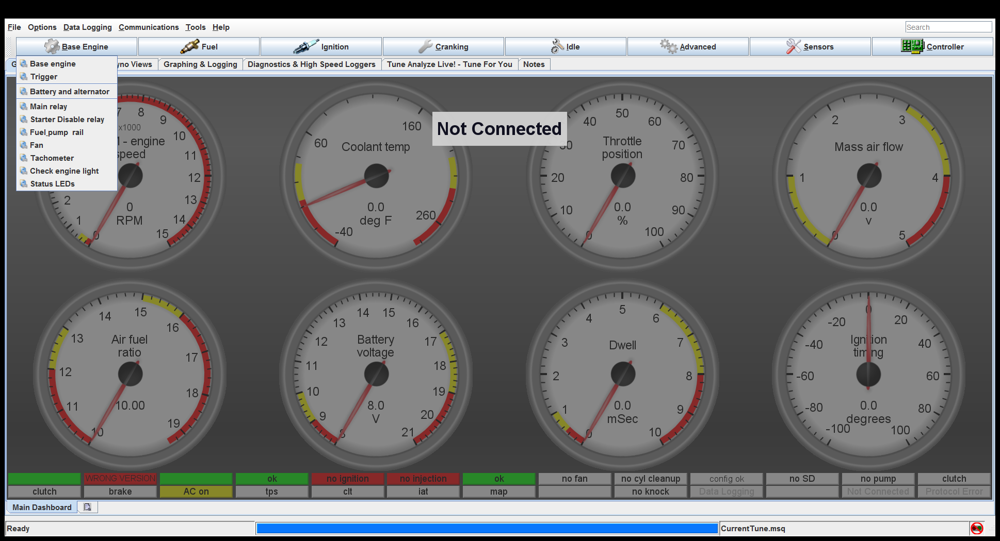

# Fuel

# Ignition

# Cranking
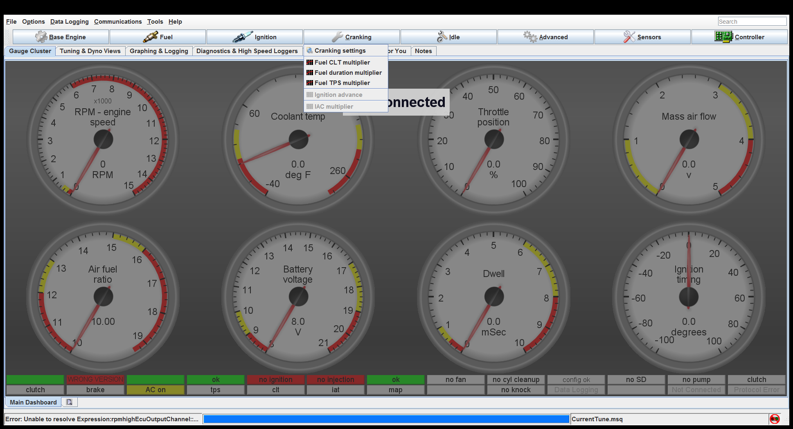

# Idle

# Advanced
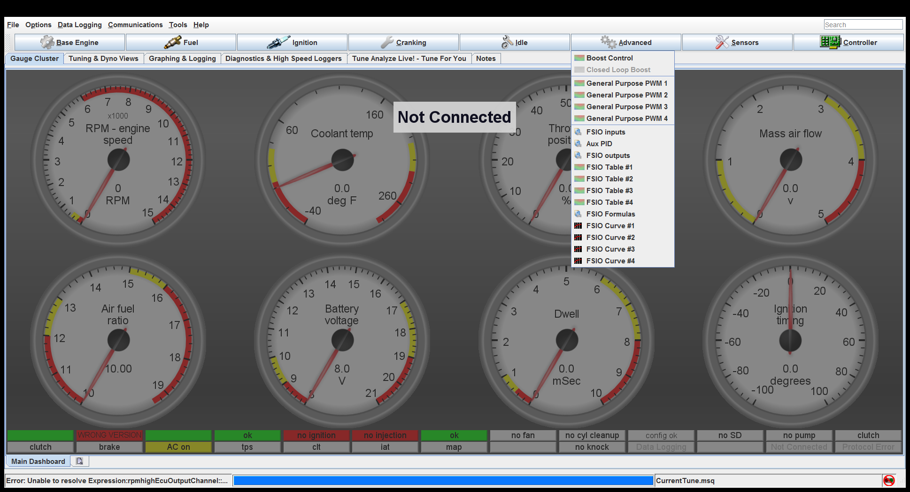

# Sensors

# Controller

# Base Engine
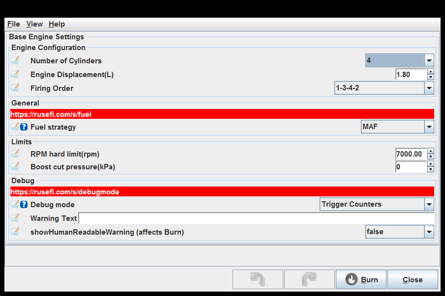
Fuel strategy: This setting controls which fuel quantity control algorithm is used.\nSee also useTPSAdvanceTable\nset algorithm X

Debug mode: See http://rusefi.com/s/debugmode\n\nset debug_mode X

Fuel strategy: This setting controls which fuel quantity control algorithm is used.\nSee also useTPSAdvanceTable\nset algorithm X

Debug mode: See http://rusefi.com/s/debugmode\n\nset debug_mode X

Fuel strategy: This setting controls which fuel quantity control algorithm is used.\nSee also useTPSAdvanceTable\nset algorithm X

Debug mode: See http://rusefi.com/s/debugmode\n\nset debug_mode X

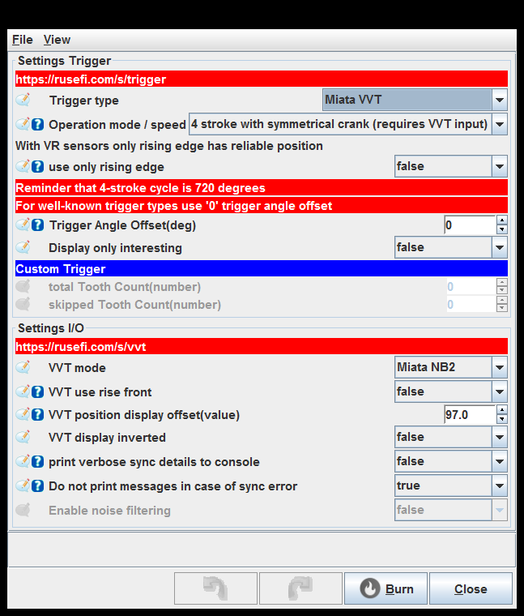
Operation mode / speed: 'Some triggers could be mounted differently. Most well-known triggers imply specific sensor setup. 4 stroke with symmetrical crank' is a pretty special case for example on Miata NB2\nSee engineCycle\nset operation_mode X

use only rising edge: VR sensors are only precise on rising front\nenable trigger_only_front

VVT use rise front: Use rise or fall signal front

print verbose sync details to console: enable trigger_details

Do not print messages in case of sync error: Sometimes we have a performance issue while printing error

Operation mode / speed: 'Some triggers could be mounted differently. Most well-known triggers imply specific sensor setup. 4 stroke with symmetrical crank' is a pretty special case for example on Miata NB2\nSee engineCycle\nset operation_mode X

use only rising edge: VR sensors are only precise on rising front\nenable trigger_only_front

VVT use rise front: Use rise or fall signal front

print verbose sync details to console: enable trigger_details

Do not print messages in case of sync error: Sometimes we have a performance issue while printing error

Operation mode / speed: 'Some triggers could be mounted differently. Most well-known triggers imply specific sensor setup. 4 stroke with symmetrical crank' is a pretty special case for example on Miata NB2\nSee engineCycle\nset operation_mode X

use only rising edge: VR sensors are only precise on rising front\nenable trigger_only_front

VVT use rise front: Use rise or fall signal front

print verbose sync details to console: enable trigger_details

Do not print messages in case of sync error: Sometimes we have a performance issue while printing error

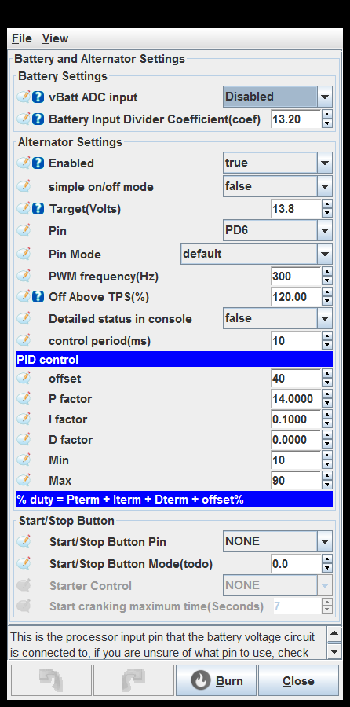
vBatt ADC input: This is the processor input pin that the battery voltage circuit is connected to, if you are unsure of what pin to use, check the schematic that corresponds to your PCB.

Pin: This implementation produces one pulse per engine cycle. See also dizzySparkOutputPin.

Off Above TPS(%): Turns off alternator output above specified TPS, enabling this reduced parasitic drag on the engine at full load.

Detailed status in console: Print details into rusEfi console

vBatt ADC input: This is the processor input pin that the battery voltage circuit is connected to, if you are unsure of what pin to use, check the schematic that corresponds to your PCB.

Pin: This implementation produces one pulse per engine cycle. See also dizzySparkOutputPin.

Off Above TPS(%): Turns off alternator output above specified TPS, enabling this reduced parasitic drag on the engine at full load.

Detailed status in console: Print details into rusEfi console

vBatt ADC input: This is the processor input pin that the battery voltage circuit is connected to, if you are unsure of what pin to use, check the schematic that corresponds to your PCB.

Pin: This implementation produces one pulse per engine cycle. See also dizzySparkOutputPin.

Off Above TPS(%): Turns off alternator output above specified TPS, enabling this reduced parasitic drag on the engine at full load.

Detailed status in console: Print details into rusEfi console

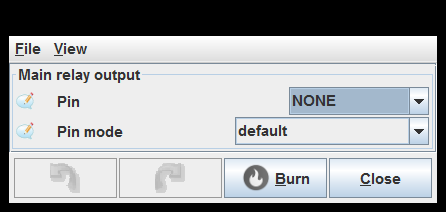
Pin: This implementation produces one pulse per engine cycle. See also dizzySparkOutputPin.

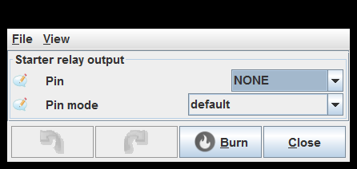
Pin: This implementation produces one pulse per engine cycle. See also dizzySparkOutputPin.

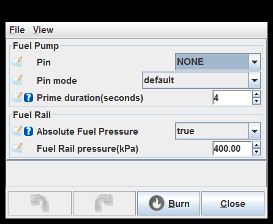
Pin: This implementation produces one pulse per engine cycle. See also dizzySparkOutputPin.

Absolute Fuel Pressure: If your fuel regulator does not have vacuum line

Pin: This implementation produces one pulse per engine cycle. See also dizzySparkOutputPin.

Absolute Fuel Pressure: If your fuel regulator does not have vacuum line

Pin: This implementation produces one pulse per engine cycle. See also dizzySparkOutputPin.

Absolute Fuel Pressure: If your fuel regulator does not have vacuum line

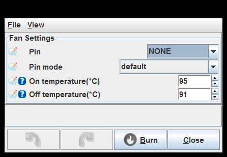
Pin: This implementation produces one pulse per engine cycle. See also dizzySparkOutputPin.

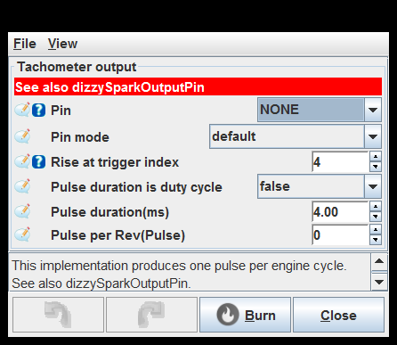
Pin: This implementation produces one pulse per engine cycle. See also dizzySparkOutputPin.

Rise at trigger index: Trigger cycle index at which we start tach pulse (performance consideration)

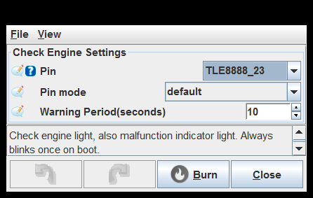
Pin: This implementation produces one pulse per engine cycle. See also dizzySparkOutputPin.

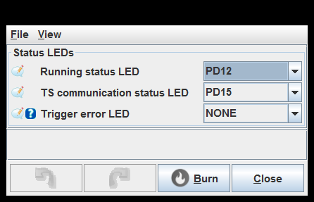
Trigger error LED: This pin is used for debugging - snap a logic analyzer on it and see if it's ever high

# Fuel
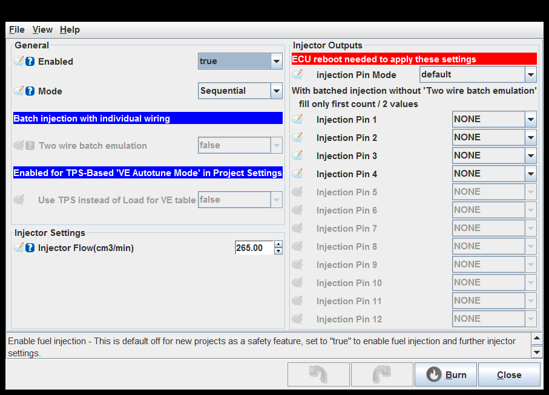
Two wire batch emulation: This is needed if your coils are individually wired and you wish to use batch injection.\nenable two_wire_batch_injection

Two wire batch emulation: This is needed if your coils are individually wired and you wish to use batch injection.\nenable two_wire_batch_injection

Two wire batch emulation: This is needed if your coils are individually wired and you wish to use batch injection.\nenable two_wire_batch_injection

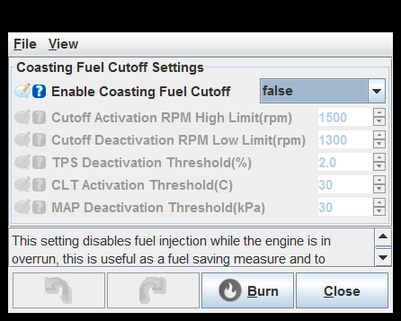
Enable Coasting Fuel Cutoff: This setting disables fuel injection while the engine is in overrun, this is useful as a fuel saving measure and to prevent back firing.

TPS Deactivation Threshold(%): percent between 0 and 100 below which the fuel cut is deactivated, this helps low speed drivability.

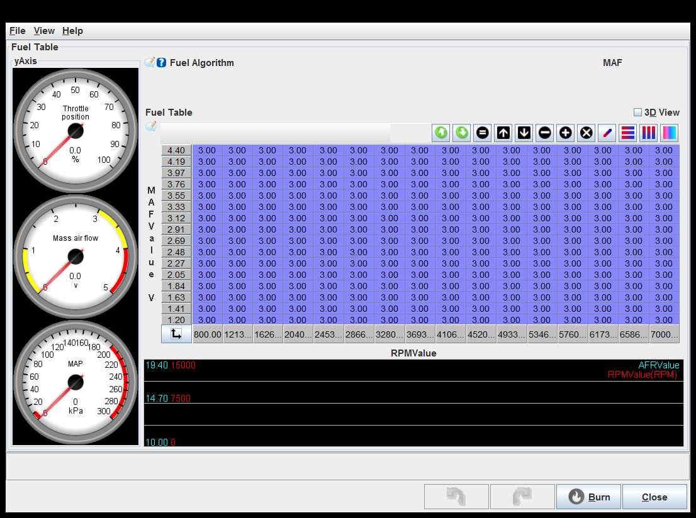

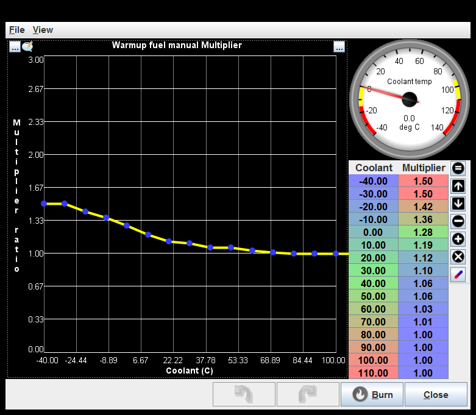
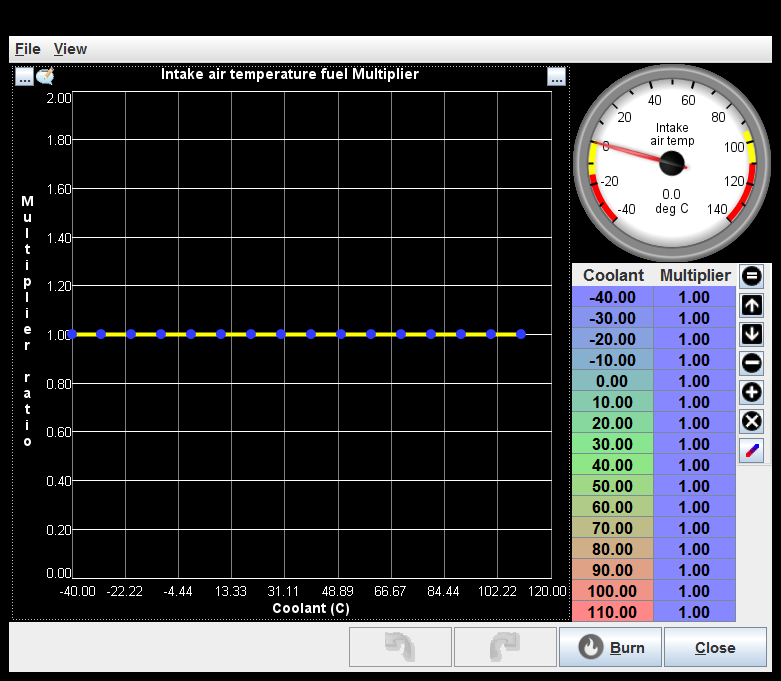
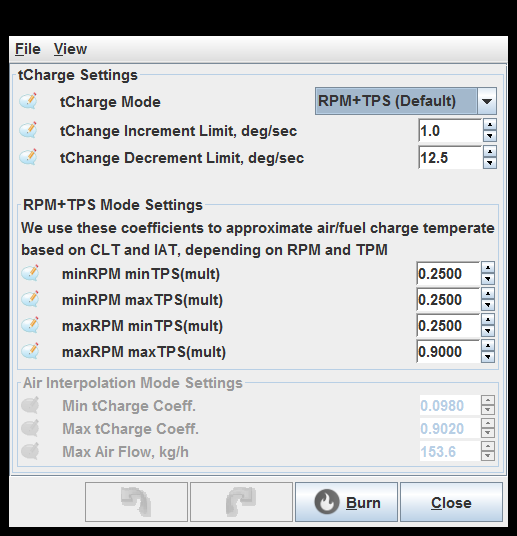

# Ignition
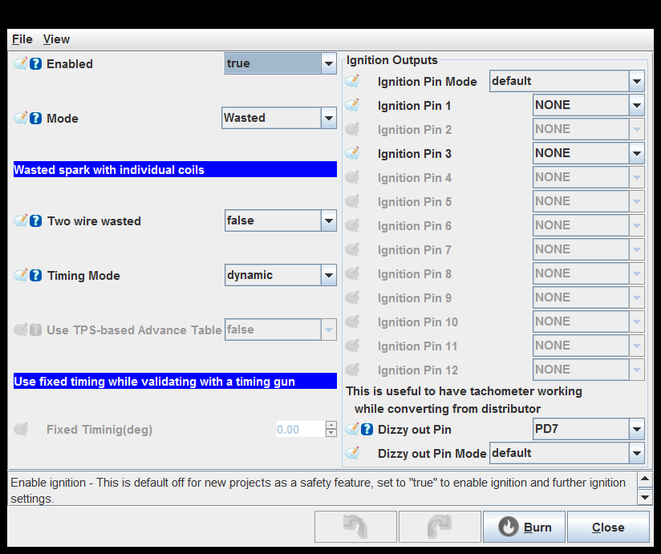
Two wire wasted: This is needed if your coils are individually wired (COP) and you wish to use batch ignition (wasted spark).

Timing Mode: Dynamic uses the timing map to decide the ignition timing, Static timing fixes the timing to the value set below (only use for checking static timing).

Use TPS-based Advance Table: This flag allows to use TPS for ignition lookup while in Speed Density Fuel Mode

Dizzy out Pin: This implementation makes a pulse every time one of the coils is charged, using coil dwell for pulse width. See also tachOutputPin

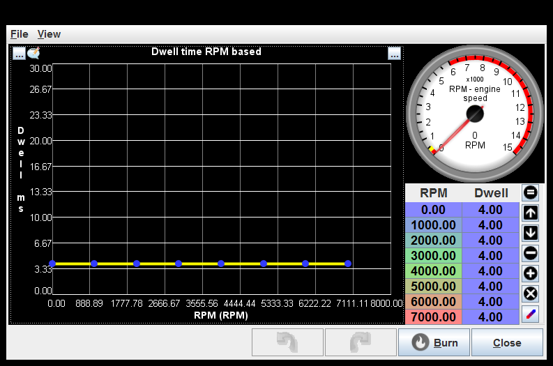

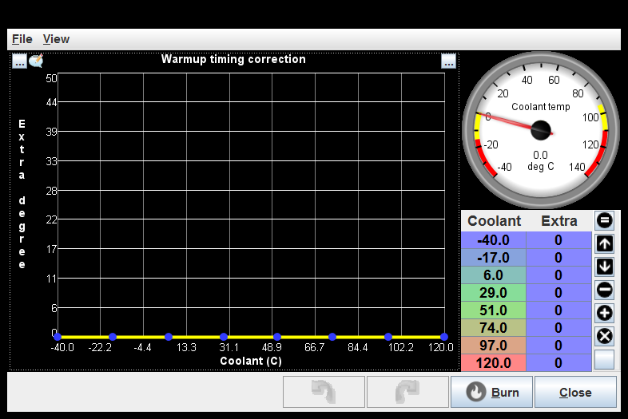
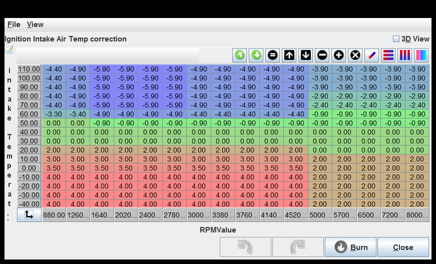
# Cranking
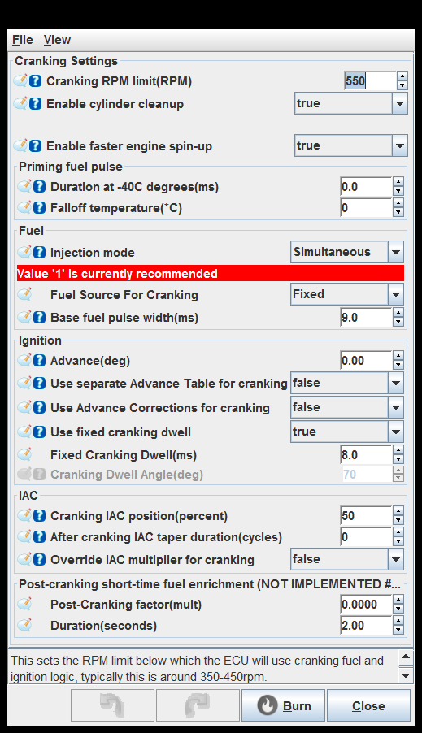
Enable cylinder cleanup: When enabled if TPS is held above 95% no fuel is injected while cranking to clear excess fuel from the cylinders.

Enable faster engine spin-up: Smarter cranking logic.\nSee also startOfCrankingPrimingPulse

Use separate Advance Table for cranking: This activates a separate advance table for cranking conditions, this allows cranking advance to be RPM dependant.

Use Advance Corrections for cranking: This enables the various ignition corrections during cranking (IAT, CLT, FSIO and PID idle).

Use fixed cranking dwell: If set to true, will use the specified duration for cranking dwell. If set to false, will use the specified dwell angle. Unless you have a really good reason to, leave this set to true to use duration mode.

Use separate Advance Table for cranking: This activates a separate advance table for cranking conditions, this allows cranking advance to be RPM dependant.

Use Advance Corrections for cranking: This enables the various ignition corrections during cranking (IAT, CLT, FSIO and PID idle).

Use fixed cranking dwell: If set to true, will use the specified duration for cranking dwell. If set to false, will use the specified dwell angle. Unless you have a really good reason to, leave this set to true to use duration mode.

Use separate Advance Table for cranking: This activates a separate advance table for cranking conditions, this allows cranking advance to be RPM dependant.

Use Advance Corrections for cranking: This enables the various ignition corrections during cranking (IAT, CLT, FSIO and PID idle).

Use fixed cranking dwell: If set to true, will use the specified duration for cranking dwell. If set to false, will use the specified dwell angle. Unless you have a really good reason to, leave this set to true to use duration mode.

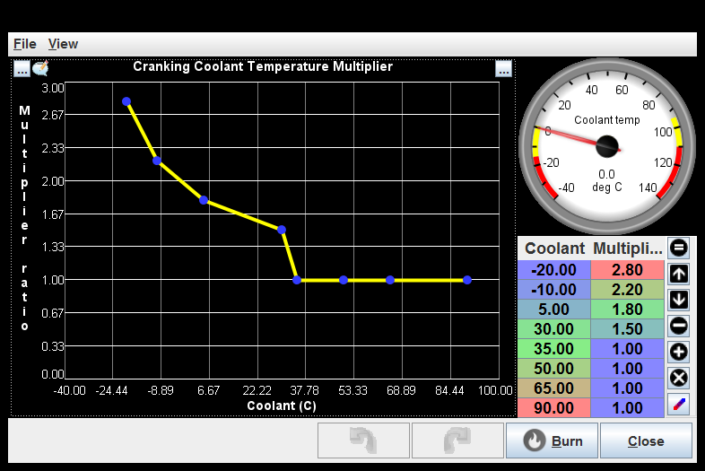
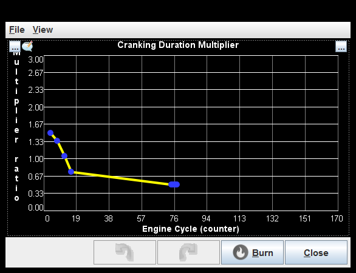
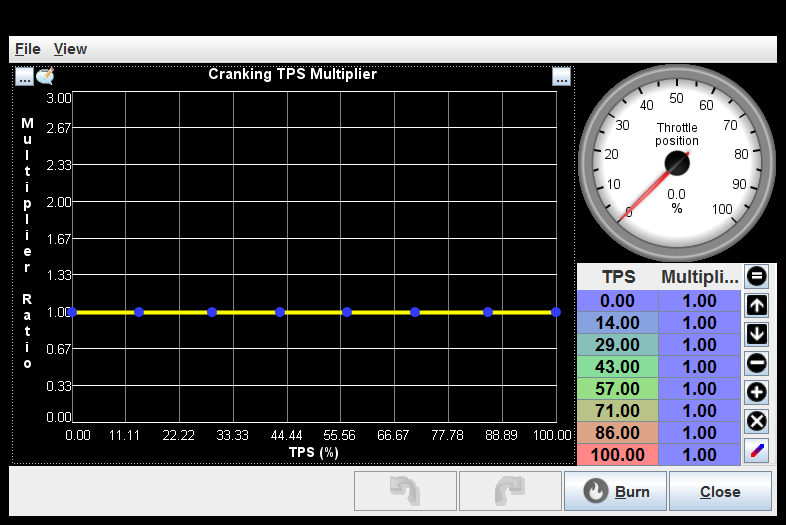
# Idle
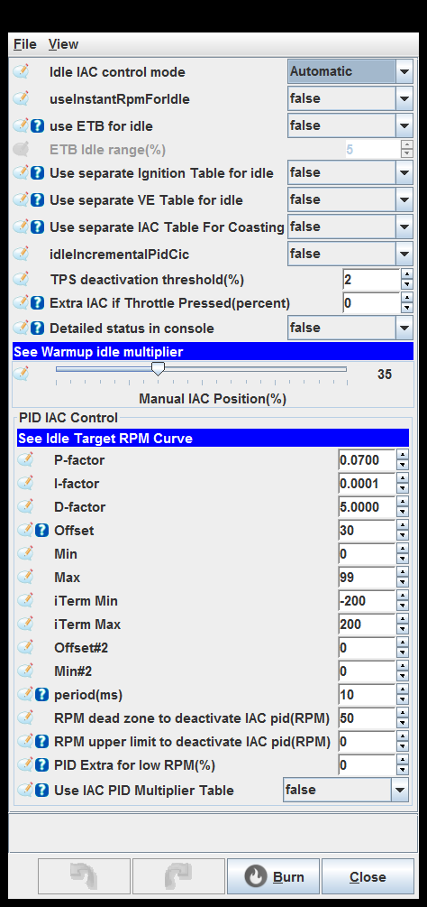
use ETB for idle: This setting allows the ETB to act as the idle air control valve and move to regulate the airflow at idle.

Use separate Ignition Table for idle: This activates a separate ignition timing table for idle conditions, this can help idle stability by using ignition retard and advance either side of the desired idle speed. Extra retard at low idle speeds will prevent stalling and extra advance at high idle speeds can help reduce engine power and slow the idle speed.

Use separate VE Table for idle: This activates a separate fuel table for Idle, this allows fine tuning of the idle fuelling.

Use separate IAC Table For Coasting: This setting allows the ECU to open the IAC during overrun conditions to help reduce engine breaking, this can be helpful for large engines in light weight cars.

Detailed status in console: Print details into rusEfi console

PID Extra for low RPM(%): Increases PID reaction for RPM<target by adding extra percent to PID-error

Use IAC PID Multiplier Table: This flag allows to use a special 'PID Multiplier' table (0.0-1.0) to compensate for nonlinear nature of IAC-RPM controller

PID Extra for low RPM(%): Increases PID reaction for RPM<target by adding extra percent to PID-error

Use IAC PID Multiplier Table: This flag allows to use a special 'PID Multiplier' table (0.0-1.0) to compensate for nonlinear nature of IAC-RPM controller

PID Extra for low RPM(%): Increases PID reaction for RPM<target by adding extra percent to PID-error

Use IAC PID Multiplier Table: This flag allows to use a special 'PID Multiplier' table (0.0-1.0) to compensate for nonlinear nature of IAC-RPM controller

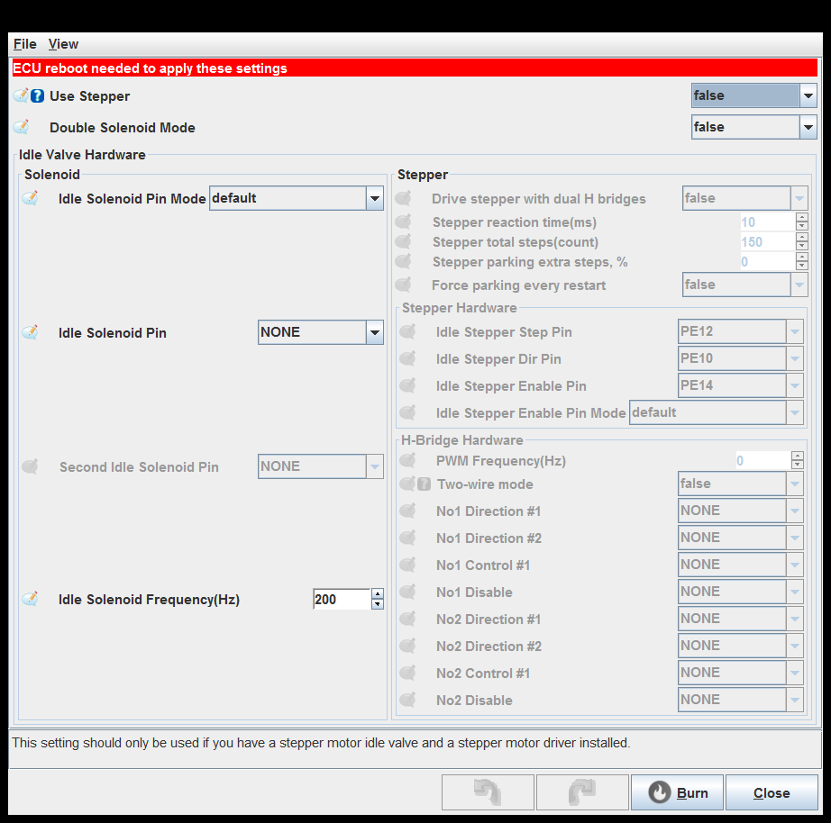
Use Stepper: This setting should only be used if you have a stepper motor idle valve and a stepper motor driver installed.

Two-wire mode: TLE7209 uses two-wire mode. TLE9201 and VNH2SP30 do NOT use two wire mode.

Two-wire mode: TLE7209 uses two-wire mode. TLE9201 and VNH2SP30 do NOT use two wire mode.

Two-wire mode: TLE7209 uses two-wire mode. TLE9201 and VNH2SP30 do NOT use two wire mode.

Two-wire mode: TLE7209 uses two-wire mode. TLE9201 and VNH2SP30 do NOT use two wire mode.

Two-wire mode: TLE7209 uses two-wire mode. TLE9201 and VNH2SP30 do NOT use two wire mode.

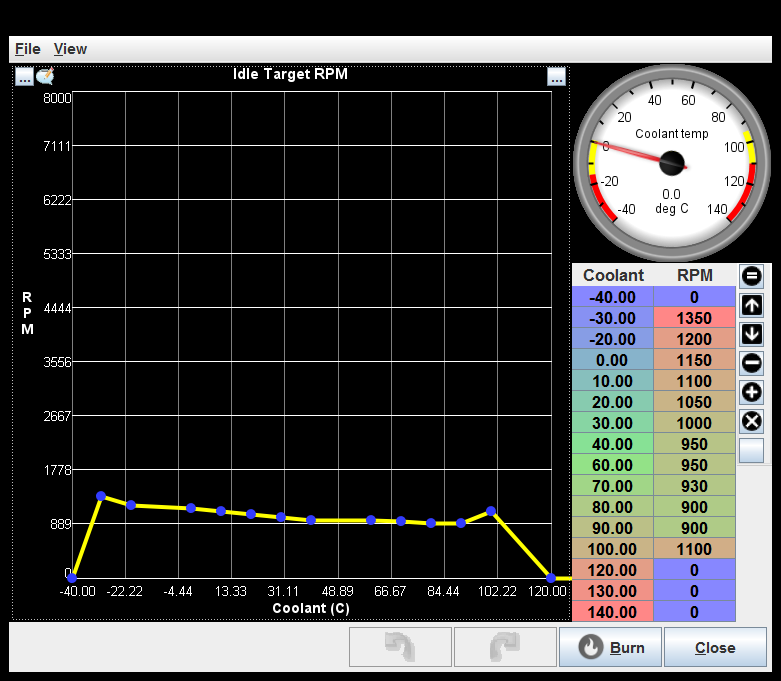
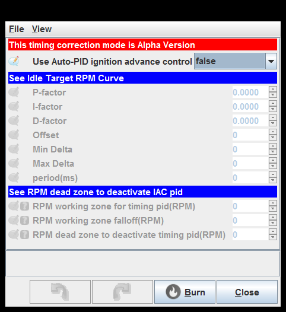
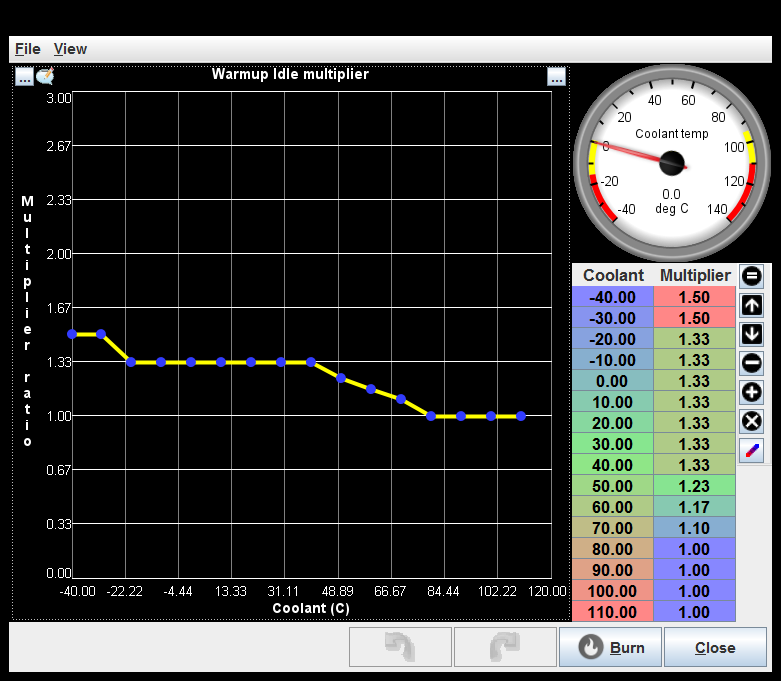
# Advanced
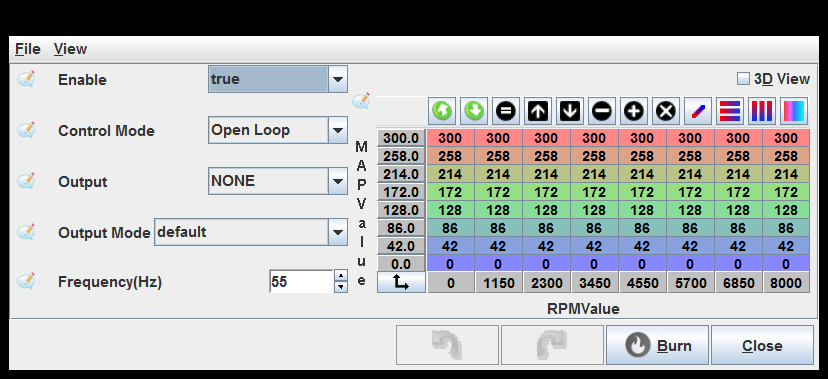
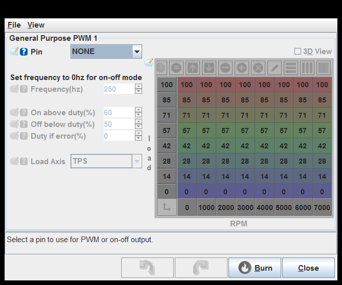
Pin: This implementation produces one pulse per engine cycle. See also dizzySparkOutputPin.

On above duty(%): In on-off mode, turn the output on when the table value is above this duty.

Off below duty(%): In on-off mode, turn the output off when the table value is below this duty.

Duty if error(%): If an error (with a sensor, etc) is detected, this value is used instead of reading from the table.\nThis should be a safe value for whatever hardware is connected to prevent damage.

Load Axis: Selects the load axis to use for the table.

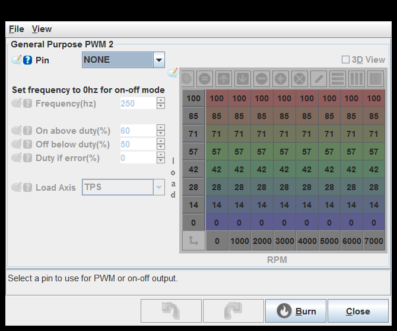
Pin: This implementation produces one pulse per engine cycle. See also dizzySparkOutputPin.

On above duty(%): In on-off mode, turn the output on when the table value is above this duty.

Off below duty(%): In on-off mode, turn the output off when the table value is below this duty.

Duty if error(%): If an error (with a sensor, etc) is detected, this value is used instead of reading from the table.\nThis should be a safe value for whatever hardware is connected to prevent damage.

Load Axis: Selects the load axis to use for the table.

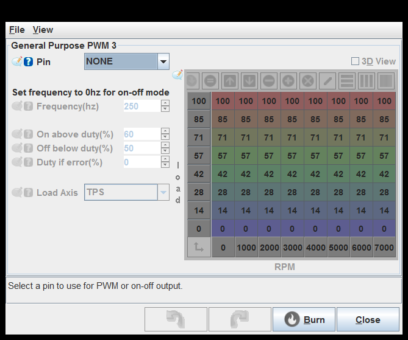
Pin: This implementation produces one pulse per engine cycle. See also dizzySparkOutputPin.

On above duty(%): In on-off mode, turn the output on when the table value is above this duty.

Off below duty(%): In on-off mode, turn the output off when the table value is below this duty.

Duty if error(%): If an error (with a sensor, etc) is detected, this value is used instead of reading from the table.\nThis should be a safe value for whatever hardware is connected to prevent damage.

Load Axis: Selects the load axis to use for the table.

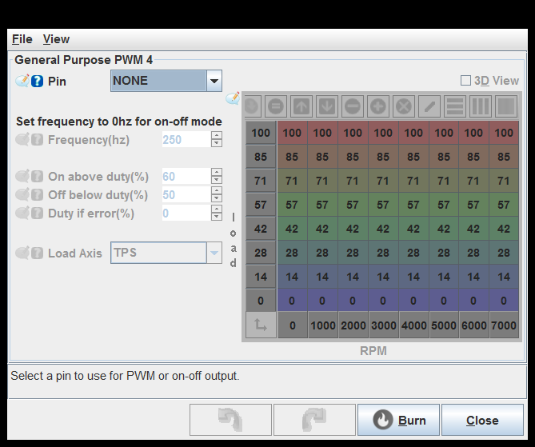
Pin: This implementation produces one pulse per engine cycle. See also dizzySparkOutputPin.

On above duty(%): In on-off mode, turn the output on when the table value is above this duty.

Off below duty(%): In on-off mode, turn the output off when the table value is below this duty.

Duty if error(%): If an error (with a sensor, etc) is detected, this value is used instead of reading from the table.\nThis should be a safe value for whatever hardware is connected to prevent damage.

Load Axis: Selects the load axis to use for the table.

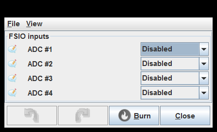
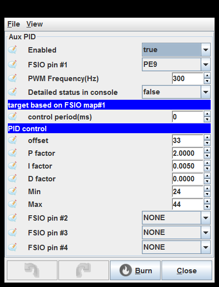
Detailed status in console: Print details into rusEfi console

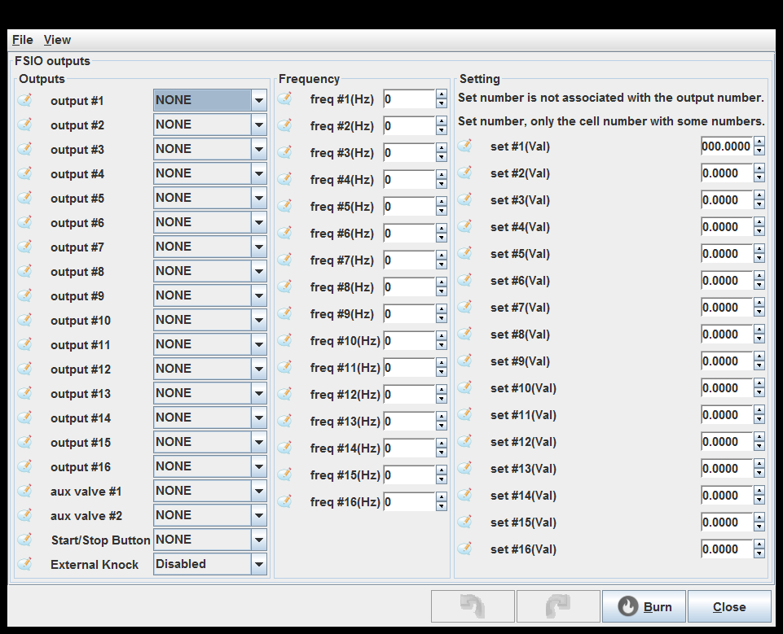

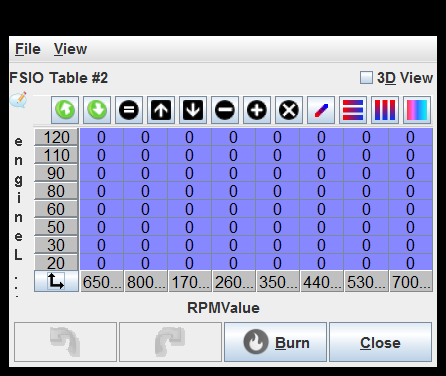
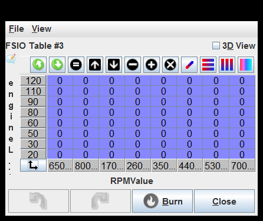
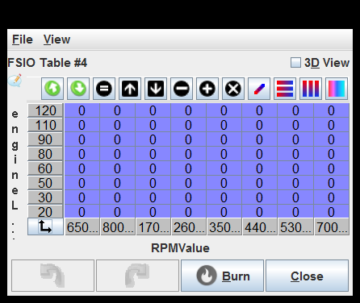
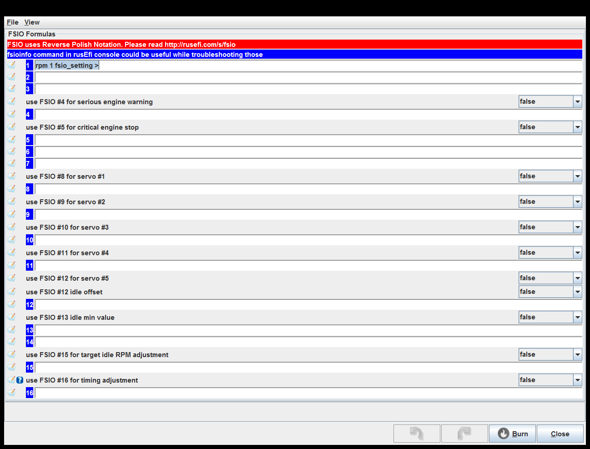
use FSIO #16 for timing adjustment: See fsioTimingAdjustment

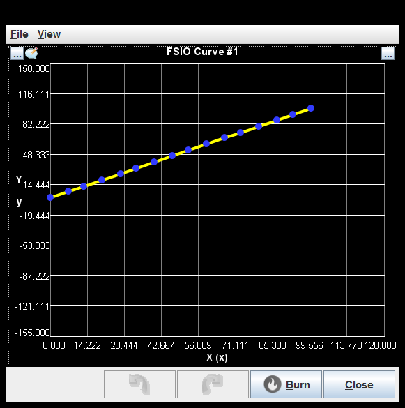
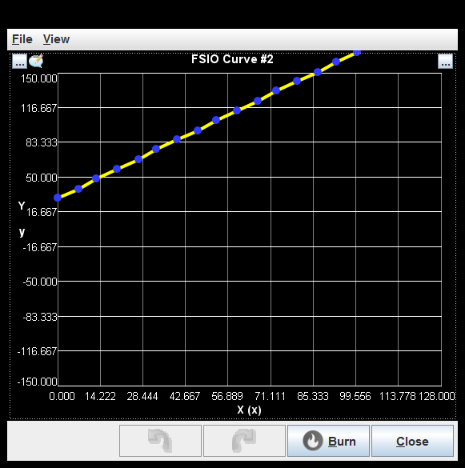
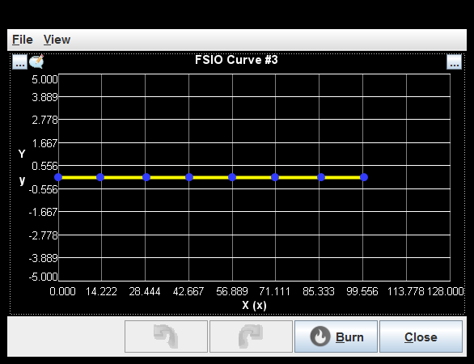
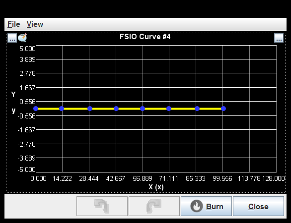
# Sensors
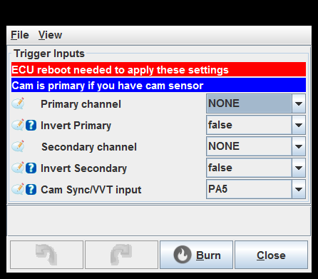
Invert Primary: This setting flips the signal from the primary engine speed sensor.

Invert Secondary: This setting flips the signal from the secondary engine speed sensor.

Cam Sync/VVT input: Camshaft input could be used either just for engine phase detection if your trigger shape does not include cam sensor as 'primary' channel, or it could be used for Variable Valve timing on one of the camshafts.\nTODO #660

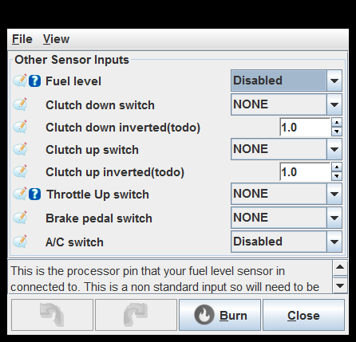
Throttle Up switch: Throttle Pedal not pressed switch - used on some older vehicles like early Mazda Miata


TPS low value detection threshold(%): TPS error detection, what TPS % value is unrealistically low

TPS high value detection threshold(%): TPS error detection, what TPS % value is unrealistically high


Down (WOT) voltage: Pedal in the floor


Measure Map Only In One Cylinder: Useful for individual intakes

Measure Map Only In One Cylinder: Useful for individual intakes

Measure Map Only In One Cylinder: Useful for individual intakes


Is UA input divided?: Is your UA CJ125 output wired to MCU via resistor divider?

Is UR input divided?: Is your UR CJ125 output wired to MCU via resistor divider?\nLooks like 3v range should be enough, divider generally not needed.


# Controller


SPI1mosi mode: Modes count be used for 3v<>5v integration using pull-ups/pull-downs etc.

Sensor Sniffer: rusEfi console Sensor Sniffer mode

Engine Sniffer: This options enables data for 'engine sniffer' tab in console, which comes at some CPU price


Dizzy out Pin: This implementation makes a pulse every time one of the coils is charged, using coil dwell for pulse width. See also tachOutputPin

Saab CDM knock: Saab Combustion Detection Module knock signal input pin\nalso known as Saab Ion Sensing Module


Cam Sync/VVT input: Camshaft input could be used either just for engine phase detection if your trigger shape does not include cam sensor as 'primary' channel, or it could be used for Variable Valve timing on one of the camshafts.\nTODO #660

vBatt ADC input: This is the processor input pin that the battery voltage circuit is connected to, if you are unsure of what pin to use, check the schematic that corresponds to your PCB.

FuelLevelSensor: This is the processor pin that your fuel level sensor in connected to. This is a non standard input so will need to be user defined.


Detailed status in console: Print details into rusEfi console

Disable ETB Motor: Disable the electronic throttle motor for testing.\nThis mode is for testing ETB position sensors, etc without actually driving the throttle.

Two-wire mode: TLE7209 uses two-wire mode. TLE9201 and VNH2SP30 do NOT use two wire mode.

Two-wire mode: TLE7209 uses two-wire mode. TLE9201 and VNH2SP30 do NOT use two wire mode.

Two-wire mode: TLE7209 uses two-wire mode. TLE9201 and VNH2SP30 do NOT use two wire mode.

use ETB for idle: This setting allows the ETB to act as the idle air control valve and move to regulate the airflow at idle.

Debug mode: See http://rusefi.com/s/debugmode\n\nset debug_mode X

use ETB for idle: This setting allows the ETB to act as the idle air control valve and move to regulate the airflow at idle.

Debug mode: See http://rusefi.com/s/debugmode\n\nset debug_mode X

use ETB for idle: This setting allows the ETB to act as the idle air control valve and move to regulate the airflow at idle.

Debug mode: See http://rusefi.com/s/debugmode\n\nset debug_mode X


Extra Fuel(%): Extra Fuel Added

Boost Solenoid Duty(%): Duty Cycle for the Boost Solenoid

Smooth Retard Mode: Interpolates the Ignition Retard from 0 to 100% within the RPM Range

Ignition Cut: This is the Cut Mode normally used


generated by class com.rusefi.MdGenerator on Fri May 01 14:10:39 EDT 2020
