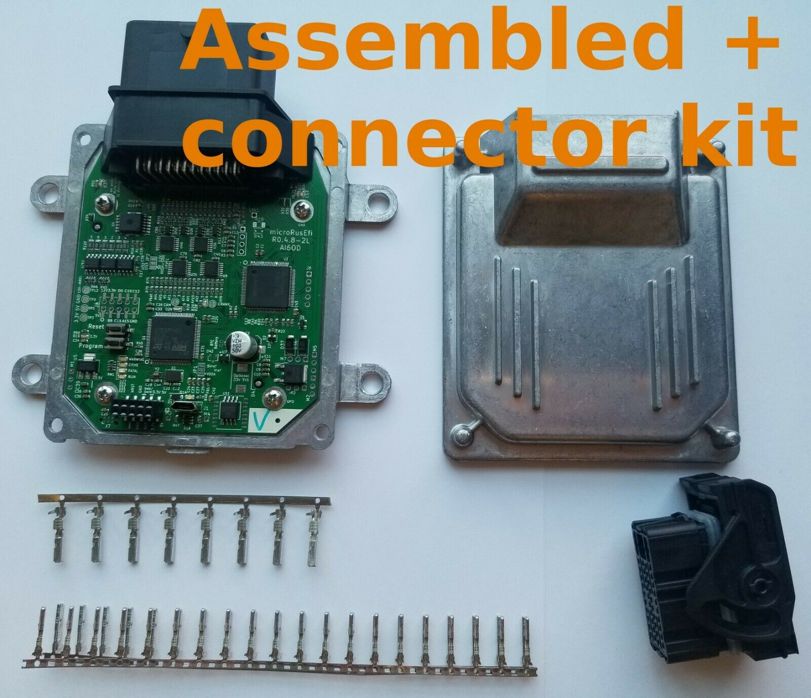

Hellen? сложнее, надо писать в [чатик](https://chat.whatsapp.com/Ey4p7DIDoy299AS1h3ejpB)

Тут у нас русская версия [https://shop.rusefi.com/](https://shop.rusefi.com/)

У нас есть собранные microRusEFI в Питере. <https://rusefi.com/index.html#microrusefi>

У нас есть собранные Proteus 500 USD в рублях по курсу с только белым разъёмом и 550 USD в рублях по курсу с полным комплектом под обжим
<https://rusefi.com/index.html#proteus>

Собранный microRusEFI 220 USD в рублях по курсу - в этом варианте заказчик сам идёт отрезать проводку от Лады или Ниссана

Собранный microRusEFI + компоненты коннектора 240 USD в рублях по курсу - в этом варианте заказчик умеет обжимать разъёмы

Собранный microRusEFI + новый хвост проводки потому что 270 USD в рублях по курсу.

Оплата на карту 4627291471315556

После оплаты пожалуйста пишите в Whatsapp или Телеграм +1-773-414-1279

Покупки лично в Петербурге или доставка через [https://cdek.ru/](https://cdek.ru/) с оплатой доставки получателем.

Кстати, русский чатик [https://chat.whatsapp.com/Ey4p7DIDoy299AS1h3ejpB](https://chat.whatsapp.com/Ey4p7DIDoy299AS1h3ejpB)

PS: всё очень добровольно. Всегда есть вариант всё сделать самим, см. [https://www.drive2.ru/c/555801204769161551/](https://www.drive2.ru/c/555801204769161551/)
