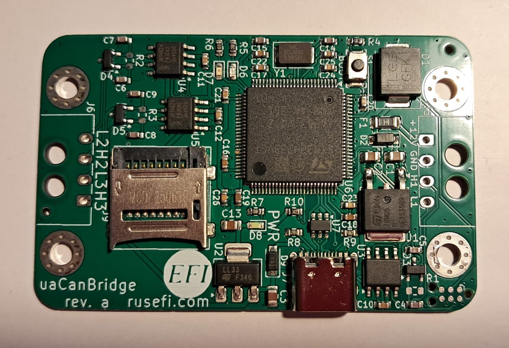

# uaCanBridge

Three-channel CAN-FD gateway programmable using Lua scripting.

[💲rusEFI store💲](https://www.shop.rusefi.com/shop/p/ua-can-bridge)

* x3 CAN bus
* +12v power
* USB-C for configuration
* MicroSD card slot
* Optional molex 43650-0400 connectors

## Use-cases

* Shift CAN ID and/or change baud rate
* Man-in-the middle tool

[Software](https://rusefi.com/build_server/rusefi_bundle_canBridge.zip)

## HOWTO

[This old video is still very relevant](https://www.youtube.com/watch?v=3fbXCgkIJoM)

Use the rusEFI Console 'Lua' tab for Lua and the  TunerStudio 'CAN' dialog to adjust baud rates. See [Lua Scripting](Lua-Scripting) for API details; links to examples can be found at the bottom of the page.

[open source firmware](https://github.com/rusefi/fw-uaCanBridge/)

## Wiring

PCB header 43650-0400

harness connector 43645-0410

terminals 43030-0040
