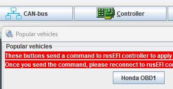
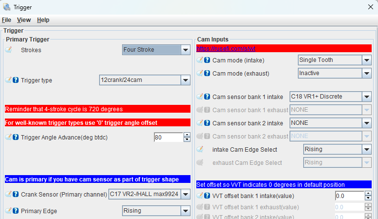

# Ultra Affordable EFI for Honda OBD1

🔴 Community support ONLY 🔴 [Support Statement](https://github.com/rusefi/rusefi/wiki/Support) 🔴 [Facebook group](https://www.facebook.com/groups/rusEfi) 🔴 [Discord](https://github.com/rusefi/rusefi/wiki/Discord) 🔴

Available at the [💲rusEFI store💲](https://www.shop.rusefi.com/shop/p/rusefi-for-obd1)

## firmware

Nicer single board [OBD1 Beta Snapshot](https://rusefi.com/build_server/rusefi_bundle_uaefi-obd1.zip)

Sandwich dual PCB adapter board use [uaEFI](uaEFI) firmware

## Technical Details

See [uaEFI](uaEFI)

[⏩ Interactive Pinout ⏪](https://rusefi.com/docs/pinouts/uaefi/honda-obd1/)

[Adapter Schematics rev a](Hardware-files/Hellen/uaefi-Honda-OBD1-adapter-a-schematic.pdf)

## Features

* reads OEM distributor just fine (single tooth and 24 tooth)
* on-board LSU 4.9 controller exposed on extra ECU plug
* flex fuel sensor input exposed on extra ECU plug
* option to use coil on plugs see J4
* option to convert to hall position sensors see J5
* option to upgrade to electronic throttle body J1+J2
* designed to fit OBD2 enclosure - these are cheaper, also we have auxiliary section on the header so we need wider opening

## Issue Tracker

open source firmware see https://github.com/rusefi/fw-uaefi-Honda-OBD1/issues

## Micro Fit

* harness side 2x3 0430250600
* harness side 2x4 0430250808
* harness side terminal 0430300001
* PCB side 2x3 0430450612

See [Vault Of Honda OEM](Vault-Of-Honda-OEM#obd-1)

## OEM Cases

37820-p2e OBD2 case looks very similar to P28 OBD1 case

## FAQ

Q: how to set trigger?

A: you *HAVE* to trust "popular vehicles>Honda OBD" button. Confirm your trigger offset with timing light, keep everything else!

