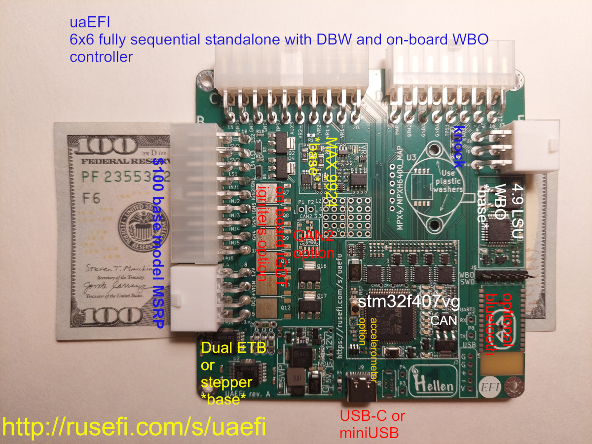
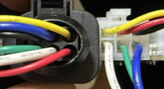
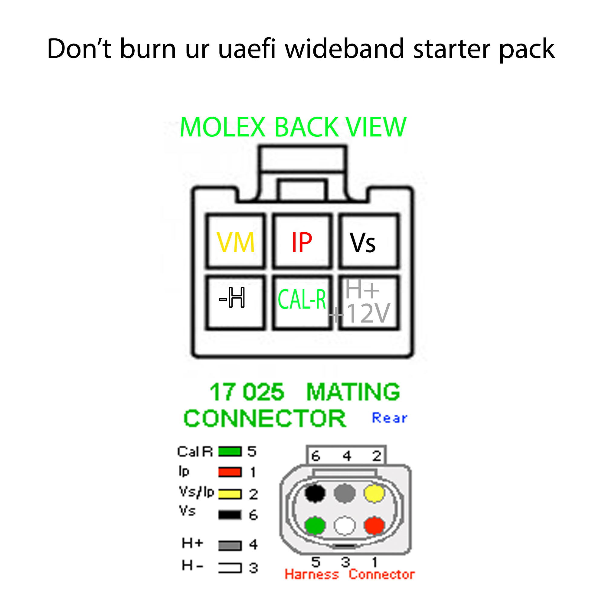
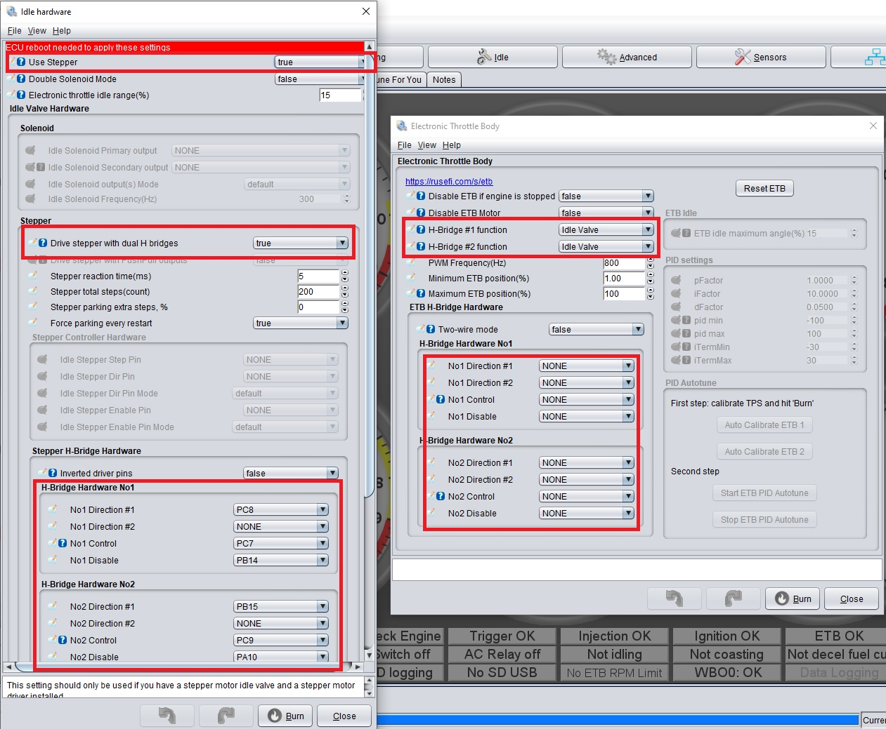

# uaEFI (Ultra Affordable EFI)

The most fully-featured ECU in this price category; available at [💲rusEFI Store💲](https://www.shop.rusefi.com/shop/p/uaefi-ultra-affordable-efi)

🔴 Community support ONLY 🔴 [Support Statement](Support) 🔴 [Facebook group](https://www.facebook.com/groups/rusEfi) 🔴 [Discord](Discord) 🔴

[New to rusEFI start here](Home)

[uaEFI Release Software](https://github.com/rusefi/rusefi/releases/latest/download/rusefi_bundle_uaefi.zip)
[uaEFI Beta Snapshot](https://rusefi.com/build_server/rusefi_bundle_uaefi.zip)
[Release vs Snapshot](Release-Snapshot-Latest-firmware)

[uaEFI PRO Release Software](https://github.com/rusefi/rusefi/releases/latest/download/rusefi_bundle_uaefi_pro.zip)
[uaEFI PRO Beta Snapshot](https://rusefi.com/build_server/rusefi_bundle_uaefi_pro.zip)

## Specs

* [⏩ Interactive Pinout ⏪](https://rusefi.com/docs/pinouts/hellen/uaefi/)
* One of the eight [universal units we offer](Hardware)
* Sequential six smart coils with option of on-board igniters
* Sequential six injector outputs for more complex engines
* Capable of driving 8 sequential injector outputs on simpler engines
* Four above 1A current low side outputs (six on new revisions)
* A couple of lower current low side outputs
* Two VRs: one MAX9924 one vr-discrete (Add R1 to switch MAX9924 into Hall mode)
* Three hall inputs
* Two DC motor drivers up to 6A. Can drive two ETBs or ETB + electronic wastegate or stepper idle
* On-board 4.9 LSU WBO controller
* On-board SD card
* Up to two CAN buses
* On-board digital baro sensor
* 9+2 analog inputs
* Flex fuel input
* Knock sensor input
* Proto area
* 100x100mm 4 layer PCB
* Expandable with on-board IGBT igniters
* Expandable with on-board MAP sensor (MPX4250AP or smaller MPXH6400AC)
* Expandable with on-board Bluetooth (JDY-33 would need to be soldered)
* Expandable with on-board EGT input (MAX31855 and related passives would need to be soldered)
* Expandable with second CAN bus (TJA1051T and related passives would need to be soldered)
* On-board real time cr1220 clock battery (software broken https://github.com/rusefi/rusefi/issues/4556)
* PRO comes with extra memory for Lua and more powerful stm32f7 MCU
* PRO comes with second CAN bus populated

## Technical Details

[General rusEFI documentation](Support)

[Schematics and fab files](https://github.com/rusefi/uaefi/tree/main/boards)

[uaEFI schematics/PCB/gerbers](https://github.com/rusefi/uaefi)

[uaEFI interactive BOM rev D](https://rusefi.com/docs/ibom/uaefi-d-ibom.html) [uaEFI interactive BOM rev A](https://rusefi.com/docs/ibom/uaefi-a-ibom.html)

[WBO documentation](rusEFI-Wideband-Controller)

## Harness Connectors

Molex Mini Fit Jr

* A 39012080 or 39012085
* B 39012180 or 39012185
* C 39012200 or 39012205
* D 39012160 or 39012165
* E 39012060 or 39012065

## PCB headers

* A 5569-08A2 39300080 39301080
* B 5569-18A2 39301180
* C 5569-20A2 39301200
* D 5569-16A2 39301160
* E 5569-06A2 39301060

## External USB connector

USBBF7

## WBO Connector

{: style="width: 232px; height: 126px;" }

## Adapters

Want to make an adapter? See https://github.com/rusefi/uaefi-NA6-adapter

## FAQ

*__Q:__ How do I order from Europe?*  
__A:__ https://shop.rusefi.com is the only official store, there are no distributors for this ultra affordable unit.

*__Q:__ Can it do 8x8?*  
__A:__ You would have to remove two flyback diodes to have 8 similar injector outputs. You would have to figure out a way to have 8 equal coil outputs, maybe settle on wasted spark?
Additional notes at https://rusefi.com/docs/pinouts/hellen/uaefi/?connector=b&pin=B17 https://rusefi.com/docs/pinouts/hellen/uaefi/?connector=b&pin=B18

### __Q:__ Can it do v12

__A:__ No, it's not recommended. This board was designed for one injector per channel.

*__Q:__ What's the difference between normal and PRO?*  
__A:__ 94% of users should go with Normal. PRO can do much more complex Lua scripts, PRO also has a knock spectrogram feature.

*__Q:__ Do you have any dealer prices or discount for companies?*  
__A:__ There is too little profit margin on these to offer discounts, sorry.
PCB files are available for free; you should be able to order your own. Paid consulting is available on how to set things up with JLCPCB if you need help.

*__Q:__ How do I use uaEFI with dumb coils?*  
__A:__ See notes on the schematics, it has part numbers to add and reference numbers to remove!

*__Q:__ Would it run a v12?*  
__A:__ It definitely would idle a v12; not sure if thermals would be a problem at higher RPM with two injectors per channel. Proteus or Huge is recommended for v12.

*__Q:__ How do I add Bluetooth?*  
__A:__ See [Bluetooth](Bluetooth#jdy)

*__Q:__ Where do I buy igniters?*  
__A:__ See https://www.findchips.com/search/ISL9V3040D for stock at distributors.

*__Q:__ Can it control a stepper motor?*  
__A:__ Yes, it's possible.

🔴 [Commercial Support](https://www.shop.rusefi.com/shop/p/details-about-rusefi-ecu-technical-support) 🔴

