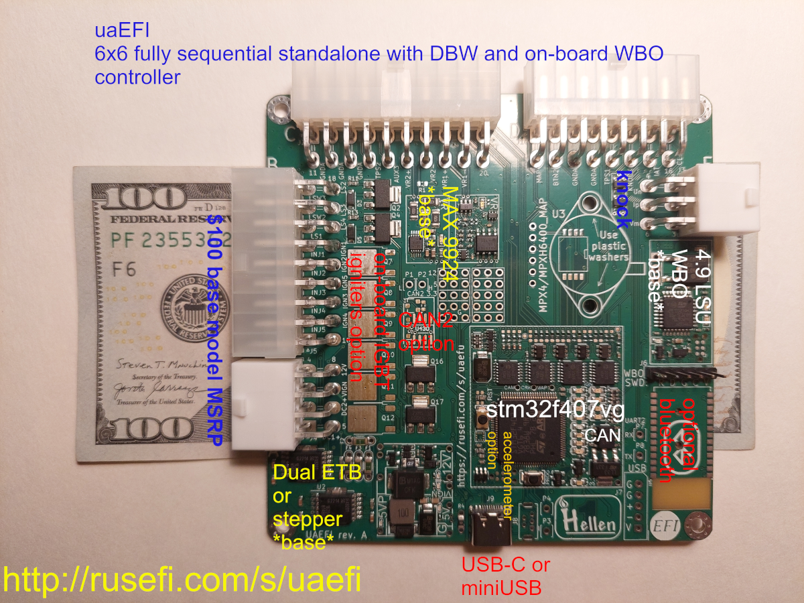
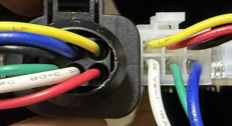
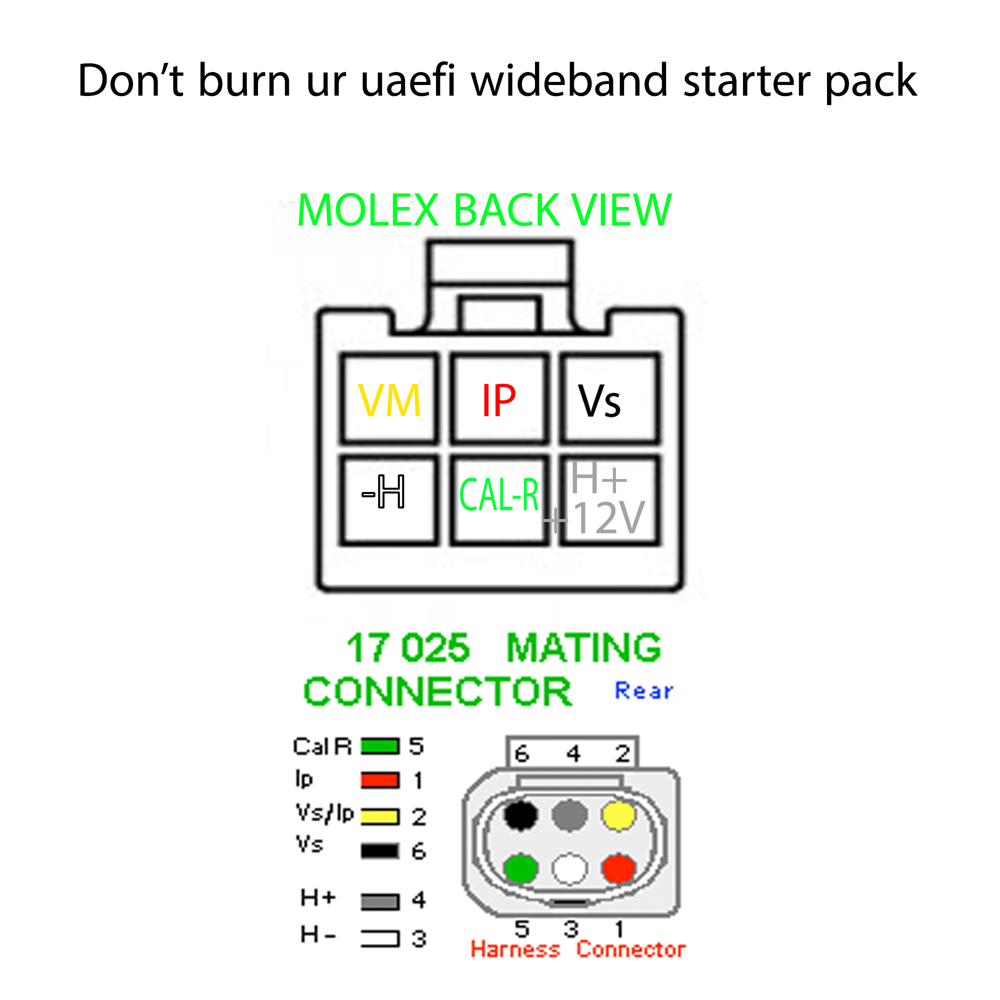
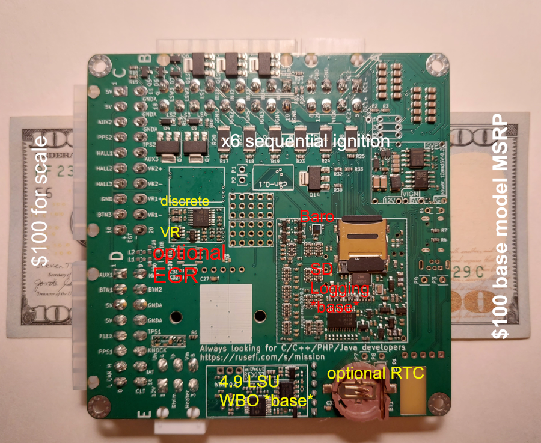
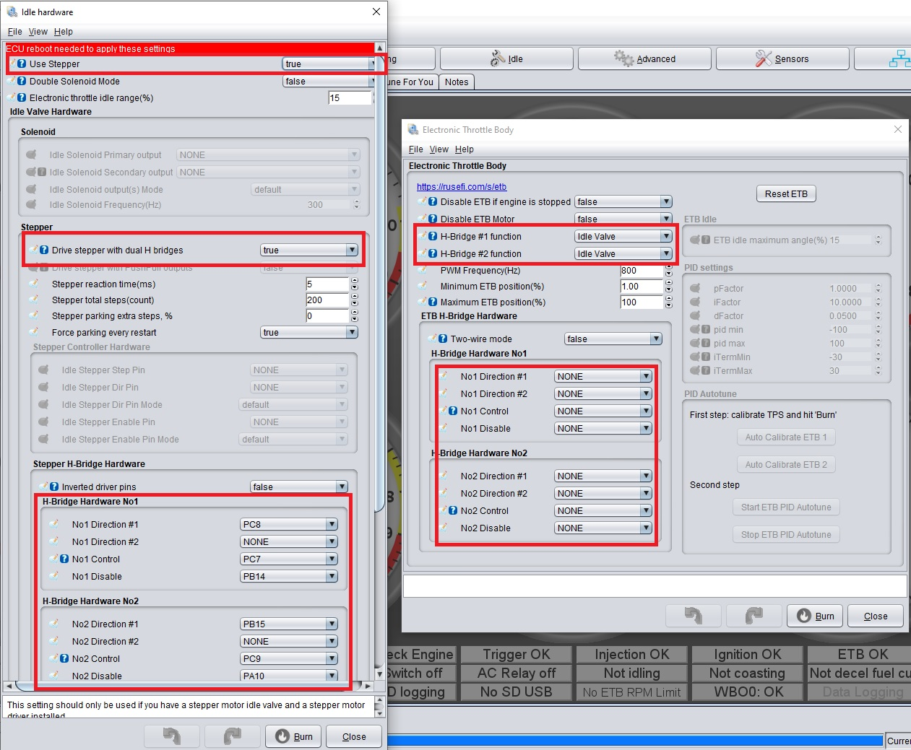

# uaEFI (Ultra Affordable EFI)

The most fully-featured ECU in this price category; available at [💲rusEFI Store💲](https://www.shop.rusefi.com/shop/p/uaefi-ultra-affordable-efi)

🔴 Community support ONLY 🔴 [Support Statement](Support) 🔴 [Facebook group](https://www.facebook.com/groups/rusEfi) 🔴 [Discord](Discord) 🔴

[New to rusEFI start here](Home)

[📦uaEFI Release Software](https://github.com/rusefi/rusefi/releases/latest/download/rusefi_bundle_uaefi.zip)
[📦uaEFI PRO Release Software](https://github.com/rusefi/rusefi/releases/latest/download/rusefi_bundle_uaefi_pro.zip)

[🆕rusEFI_Universal_Updater with Beta Snapshot🆕](https://rusefi.com/installer/rusEFI_Universal_Updater.exe)
[ℹ️Release vs Snapshotℹ️](Release-Snapshot-Latest-firmware)

## Specs

* [⏩ Interactive Pinout ⏪](https://rusefi.com/docs/pinouts/hellen/uaefi/)
* One of the eight [universal units we offer](Hardware)

### Ignition and injection

* Sequential six smart coils with option of on-board igniters
* Sequential six injector outputs for more complex engines
* Capable of driving 8 sequential injector outputs on simpler engines

### Inputs

* Two VRs: one MAX9924 one vr-discrete (Add R1 to switch MAX9924 into Hall mode)
* Three hall inputs
* 9+2 analog inputs
* [Flex fuel](Flex-Fuel) input
* [Knock sensor](knock-sensing) input
* On-board digital baro sensor

### Outputs

* Four above 1A current low side outputs (six on new revisions)
* A couple of lower current low side outputs
* Two DC motor drivers up to 6A. Can drive two [ETBs](Electronic-Throttle-Body-Configuration-Guide) or ETB + electronic wastegate or [stepper idle](Idle-Control#stepper-idle-valve-wiring)

### On-board

* On-board 4.9 LSU [WBO controller](rusEFI-Wideband-Controller)
* On-board SD card
* Up to two CAN buses
* On-board real time cr1220 clock battery (software broken https://github.com/rusefi/rusefi/issues/4556)

### Physical

* 100x100mm 4 layer PCB
* Proto area

free open source firmware - support us at https://www.patreon.com/rusefi

## uaEFI vs uaEFI PRO

94% of users should go with Normal. The PRO variant adds:

| PRO adds | Detail |
|---|---|
| More powerful MCU | stm32f7 |
| Extra memory for Lua | Much more complex Lua scripts |
| Second CAN bus populated | On the base board this is an expansion option, see below |
| Knock spectrogram feature | |

Each variant has its own firmware bundle — see the download links at the top of this page.

## Expansion options

The base board is designed to be extended. Each of these needs parts soldered on:

| Expansion | What is needed |
|---|---|
| On-board IGBT igniters (to drive dumb coils) | Many parts would work, we like ISL9V3040D3ST |
| On-board MAP sensor | [MPX4250AP%20or%20smaller%20MPXH6400AC](on-board-MAP) |
| On-board [Bluetooth](Bluetooth#supported-modules) | JDY-33 would need to be soldered |
| On-board EGT input | MAX31855 and related passives would need to be soldered |
| Second CAN bus | TJA1051T and related passives would need to be soldered |

See notes on the schematics: they have part numbers to add and reference numbers to remove.

## uaEFI User Documentation

New to rusEFI? Start with the [Getting Started roadmap](Getting-Started), which walks through the whole path from choosing hardware to a first start.

| Topic | Page |
|---|---|
| Wiring and connections | [Wiring & Connectivity Overview](FAQ-Basic-Wiring-and-Connections) |
| Firmware install and updates | [HOWTO Update Firmware](HOWTO-Update-Firmware), [Release vs Snapshot](Release-Snapshot-Latest-firmware) |
| Trigger setup | [Trigger Configuration Guide](Trigger-Configuration-Guide) |
| On-board wideband | [rusEFI Wideband Controller](rusEFI-Wideband-Controller) |
| Idle control | [Idle Control](Idle-Control), [Stepper Motor](Stepper-Motor) |
| Electronic throttle | [Electronic Throttle Body Configuration Guide](Electronic-Throttle-Body-Configuration-Guide) |
| Wireless connection | [Bluetooth](Bluetooth) |
| Logging and diagnostics | [Diagnostics and Logging](Diagnostics-and-Logging) |
| Something is wrong | [Troubleshooting](Troubleshooting) |

## Connectors

All five harness connectors are **Molex [Mini-Fit Jr.](https://www.molex.com/en-us/products/connectors/wire-to-board-connectors/mini-fit-connectors)**, a 4.20 mm pitch dual-row power connector family. The harness side uses **5557-series receptacle housings** and the board side uses **5569-series right-angle headers**, so a single Mini-Fit Jr. crimp terminal and one crimp tool cover the whole harness. Circuit counts are encoded in the part numbers.

| Connector | Circuits | Harness plug (Molex 5557 receptacle housing) | PCB header (Molex 5569 right-angle header) |
|---|---|---|---|
| A | 8 | 39012080 or 39012085 | 39301080 (legacy 5569-08A2), 39300080 |
| B | 18 | 39012180 or 39012185 | 39301180 (legacy 5569-18A2) |
| C | 20 | 39012200 or 39012205 | 39301200 (legacy 5569-20A2) |
| D | 16 | 39012160 or 39012165 | 39301160 (legacy 5569-16A2) |
| E | 6 | 39012060 or 39012065 | 39301060 (legacy 5569-06A2) |

Two things that make the list above look more confusing than it is:

- **The pairs are the same housing in two flame ratings.** The part ending in `0` is UL 94V-2 and the one ending in `5` is UL 94V-0 — for example 39012080 and 39012085 are both 8-circuit Mini-Fit Jr. receptacle housings. Either one mates; 94V-0 is the more flame-retardant material.
- **`5569-xxA2` is Molex's legacy numbering** for the same right-angle headers, so 5569-08A2 and 39301080 are one part, not two.

You also need Mini-Fit Jr. **crimp terminals** and a matching crimp tool; these are not part-specific to uaEFI and are listed on the Mini-Fit Jr. family page linked above.

### External USB connector

USBBF7

### WBO connector

{: style="width: 232px; height: 126px;" }

## Technical Details

[Schematics and fab files](https://github.com/rusefi/uaefi/tree/main/boards)

[uaEFI schematics/PCB/gerbers](https://github.com/rusefi/uaefi)

[uaEFI interactive BOM rev D](https://rusefi.com/docs/ibom/uaefi-d-ibom.html) [uaEFI interactive BOM rev A](https://rusefi.com/docs/ibom/uaefi-a-ibom.html)

[Support & Community](Support)

## Adapters

Want to make an adapter? See https://github.com/rusefi/uaefi-NA6-adapter

There is also a dedicated variant for Honda OBD1: [Ultra Affordable EFI for Honda OBD1](uaEFI-Honda-OBD1).

## FAQ

### Buying

*__Q:__ How do I order from Europe?*  
__A:__ https://shop.rusefi.com is the only official store, there are no distributors for this ultra affordable unit.

*__Q:__ What's the difference between normal and PRO?*  
__A:__ 94% of users should go with Normal. PRO can do much more complex Lua scripts, PRO also has a knock spectrogram feature. See [uaEFI vs uaEFI PRO](#uaefi-vs-uaefi-pro) above.

*__Q:__ Do you have any dealer prices or discount for companies?*  
__A:__ There is too little profit margin on these to offer discounts, sorry.
PCB files are available for free; you should be able to order your own. Paid consulting is available on how to set things up with JLCPCB if you need help.

### Engine compatibility

*__Q:__ Can it do 8x8?*  
__A:__ You would have to remove two flyback diodes to have 8 similar injector outputs. You would have to figure out a way to have 8 equal coil outputs, maybe settle on wasted spark?
Additional notes at https://rusefi.com/docs/pinouts/hellen/uaefi/?connector=b&pin=B17 https://rusefi.com/docs/pinouts/hellen/uaefi/?connector=b&pin=B18

*__Q:__ Can I have three injectors per wire?*  
__A:__ Consider replacing chips with VNLD5090.

*__Q:__ Can it do a v12?*  
__A:__ It's not recommended. uaEFI has six injector drivers and this board was designed for one injector per driver. A v12 has twelve injectors, so you would have to wire two injectors to each driver. That is no longer sequential injection, and each driver then has to carry the current of two injectors instead of one — which is why thermals are the concern. It definitely would idle a v12; whether the drivers get too hot at higher RPM is not certain. [Proteus](Proteus) or [rusEFI Huge](rusEFI-Huge) is recommended for a v12.

### Hardware and features

*__Q:__ How do I use uaEFI with dumb coils?*  
__A:__ See notes on the schematics, it has part numbers to add and reference numbers to remove!

*__Q:__ Where do I buy igniters?*  
__A:__ See https://www.findchips.com/search/ISL9V3040D for stock at distributors.

*__Q:__ How do I add Bluetooth?*  
__A:__ A JDY-33 module needs to be soldered on — see [Bluetooth](Bluetooth#supported-modules).

*__Q:__ Can it control a stepper motor?*  
__A:__ Yes, it's possible — uaEFI drives a 4-wire stepper from its two DC motor drivers. See [Stepper Motor](Stepper-Motor) and [Stepper idle valve wiring](Idle-Control#stepper-idle-valve-wiring). There are two ways to set it up in TunerStudio:

*New quicker way:*

*Older detailed way:*

## Related pages

* [Hardware](Hardware) — all eight universal units
* [uaEFI 121](uaefi121) — sibling with a metal enclosure and automotive header
* [super-uaEFI](super-uaEFI) — sibling with STM32F7 and superseal headers
* [Ultra Affordable EFI for Honda OBD1](uaEFI-Honda-OBD1) — Honda OBD1 variant

🔴 [Commercial Support](https://www.shop.rusefi.com/shop/p/details-about-rusefi-ecu-technical-support) 🔴

