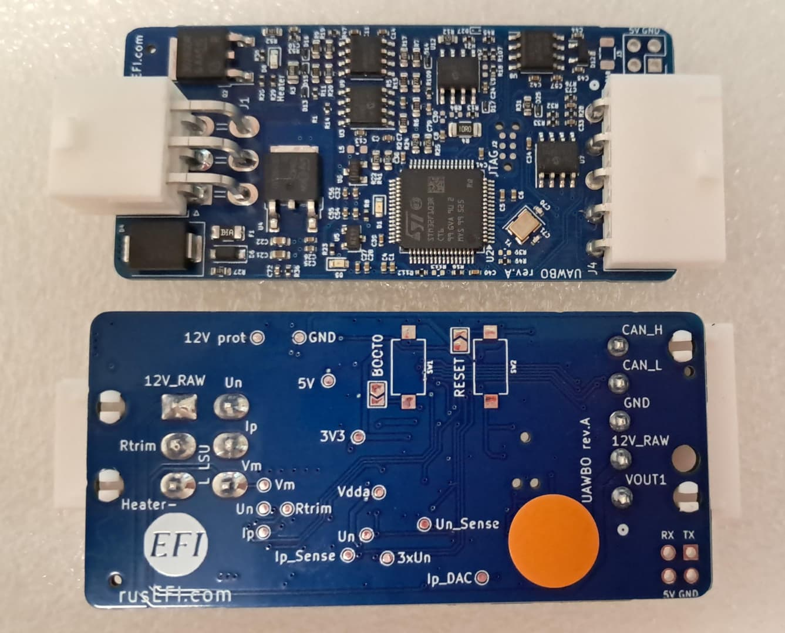

# uaWBO

Compact WBO controller with both CAN and analog output. **Uses** [lambda-x2 firmware](https://github.com/rusefi/wideband/releases/tag/2024-placeholder), **overall this is a truncated compact edition of [lambda-x2](https://github.com/rusefi/rusefi-hardware/tree/main/lambda-x2).**

Available at [💲rusEFI store 💲](https://www.shop.rusefi.com/shop/p/uawbo)

One of few unified [rusEFI-Wideband-Controller](rusEFI-Wideband-Controller)

Only 4.9 for now - we maybe know how to control 4.2 and ADV, but not with this unit.

Default analog output curve is 0..5V for AFR 8.5 to 18.0

## FAQ

Q: How do I move from default 0x190/0x191 CAN bus addresses?

A:

Q: How do I flash custom firmware?

A: TC2030 is the most proper way to change firmware on these devices.

## Changelog

rev A

Works!
