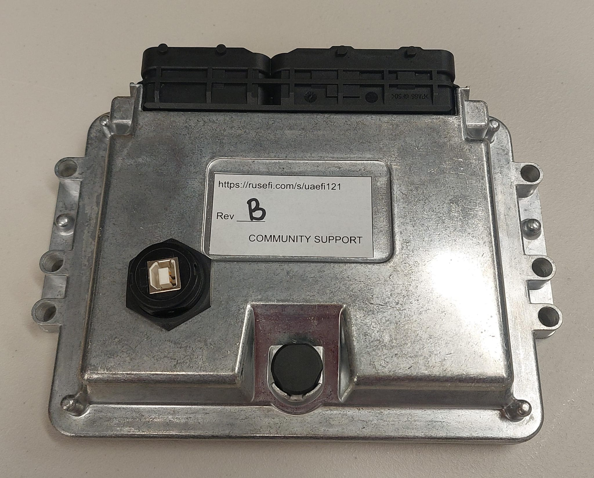
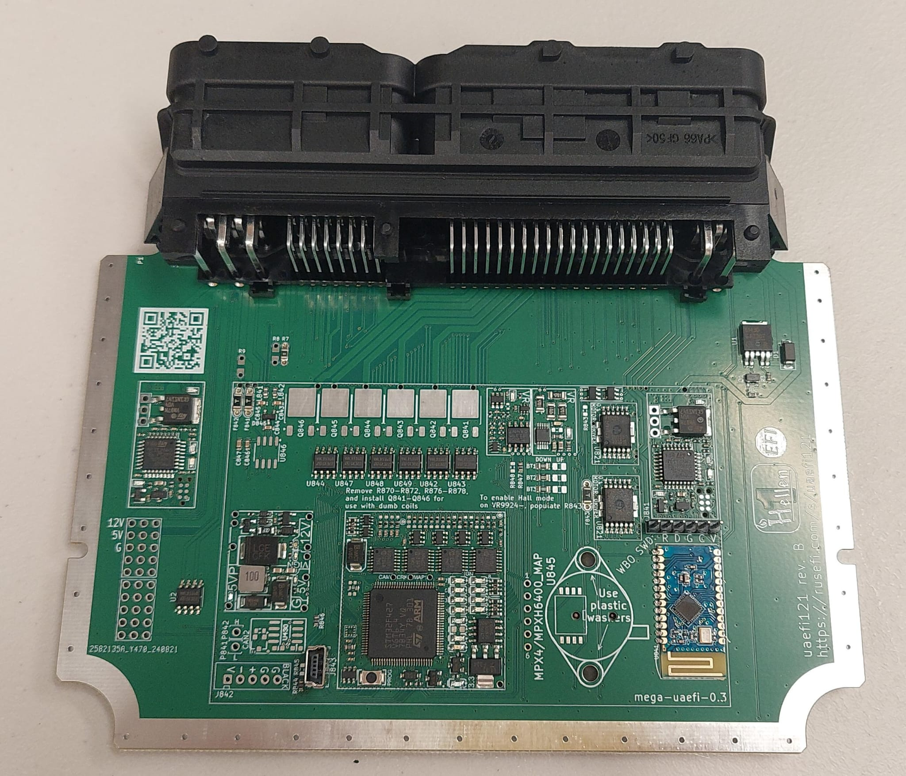

# uaEFI 121

A sibling of [uaEFI](uaEFI) with a metal enclosure available at [💲rusEFI store💲](https://www.shop.rusefi.com/shop/p/uaefi121)

🔴 Community support ONLY 🔴 [Support Statement](Support) 🔴 [Facebook group](https://www.facebook.com/groups/rusEfi) 🔴 [Discord](Discord) 🔴

[New to rusEFI start here](Home)

[uaEFI121 Stable Software](https://github.com/rusefi/rusefi/releases/latest/download/rusefi_bundle_uaefi121.zip)
[uaEFI121 Beta Snapshot](https://rusefi.com/build_server/rusefi_bundle_uaefi121.zip)
[Release vs Snapshot](Release-Snapshot-Latest-firmware)

## Specs

* [⏩ Interactive Pinout ⏪](https://rusefi.com/docs/pinouts/hellen/uaefi121/)
* One of the eight [universal units we offer](Hardware)
* TL,DR: uaEFI with a couple of extra outputs, automotive header and metal enclosure
* Sequential 8 cylinder injection
* Sequential six injector outputs for more complex engines
* Capable of driving 8 sequential injector outputs on simpler engines
* Smart coils by default, expandable with on-board IGBT igniters to drive legacy coils
* Six additional low side outputs
* Dual on-board 4.9 WBO controller
* Dual Drive By Wire electronic throttle body
* One 2A high side output
* Two VRs: one MAX9924 one VR-discrete
* Knock sensor input
* 121 pin header (40P+81P) (81 female plug 1355171-1/368389-1/368382-1/1J0906385C) (40 female plug 0-1355172-1/038906379B) terminals 928886-1
* Metal enclosure
* On-board digital baro sensor
* 7+2 analog inputs
* Optional on-board EGT
* Optional on-board MAP sensor
* Comes WITHOUT waterproofing considerations - please add your own potting!
* Matching USB cap sold separately CAP-WADMLPC2
* On-board non-removable SD card
* Looking for proper 8 cylinder sequential ignition? that's https://www.shop.rusefi.com/shop/p/rusefi-huge
* USB plus cap CAP-WADMLPC2 could be purchased separately
* free open source firmware - support us at https://www.patreon.com/rusefi

[Schematics rev b](Hardware-files/Hellen/uaefi121-b-schematic.pdf)
[uaEFI interactive BOM rev B](https://rusefi.com/docs/ibom/uaefi121-b-ibom.html)

## FAQ

*__Q:__ Are there going to be gerbers and bom list etc. available for uaefi121?*  
__A:__ There are no plans to make this unit open source hardware at the moment. Same for the mega-uaefi hellen module.

*__Q:__ I have questions*  
__A:__ Part of the context is the fact that uaefi121 is a sibling of the fully open-source https://github.com/rusefi/uaefi/ so much of [uaEFI](uaEFI) applies.

*__Q:__ Which style of 121-pin connector does it use?*  
__A:__ It ships with 1241434-1 header; see also [OEM 121 pin connectors](OEM-121-pin-connectors).

## Changelog

### rev D

* on-board logging

### rev B

* pin 108 ignition key added
* silkscreen improvements

### rev A

it's alive!

🔴 [Commercial Support](https://www.shop.rusefi.com/shop/p/details-about-rusefi-ecu-technical-support) 🔴
